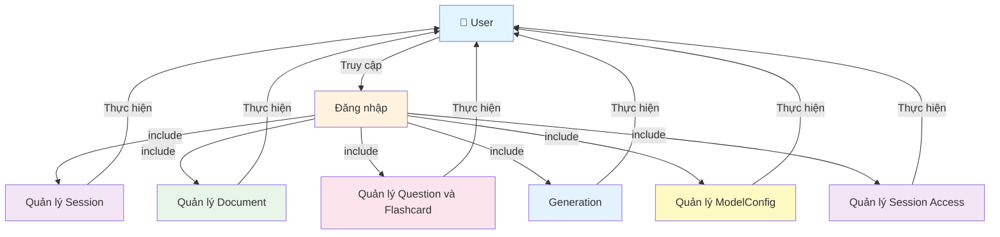

# Use Case Diagram - Tổng quan hệ thống DLab

**Ghi chú:**
- Đăng nhập là điều kiện tiên quyết để truy cập tất cả các chức năng của hệ thống DLab.
- Mỗi module quản lý đại diện cho một nhóm chức năng liên quan, được mô tả chi tiết trong các folder tương ứng.
- Các module được thiết kế để hoạt động độc lập nhưng có thể tương tác với nhau thông qua Session.