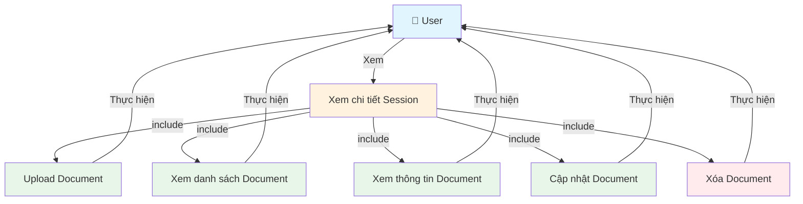

# Use Case Diagram - Quản lý Document

**Ghi chú:**
- Xem chi tiết Session là điều kiện tiên quyết để sử dụng các chức năng quản lý Document.
- Các thao tác được thực hiện trong SideBarLeft và các dialog tương ứng.
- Upload Document hỗ trợ cả file và URL.
