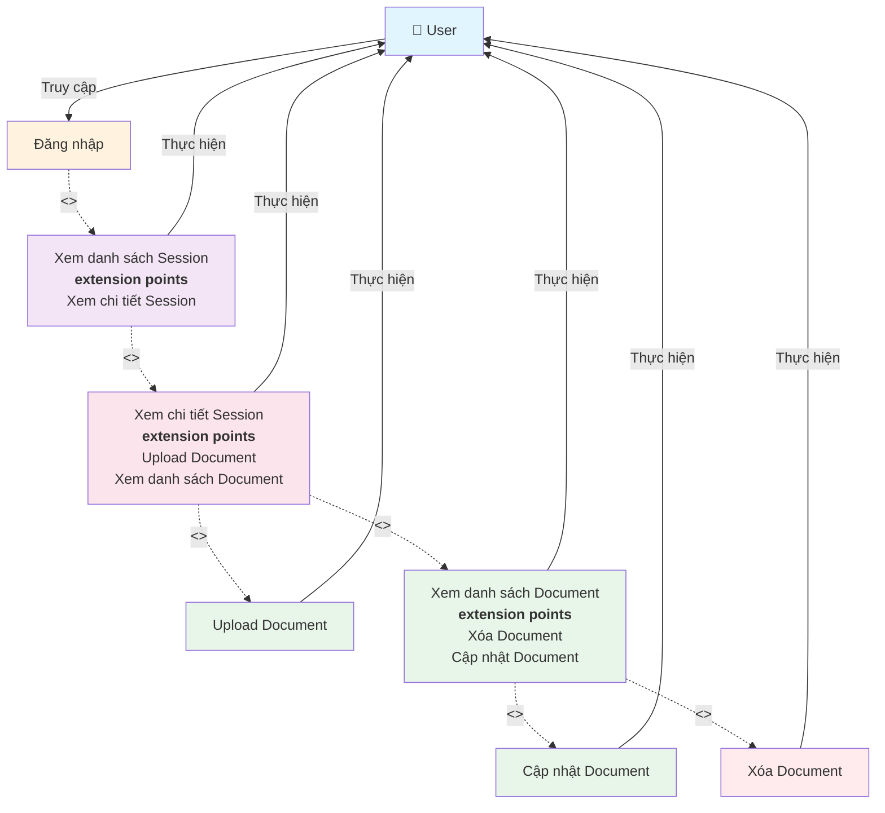

# Use Case Diagram - Quản lý Document

**Ghi chú:**
- Đăng nhập là điều kiện tiên quyết để truy cập hệ thống.
- Xem danh sách Session là bước cần thiết để có thể xem chi tiết Session.
- Xem chi tiết Session có các extension points cho Upload và Xem danh sách Document.
- Xem danh sách Document có các extension points cho Cập nhật và Xóa Document.
- Các thao tác được thực hiện trong SideBarLeft và các dialog tương ứng.
- Upload Document hỗ trợ cả file và URL.
