# Use Case Diagram - Quản lý Document

```mermaid
graph TB
    Actor["👤 User"]
    
    Login["Đăng nhập"]
    ListSessions["Xem danh sách Session"]
    ViewSessionDetail["Xem chi tiết Session"]
    UploadDocument["Upload Document"]
    ViewDocumentList["Xem danh sách Document"]
    ViewDocumentInfo["Xem thông tin Document"]
    UpdateDocument["Cập nhật Document"]
    DeleteDocument["Xóa Document"]
    
    Actor -->|Truy cập| Login
    Login -->|include| ListSessions
    ListSessions -->|Thực hiện| Actor
    
    ListSessions -->|include| ViewSessionDetail
    ViewSessionDetail -->|Thực hiện| Actor
    
    ViewSessionDetail -->|include| UploadDocument
    UploadDocument -->|Thực hiện| Actor
    
    ViewSessionDetail -->|include| ViewDocumentList
    ViewDocumentList -->|Thực hiện| Actor
    
    ViewSessionDetail -->|include| ViewDocumentInfo
    ViewDocumentInfo -->|Thực hiện| Actor
    
    ViewSessionDetail -->|include| UpdateDocument
    UpdateDocument -->|Thực hiện| Actor
    
    ViewSessionDetail -->|include| DeleteDocument
    DeleteDocument -->|Thực hiện| Actor
    
    style Actor fill:#e1f5ff
    style Login fill:#fff3e0
    style ListSessions fill:#f3e5f5
    style ViewSessionDetail fill:#fce4ec
    style UploadDocument fill:#e8f5e9
    style ViewDocumentList fill:#e8f5e9
    style ViewDocumentInfo fill:#e8f5e9
    style UpdateDocument fill:#e8f5e9
    style DeleteDocument fill:#ffebee
```

**Ghi chú:**
- Đăng nhập là điều kiện tiên quyết để truy cập hệ thống.
- Xem danh sách Session là bước cần thiết để có thể xem chi tiết Session.
- Xem chi tiết Session là điều kiện tiên quyết để sử dụng các chức năng quản lý Document.
- Các thao tác được thực hiện trong SideBarLeft và các dialog tương ứng.
- Upload Document hỗ trợ cả file và URL.
