# Class Diagram - Quản lý Document

```mermaid
classDiagram
    class User {
        - id: UUID
        - username: String
        - email: String
        - phone: String
        - birthDay: LocalDate
        - firstName: String
        - lastName: String
        - avatar: String
        - userCode: String
        - userPrefix: String
        - isPremium: Boolean
        - providers: List~UserIdentity~
        + getId(): UUID
        + getRoles(): Set~Role~
    }

    class Role {
        - name: RoleType
        - users: List~User~
        + getName(): RoleType
    }

    class RoleType {
        <<enumeration>>
        STUDENT
        LECTURER
        ADMIN
    }

    class Session {
        - id: UUID
        - name: String
        - description: String | null
        - created_at: DateTime
        - updated_at: DateTime
        + getId(): UUID
    }

    class Document {
        - id: UUID
        - filename: String
        - source_name: String
        - file_type: FileType
        - file_size: Integer | null
        - source_type: SourceType
        - processing_status: ProcessingStatus
        - content_file_path: String | null
        - source_file_path: String | null
        - text_length: Integer
        - extra_metadata: Dict | null
        - storage_provider: StorageType
        - storage_bucket: String | null
        - is_active: Boolean
        - session_id: UUID
        - user_id: UUID
        - created_at: DateTime
        - updated_at: DateTime
        + getId(): UUID
        + getFilename(): String
        + getSourceName(): String
        + getFileType(): FileType
    }

    class DocumentSummary {
        - id: UUID
        - document_id: UUID
        - summary_content: String
        - total_word_count: Integer
        - summary_word_count: Integer
        - summary_file_path: String
        - created_at: DateTime
        - updated_at: DateTime
        + getId(): UUID
        + getDocumentId(): UUID
    }

    class DocumentChunk {
        - id: UUID
        - document_id: UUID
        - chunk_index: Integer
        - chunk_text: String
        - embedding: Vector
        - is_active: Boolean
        - created_at: DateTime
        - updated_at: DateTime
        + getId(): UUID
    }

    class SideBarLeft {
        - searchTerm: String
        - documents: Document[]
        - selectedDocumentId: String | null
        - isLoading: Boolean
        - summaryDialogOpen: Boolean
        - selectedDocumentForActions: Document | null
        - dropdownOpen: Boolean
        + onUploadClick()
        + onDocumentSelect()
        + handleActionsClick()
        + handleDocumentDeleted()
        + handleDocumentRenamed()
    }

    class DocumentUploadDialog {
        - activeTab: String
        - uploadItems: UploadItem[]
        - isUploading: Boolean
        - newUrl: String
        - sizeError: String | null
        - urlError: String | null
        + addFileItems()
        + addUrlItem()
        + removeItem()
        + uploadSingleItem()
        + handleUploadAll()
        + validateBatchSize()
        + validateUrlCount()
    }

    class DocumentActionDialog {
        - showUpdateDialog: Boolean
        - showDeleteDialog: Boolean
        + handleUpdateClick()
        + handleDeleteClick()
    }

    class DocumentUpdateDialog {
        - sourceName: String
        - isLoading: Boolean
        + handleRename()
        + handleClose()
    }

    class DocumentDeleteDialog {
        - isLoading: Boolean
        + handleDelete()
        + handleClose()
    }

    class DocumentInfoDialog {
        + getFileTypeDisplay()
        + formatDate()
        + handleSourceFileClick()
        + handleContentFileClick()
    }

    class DocAgentService {
        + uploadFile(file: File, sessionId: String, userId: String): ServiceResult~Document~
        + uploadUrl(url: String, sessionId: String, userId: String): ServiceResult~Document~
        + getDocumentsBySession(sessionId: String): ServiceResult~Document[]~
        + getDocument(documentId: String): ServiceResult~Document~
        + updateDocument(documentId: String, data: DocumentUpdateRequest): ServiceResult~Document~
        + deleteDocument(documentId: String, sessionId: String): ServiceResult~MessageResponse~
        - parseErrorResponse(): MessageResponse
        - getAuthHeaders(): Record~String, String~
    }

    class DocumentService {
        + get_document(db: Session, document_id: str): Document
        + get_documents(db: Session): List~Document~
        + get_documents_by_session(db: Session, session_id: str): List~Document~
        + update_document(db: Session, document_id: str, update_data: DocumentUpdateRequest): Document
        + delete_document(db: Session, document_id: str): MessageResponse
        + cleanup_document(db: Session, document: Document, delete_db_record: bool): void
    }

    class DocumentProcessService {
        + process_file_upload(db: Session, file: UploadFile, request: FileParseRequest): Document
        + process_url_upload(db: Session, request: UrlParseRequest): Document
        - _process_document(): Document
        - _create_document_chunks(): void
        - _get_file_info(content_type: str): tuple
        - _detect_source_type(source): SourceType
    }

    class ModelConfigService {
        + get_model_by_type_and_task(user_id: UUID, model_type: ModelType, task_type: TaskType): ModelConfig
        + create_model_config(data): ModelConfig
        + update_model_config(model_id: UUID, data): ModelConfig
        + delete_model_config(model_id: UUID): void
    }

    class ParserFactory {
        <<factory>>
        - _registry: Dict~ParserType, Type[BaseParser]~
        + create(parser_type: ParserType, model_config: ModelConfig): BaseParser
        + create_from_source_type(source_type: SourceType, file_category: str, model_config: ModelConfig): BaseParser
        + register(parser_type: ParserType, parser_class: Type): void
    }

    class ParserType {
        <<enumeration>>
        DOCUMENT
        AUDIO
        YOUTUBE
        WEB
        IMAGE
    }

    class BaseParser {
        <<abstract>>
        # model_config: ModelConfig
        + parse(source): String
        # _validate_source(source): void
    }

    class DocParser {
        + parse(file_path: String): String
        - _extract_text_from_pdf(file_path): String
        - _extract_text_from_docx(file_path): String
    }

    class AudioParser {
        + parse(file_path: String): String
        - _transcribe_audio(file_path): String
    }

    class YoutubeParser {
        + parse(url: String): String
        - _download_video(url): String
        - _transcribe_video(file_path): String
    }

    class WebParser {
        + parse(url: String): String
        - _scrape_content(url): String
    }

    class ImageParser {
        + parse(file_path: String): String
        - _extract_text_ocr(file_path): String
    }

    class EmbeddingFactory {
        <<factory>>
        - _registry: Dict~String, Type[BaseEmbeddingModel]~
        + create(model_config: ModelConfig): BaseEmbeddingModel
        + register(wrapper_name: String, embedding_class: Type): void
    }

    class BaseEmbeddingModel {
        <<abstract>>
        # model_config: ModelConfig
        + embed(text: String): List~Float~
        + embed_batch(texts: List~String~): List~List~Float~~
    }

    class FastEmbedModel {
        - model: FastEmbedModelInstance
        + embed(text: String): List~Float~
        + embed_batch(texts: List~String~): List~List~Float~~
    }

    class OpenAIEmbeddingModel {
        - client: OpenAIClient
        + embed(text: String): List~Float~
        + embed_batch(texts: List~String~): List~List~Float~~
    }

    class TextSplitterFactory {
        <<factory>>
        - _splitters: Dict~SplitterType, Type[BaseSplitter]~
        + create_splitter(splitter_type: SplitterType, **kwargs): BaseSplitter
    }

    class BaseSplitter {
        <<abstract>>
        + split_text(text: String): List~Dict~
    }

    class RecursiveSplitter {
        - chunk_config: ChunkConfig
        + split_text(text: String): List~Dict~
        - _calculate_chunk_size(text_length): Tuple~Integer, Integer~
    }

    class SemanticSplitter {
        - model: TextEmbedding
        - similarity_threshold: Float
        - min_chunk_size: Integer
        - max_chunk_size: Integer
        + split_text(text: String, granularity: String): List~Dict~
        + split_with_overlap(text: String, overlap_sentences: Integer): List~Dict~
        - _split_into_sentences(text: String): List~String~
        - _calculate_similarity(emb1, emb2): Float
    }

    class SplitterType {
        <<enumeration>>
        RECURSIVE
        SEMANTIC
    }

    class ModelWrapper {
        - id: UUID
        - name: String
        - instruction: String
        - task_type: TaskType
        - is_active: Boolean
        - created_at: DateTime
        - updated_at: DateTime
        + getName(): String
    }

    class ModelConfig {
        - id: UUID
        - user_id: UUID
        - name: String
        - wrapper_id: UUID
        - model_type: ModelType
        - is_used: Boolean
        - api_key: String
        - extra_config: JSON
        - lang: Lang
        - created_at: DateTime
        - updated_at: DateTime
        + set_api_key(plain_api_key: String): void
        + get_masked_api_key(): String
    }

    class ModelType {
        <<enumeration>>
        PARSE
        EMBEDDING
        GENERATION
    }

    class TaskType {
        <<enumeration>>
        PARSE_DOC
        PARSE_IMAGE
        PARSE_AUDIO
        EMBEDDING
        GENERATION
    }

    class DocumentResponse {
        - id: UUID
        - filename: String
        - source_name: String
        - file_type: FileType
        - file_size: Integer | null
        - source_type: SourceType
        - processing_status: ProcessingStatus
        - content_file_path: String | null
        - source_file_path: String | null
        - text_length: Integer
        - extra_metadata: Dict | null
        - storage_provider: StorageType
        - storage_bucket: String | null
        - session_id: UUID
        - created_at: DateTime
        - updated_at: DateTime
    }

    class DocumentUpdateRequest {
        - source_name: String | null
    }

    class FileParseRequest {
        - file: UploadFile
        - session_id: String
        - user_id: String
    }

    class UrlParseRequest {
        - url: String
        - session_id: String
        - user_id: String
    }

    class MessageResponse {
        - translation_key: String
        - message: String
        - details: Dict~String, Any~ | null
        + create(translation_key, message, details): MessageResponse
    }

    class ServiceResult~T~ {
        - type: ResponseStatus
        - data: T | null
        - error: MessageResponse | null
    }

    class ResponseStatus {
        SUCCESS
        ERROR
    }

    class FileType {
        PDF
        DOCX
        PPTX
        AUDIO
        VIDEO
        IMAGE
        WEB
        YOUTUBE
    }

    class SourceType {
        UPLOAD
        WEB
        YOUTUBE
    }

    class ProcessingStatus {
        PROCESSING
        COMPLETED
        FAILED
    }

    class StorageType {
        LOCAL
        S3
    }

    class UploadItem {
        - id: String
        - type: String
        - file: File | null
        - url: String | null
        - status: String
        - error: MessageResponse[] | null
        - document: Document | null
    }

    %% Relationships
    User "*" -- "*" Role : has
    Role "*" -- "1" RoleType : has_type
    User "1" -- "*" Session : creates
    Session "1" -- "*" Document : contains
    Document "1" -- "0..1" DocumentSummary : has
    Document "1" -- "*" DocumentChunk : has
    
    SideBarLeft --> Document : displays
    SideBarLeft --> DocumentUploadDialog : opens
    SideBarLeft --> DocumentActionDialog : opens
    SideBarLeft --> DocumentInfoDialog : opens
    
    DocumentUploadDialog --> UploadItem : manages
    DocumentActionDialog --> DocumentUpdateDialog : opens
    DocumentActionDialog --> DocumentDeleteDialog : opens
    
    DocAgentService --> Document : manages
    DocAgentService --> ServiceResult : returns
    DocAgentService --> MessageResponse : uses
    
    DocumentService --> Document : manages
    DocumentService --> MessageResponse : uses
    DocumentProcessService --> Document : creates
    DocumentProcessService --> FileParseRequest : uses
    DocumentProcessService --> UrlParseRequest : uses
    DocumentProcessService --> ModelConfigService : uses
    DocumentProcessService --> ParserFactory : uses
    DocumentProcessService --> EmbeddingFactory : uses
    DocumentProcessService --> TextSplitterFactory : uses
    
    ParserFactory --> ParserType : uses
    ParserFactory --> BaseParser : creates
    ParserFactory --> ModelConfig : uses
    BaseParser <|-- DocParser : extends
    BaseParser <|-- AudioParser : extends
    BaseParser <|-- YoutubeParser : extends
    BaseParser <|-- WebParser : extends
    BaseParser <|-- ImageParser : extends
    BaseParser --> ModelConfig : uses
    
    EmbeddingFactory --> BaseEmbeddingModel : creates
    EmbeddingFactory --> ModelConfig : uses
    BaseEmbeddingModel <|-- FastEmbedModel : extends
    BaseEmbeddingModel <|-- OpenAIEmbeddingModel : extends
    BaseEmbeddingModel --> ModelConfig : uses
    
    TextSplitterFactory --> SplitterType : uses
    TextSplitterFactory --> BaseSplitter : creates
    BaseSplitter <|-- RecursiveSplitter : extends
    BaseSplitter <|-- SemanticSplitter : extends
    
    ModelConfigService --> ModelConfig : manages
    ModelConfig "*" -- "1" ModelWrapper : belongs_to
    ModelWrapper --> TaskType : has_type
    ModelConfig --> ModelType : has_type
    
    ServiceResult --> ResponseStatus : has_status
    ServiceResult --> MessageResponse : has_error
    
    Document "*" -- "1" FileType : has_type
    Document "*" -- "1" SourceType : has_source
    Document "*" -- "1" ProcessingStatus : has_status
    Document "*" -- "1" StorageType : stored_in
```

**Mô tả quan hệ:**
- **User**: Đại diện cho User của hệ thống, có thể có nhiều Role (STUDENT, LECTURER, ADMIN).
- **Role**: Đại diện cho vai trò của User trong hệ thống, được định danh bởi RoleType enum.
- **RoleType**: Enum định nghĩa các loại role: STUDENT, LECTURER, ADMIN.
- **Session**: Đại diện cho một Session, chứa các Document.
- **Document**: Đại diện cho một tài liệu đã được upload, có thể là file hoặc từ URL.
- **DocumentSummary**: Chứa tóm tắt nội dung của Document.
- **DocumentChunk**: Chứa các đoạn văn bản đã được phân tách từ Document để tạo embedding.
- **SideBarLeft**: Component Frontend hiển thị danh sách Document.
- **DocumentUploadDialog**: Component Frontend để upload Document mới.
- **DocumentActionDialog**: Component Frontend hiển thị menu hành động cho Document.
- **DocumentUpdateDialog**: Component Frontend để cập nhật tên Document.
- **DocumentDeleteDialog**: Component Frontend để xác nhận xóa Document.
- **DocumentInfoDialog**: Component Frontend hiển thị thông tin chi tiết Document.
- **DocAgentService** (Frontend): Service xử lý API call liên quan đến Document.
- **DocumentService** (Backend): Service xử lý CRUD operations cho Document trong database.
- **DocumentProcessService** (Backend): Service xử lý toàn bộ quy trình upload và xử lý Document, bao gồm parse, chunk, và embed.
- **ModelConfigService** (Backend): Service quản lý ModelConfig, lấy model theo type và task.
- **ParserFactory** (Backend): Factory pattern để tạo Parser phù hợp dựa trên source type và file category.
- **ParserType**: Enum định nghĩa các loại parser: DOCUMENT, AUDIO, YOUTUBE, WEB, IMAGE.
- **BaseParser**: Abstract base class cho tất cả các parser.
- **DocParser, AudioParser, YoutubeParser, WebParser, ImageParser**: Các parser cụ thể kế thừa từ BaseParser.
- **EmbeddingFactory** (Backend): Factory pattern để tạo Embedding Model phù hợp dựa trên wrapper name.
- **BaseEmbeddingModel**: Abstract base class cho tất cả các embedding model.
- **FastEmbedModel, OpenAIEmbeddingModel**: Các embedding model cụ thể kế thừa từ BaseEmbeddingModel.
- **TextSplitterFactory** (Backend): Factory pattern để tạo Text Splitter phù hợp dựa trên splitter type.
- **BaseSplitter**: Abstract base class cho tất cả các text splitter.
- **RecursiveSplitter**: Splitter phân tách text theo recursive character với chunk size tự động điều chỉnh theo độ dài document.
- **SemanticSplitter**: Splitter phân tách text dựa trên semantic similarity, sử dụng embedding để nhóm các câu có ngữ nghĩa liên quan.
- **SplitterType**: Enum định nghĩa các loại splitter: RECURSIVE, SEMANTIC.
- **ModelWrapper**: Đại diện cho một wrapper (provider) của model, chứa thông tin về task type.
- **ModelConfig**: Configuration của model cụ thể, liên kết với ModelWrapper và User.
- **ModelType**: Enum định nghĩa các loại model: PARSE, EMBEDDING, GENERATION.
- **TaskType**: Enum định nghĩa các loại task: PARSE_DOC, PARSE_IMAGE, PARSE_AUDIO, EMBEDDING, GENERATION.
- **DocumentResponse**: DTO để trả về dữ liệu Document từ API.
- **MessageResponse & ServiceResult**: Lớp dùng để trả về kết quả API.
