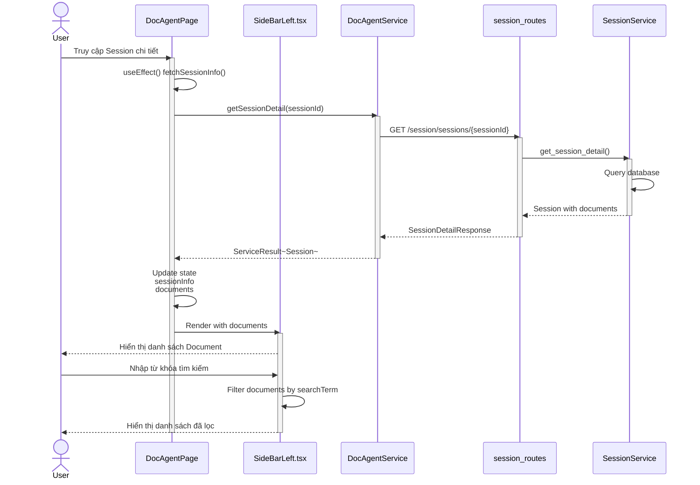
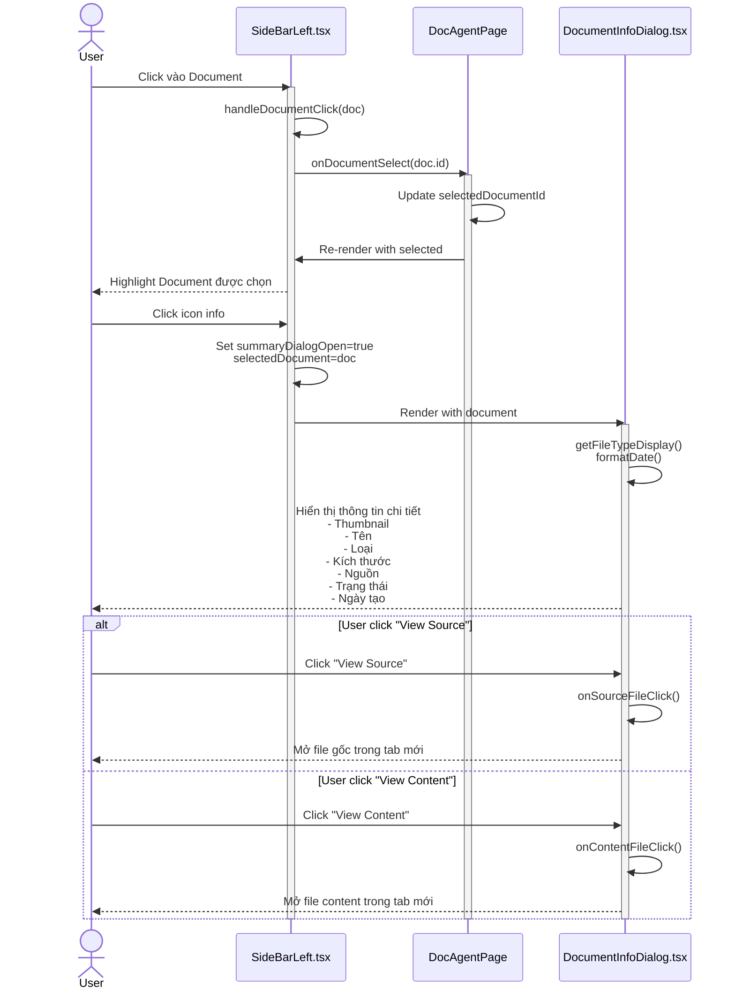
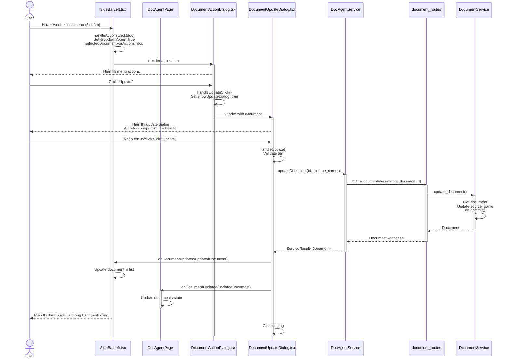
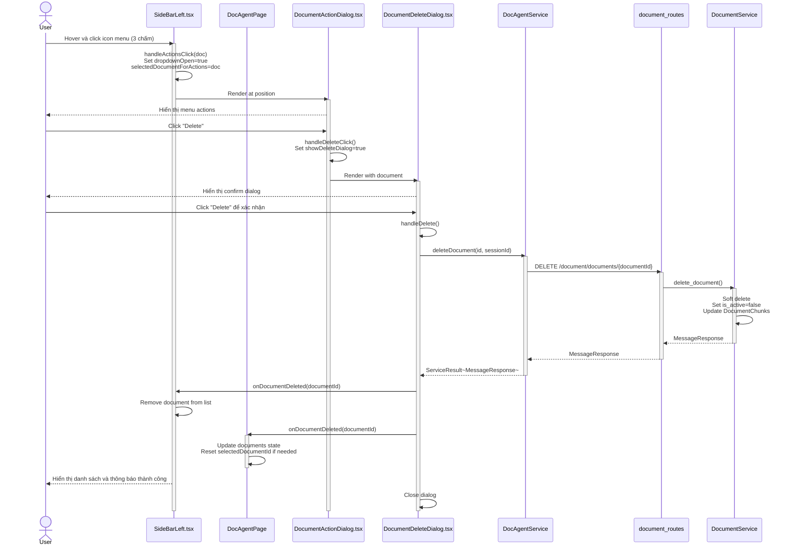

# Sequence Diagram - Quản lý Document

## 1. Upload Document

```mermaid
sequenceDiagram
    actor User
    participant DocAgentPage as DocAgentPage
    participant SideBarLeft as SideBarLeft.tsx
    participant DocumentUploadDialog as DocumentUploadDialog.tsx
    participant DocAgentService as DocAgentService
    participant DocumentRoutes as document_routes
    participant DocumentProcessService as DocumentProcessService
    participant ModelConfigService as ModelConfigService
    participant ParserFactory as ParserFactory
    participant Parser as Parser<br/>(Doc/Audio/Youtube/Web/Image)
    participant EmbeddingFactory as EmbeddingFactory
    participant EmbeddingModel as EmbeddingModel<br/>(FastEmbed/OpenAI)
    participant TextSplitterFactory as TextSplitterFactory
    participant Splitter as Splitter<br/>(Recursive/Semantic)
    participant DocumentService as DocumentService
    participant DB as Database

    User->>DocAgentPage: Truy cập Session chi tiết
    activate DocAgentPage
    DocAgentPage->>DocAgentService: getSessionDetail(sessionId)
    activate DocAgentService
    DocAgentService->>DocumentRoutes: GET /session/sessions/{sessionId}
    activate DocumentRoutes
    DocumentRoutes-->>DocAgentService: SessionDetailResponse (with documents)
    deactivate DocumentRoutes
    DocAgentService-->>DocAgentPage: ServiceResult~Session~
    deactivate DocAgentService
    
    DocAgentPage->>SideBarLeft: Render with documents
    activate SideBarLeft
    SideBarLeft-->>User: Hiển thị danh sách Document
    
    User->>SideBarLeft: Click nút "Tải lên"
    SideBarLeft->>DocAgentPage: onUploadClick()
    DocAgentPage->>DocumentUploadDialog: Open dialog
    activate DocumentUploadDialog
    DocumentUploadDialog-->>User: Hiển thị upload dialog với tab "Tệp" và "Liên kết"
    
    alt Upload File
        User->>DocumentUploadDialog: Chọn tab "Tệp" và chọn file
        DocumentUploadDialog->>DocumentUploadDialog: addFileItems()<br/>validateBatchSize()
    else Upload URL
        User->>DocumentUploadDialog: Chọn tab "Liên kết" và nhập URL
        User->>DocumentUploadDialog: Click "Thêm"
        DocumentUploadDialog->>DocumentUploadDialog: addUrlItem()<br/>validateUrlCount()
    end
    
    DocumentUploadDialog-->>User: Hiển thị items trong danh sách
    
    User->>DocumentUploadDialog: Click "Tải lên tất cả"
    DocumentUploadDialog->>DocumentUploadDialog: handleUploadAll()
    
    loop Cho từng item (File hoặc URL)
        alt Upload File
            DocumentUploadDialog->>DocAgentService: uploadFile(file, sessionId, userId)
            activate DocAgentService
            DocAgentService->>DocumentRoutes: POST /document/file
        else Upload URL
            DocumentUploadDialog->>DocAgentService: uploadUrl(url, sessionId, userId)
            DocAgentService->>DocumentRoutes: POST /document/url
        end
        
        activate DocumentRoutes
        DocumentRoutes->>DocumentProcessService: process_file() / process_url()
        activate DocumentProcessService
        
        Note over DocumentProcessService: Step 1: Lấy Parse ModelConfig
        DocumentProcessService->>DocumentProcessService: get_parse_task_type(file_category, source_type)
        DocumentProcessService->>ModelConfigService: get_model_by_type_and_task(user_id, ModelType.PARSE, task_type)
        activate ModelConfigService
        ModelConfigService->>DB: Query ModelConfig với wrapper.task_type
        activate DB
        DB-->>ModelConfigService: ModelConfig with Wrapper
        deactivate DB
        ModelConfigService-->>DocumentProcessService: parse_model_config
        deactivate ModelConfigService
        
        Note over DocumentProcessService: Step 2: Tạo Parser từ Factory
        DocumentProcessService->>ParserFactory: create_from_source_type(source_type, file_category, model_config)
        activate ParserFactory
        ParserFactory->>ParserFactory: Mapping source_type & file_category<br/>→ ParserType
        ParserFactory->>Parser: __init__(model_config)
        activate Parser
        Parser-->>ParserFactory: Parser instance
        deactivate Parser
        ParserFactory-->>DocumentProcessService: parser
        deactivate ParserFactory
        
        Note over DocumentProcessService: Step 3: Lưu file và tạo Document
        alt Upload File
            DocumentProcessService->>DocumentProcessService: Save file to storage
        end
        DocumentProcessService->>DocumentService: create_document(document_data)
        activate DocumentService
        DocumentService->>DB: INSERT Document
        activate DB
        DB-->>DocumentService: Document record
        deactivate DB
        DocumentService-->>DocumentProcessService: document
        deactivate DocumentService
        
        Note over DocumentProcessService: Step 4: Parse Document
        DocumentProcessService->>Parser: parse(source_data)
        activate Parser
        alt Document Parser
            Parser->>Parser: Extract text from PDF/DOCX/PPTX
        else Audio/Video Parser
            Parser->>Parser: Transcribe audio using model
        else Youtube Parser
            Parser->>Parser: Download and transcribe
        else Web Parser
            Parser->>Parser: Scrape web content
        else Image Parser
            Parser->>Parser: Extract text from image using OCR
        end
        Parser-->>DocumentProcessService: raw_text
        deactivate Parser
        
        DocumentProcessService->>DocumentService: update_document(document.id, {processing_status: COMPLETED})
        activate DocumentService
        DocumentService->>DB: UPDATE Document
        activate DB
        DB-->>DocumentService: Updated document
        deactivate DB
        DocumentService-->>DocumentProcessService: document
        deactivate DocumentService
        
        Note over DocumentProcessService: Step 5: Lấy Embedding ModelConfig
        DocumentProcessService->>ModelConfigService: get_model_by_type_and_task(user_id, ModelType.EMBEDDING, TaskType.EMBEDDING)
        activate ModelConfigService
        ModelConfigService->>DB: Query ModelConfig
        activate DB
        DB-->>ModelConfigService: ModelConfig with Wrapper
        deactivate DB
        ModelConfigService-->>DocumentProcessService: embedding_model_config
        deactivate ModelConfigService
        
        Note over DocumentProcessService: Step 6: Tạo Embedding Model từ Factory
        DocumentProcessService->>EmbeddingFactory: create(embedding_model_config)
        activate EmbeddingFactory
        EmbeddingFactory->>EmbeddingFactory: Get wrapper_name from model_config
        EmbeddingFactory->>EmbeddingModel: __init__(model_config)
        activate EmbeddingModel
        EmbeddingModel-->>EmbeddingFactory: EmbeddingModel instance
        deactivate EmbeddingModel
        EmbeddingFactory-->>DocumentProcessService: embedding_model
        deactivate EmbeddingFactory
        
        Note over DocumentProcessService: Step 7: Tạo Splitter và split text
        DocumentProcessService->>TextSplitterFactory: create_splitter(splitter_type)
        activate TextSplitterFactory
        TextSplitterFactory->>TextSplitterFactory: Get splitter_class from registry
        TextSplitterFactory->>Splitter: __init__(**kwargs)
        activate Splitter
        Splitter-->>TextSplitterFactory: Splitter instance
        deactivate Splitter
        TextSplitterFactory-->>DocumentProcessService: splitter
        deactivate TextSplitterFactory
        
        DocumentProcessService->>Splitter: split_text(raw_text)
        activate Splitter
        Splitter->>Splitter: Split theo chunk_size và overlap
        Splitter-->>DocumentProcessService: text_chunks[]
        deactivate Splitter
        
        Note over DocumentProcessService: Step 8: Tạo embeddings và lưu chunks
        loop Cho từng chunk
            DocumentProcessService->>EmbeddingModel: embed(chunk_text)
            activate EmbeddingModel
            EmbeddingModel->>EmbeddingModel: Generate embedding vector
            EmbeddingModel-->>DocumentProcessService: embedding_vector
            deactivate EmbeddingModel
            
            DocumentProcessService->>DocumentService: create_document_chunk(document_id, chunk_index, chunk_text, embedding)
            activate DocumentService
            DocumentService->>DB: INSERT DocumentChunk
            activate DB
            DB-->>DocumentService: DocumentChunk record
            deactivate DB
            DocumentService-->>DocumentProcessService: chunk
            deactivate DocumentService
        end
        
        DocumentProcessService-->>DocumentRoutes: document
        deactivate DocumentProcessService
        DocumentRoutes-->>DocAgentService: DocumentResponse
        deactivate DocumentRoutes
        DocAgentService-->>DocumentUploadDialog: ServiceResult~Document~
        deactivate DocAgentService
        DocumentUploadDialog->>DocumentUploadDialog: Update uploadItem status = 'completed'
    end
    
    DocumentUploadDialog->>DocAgentPage: onDocumentsUploaded(documents)
    DocAgentPage->>DocAgentPage: Update documents state
    DocAgentPage->>SideBarLeft: Re-render with new documents
    SideBarLeft-->>User: Hiển thị danh sách và thông báo thành công
    deactivate DocumentUploadDialog
    deactivate SideBarLeft
    deactivate DocAgentPage
```

---

## 2. Xem danh sách Document

```mermaid
sequenceDiagram
    actor User
    participant DocAgentPage as DocAgentPage
    participant SideBarLeft as SideBarLeft.tsx
    participant DocAgentService as DocAgentService
    participant SessionRoutes as session_routes
    participant SessionService as SessionService

    User->>DocAgentPage: Truy cập Session chi tiết
    activate DocAgentPage
    
    DocAgentPage->>DocAgentPage: useEffect() fetchSessionInfo()
    
    DocAgentPage->>DocAgentService: getSessionDetail(sessionId)
    activate DocAgentService
    
    DocAgentService->>SessionRoutes: GET /session/sessions/{sessionId}
    activate SessionRoutes
    
    SessionRoutes->>SessionService: get_session_detail()
    activate SessionService
    
    SessionService->>SessionService: Query database
    
    SessionService-->>SessionRoutes: Session with documents
    deactivate SessionService
    
    SessionRoutes-->>DocAgentService: SessionDetailResponse
    deactivate SessionRoutes
    
    DocAgentService-->>DocAgentPage: ServiceResult~Session~
    deactivate DocAgentService
    
    DocAgentPage->>DocAgentPage: Update state<br/>sessionInfo<br/>documents
    
    DocAgentPage->>SideBarLeft: Render with documents
    activate SideBarLeft
    
    SideBarLeft-->>User: Hiển thị danh sách Document
    
    User->>SideBarLeft: Nhập từ khóa tìm kiếm
    SideBarLeft->>SideBarLeft: Filter documents by searchTerm
    SideBarLeft-->>User: Hiển thị danh sách đã lọc
    
    deactivate SideBarLeft
    deactivate DocAgentPage
```

---

## 3. Xem thông tin Document

```mermaid
sequenceDiagram
    actor User
    participant SideBarLeft as SideBarLeft.tsx
    participant DocAgentPage as DocAgentPage
    participant DocumentInfoDialog as DocumentInfoDialog.tsx

    User->>SideBarLeft: Click vào Document
    activate SideBarLeft
    
    SideBarLeft->>SideBarLeft: handleDocumentClick(doc)
    
    SideBarLeft->>DocAgentPage: onDocumentSelect(doc.id)
    activate DocAgentPage
    
    DocAgentPage->>DocAgentPage: Update selectedDocumentId
    
    DocAgentPage->>SideBarLeft: Re-render with selected
    SideBarLeft-->>User: Highlight Document được chọn
    
    User->>SideBarLeft: Click icon info
    SideBarLeft->>SideBarLeft: Set summaryDialogOpen=true<br/>selectedDocument=doc
    
    SideBarLeft->>DocumentInfoDialog: Render with document
    activate DocumentInfoDialog
    
    DocumentInfoDialog->>DocumentInfoDialog: getFileTypeDisplay()<br/>formatDate()
    
    DocumentInfoDialog-->>User: Hiển thị thông tin chi tiết<br/>- Thumbnail<br/>- Tên<br/>- Loại<br/>- Kích thước<br/>- Nguồn<br/>- Trạng thái<br/>- Ngày tạo
    
    alt User click "View Source"
        User->>DocumentInfoDialog: Click "View Source"
        DocumentInfoDialog->>DocumentInfoDialog: onSourceFileClick()
        DocumentInfoDialog-->>User: Mở file gốc trong tab mới
    else User click "View Content"
        User->>DocumentInfoDialog: Click "View Content"
        DocumentInfoDialog->>DocumentInfoDialog: onContentFileClick()
        DocumentInfoDialog-->>User: Mở file content trong tab mới
    end
    
    deactivate DocumentInfoDialog
    deactivate DocAgentPage
    deactivate SideBarLeft
```

---

## 4. Cập nhật Document

```mermaid
sequenceDiagram
    actor User
    participant SideBarLeft as SideBarLeft.tsx
    participant DocAgentPage as DocAgentPage
    participant DocumentActionDialog as DocumentActionDialog.tsx
    participant DocumentUpdateDialog as DocumentUpdateDialog.tsx
    participant DocAgentService as DocAgentService
    participant DocumentRoutes as document_routes
    participant DocumentService as DocumentService

    User->>SideBarLeft: Hover và click icon menu (3 chấm)
    activate SideBarLeft
    
    SideBarLeft->>SideBarLeft: handleActionsClick(doc)<br/>Set dropdownOpen=true<br/>selectedDocumentForActions=doc
    
    SideBarLeft->>DocumentActionDialog: Render at position
    activate DocumentActionDialog
    
    DocumentActionDialog-->>User: Hiển thị menu actions
    
    User->>DocumentActionDialog: Click "Update"
    DocumentActionDialog->>DocumentActionDialog: handleUpdateClick()<br/>Set showUpdateDialog=true
    
    DocumentActionDialog->>DocumentUpdateDialog: Render with document
    activate DocumentUpdateDialog
    
    DocumentUpdateDialog-->>User: Hiển thị update dialog<br/>Auto-focus input với tên hiện tại
    
    User->>DocumentUpdateDialog: Nhập tên mới và click "Update"
    DocumentUpdateDialog->>DocumentUpdateDialog: handleUpdate()<br/>Validate tên
    
    DocumentUpdateDialog->>DocAgentService: updateDocument(id, {source_name})
    activate DocAgentService
    
    DocAgentService->>DocumentRoutes: PUT /document/documents/{documentId}
    activate DocumentRoutes
    
    DocumentRoutes->>DocumentService: update_document()
    activate DocumentService
    
    DocumentService->>DocumentService: Get document<br/>Update source_name<br/>db.commit()
    
    DocumentService-->>DocumentRoutes: Document
    deactivate DocumentService
    
    DocumentRoutes-->>DocAgentService: DocumentResponse
    deactivate DocumentRoutes
    
    DocAgentService-->>DocumentUpdateDialog: ServiceResult~Document~
    deactivate DocAgentService
    
    DocumentUpdateDialog->>SideBarLeft: onDocumentUpdated(updatedDocument)
    SideBarLeft->>SideBarLeft: Update document in list
    
    DocumentUpdateDialog->>DocAgentPage: onDocumentUpdated(updatedDocument)
    activate DocAgentPage
    DocAgentPage->>DocAgentPage: Update documents state
    deactivate DocAgentPage
    
    SideBarLeft-->>User: Hiển thị danh sách và thông báo thành công
    
    DocumentUpdateDialog->>DocumentUpdateDialog: Close dialog
    deactivate DocumentUpdateDialog
    deactivate DocumentActionDialog
    deactivate SideBarLeft
```

---

## 5. Xóa Document

```mermaid
sequenceDiagram
    actor User
    participant SideBarLeft as SideBarLeft.tsx
    participant DocAgentPage as DocAgentPage
    participant DocumentActionDialog as DocumentActionDialog.tsx
    participant DocumentDeleteDialog as DocumentDeleteDialog.tsx
    participant DocAgentService as DocAgentService
    participant DocumentRoutes as document_routes
    participant DocumentService as DocumentService

    User->>SideBarLeft: Hover và click icon menu (3 chấm)
    activate SideBarLeft
    
    SideBarLeft->>SideBarLeft: handleActionsClick(doc)<br/>Set dropdownOpen=true<br/>selectedDocumentForActions=doc
    
    SideBarLeft->>DocumentActionDialog: Render at position
    activate DocumentActionDialog
    
    DocumentActionDialog-->>User: Hiển thị menu actions
    
    User->>DocumentActionDialog: Click "Delete"
    DocumentActionDialog->>DocumentActionDialog: handleDeleteClick()<br/>Set showDeleteDialog=true
    
    DocumentActionDialog->>DocumentDeleteDialog: Render with document
    activate DocumentDeleteDialog
    
    DocumentDeleteDialog-->>User: Hiển thị confirm dialog
    
    User->>DocumentDeleteDialog: Click "Delete" để xác nhận
    DocumentDeleteDialog->>DocumentDeleteDialog: handleDelete()
    
    DocumentDeleteDialog->>DocAgentService: deleteDocument(id, sessionId)
    activate DocAgentService
    
    DocAgentService->>DocumentRoutes: DELETE /document/documents/{documentId}
    activate DocumentRoutes
    
    DocumentRoutes->>DocumentService: delete_document()
    activate DocumentService
    
    DocumentService->>DocumentService: Soft delete<br/>Set is_active=false<br/>Update DocumentChunks
    
    DocumentService-->>DocumentRoutes: MessageResponse
    deactivate DocumentService
    
    DocumentRoutes-->>DocAgentService: MessageResponse
    deactivate DocumentRoutes
    
    DocAgentService-->>DocumentDeleteDialog: ServiceResult~MessageResponse~
    deactivate DocAgentService
    
    DocumentDeleteDialog->>SideBarLeft: onDocumentDeleted(documentId)
    SideBarLeft->>SideBarLeft: Remove document from list
    
    DocumentDeleteDialog->>DocAgentPage: onDocumentDeleted(documentId)
    activate DocAgentPage
    DocAgentPage->>DocAgentPage: Update documents state<br/>Reset selectedDocumentId if needed
    deactivate DocAgentPage
    
    SideBarLeft-->>User: Hiển thị danh sách và thông báo thành công
    
    DocumentDeleteDialog->>DocumentDeleteDialog: Close dialog
    deactivate DocumentDeleteDialog
    deactivate DocumentActionDialog
    deactivate SideBarLeft
```
