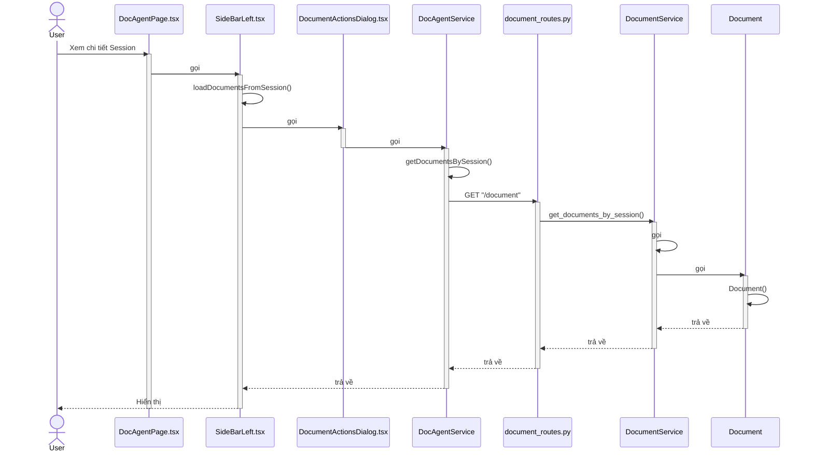
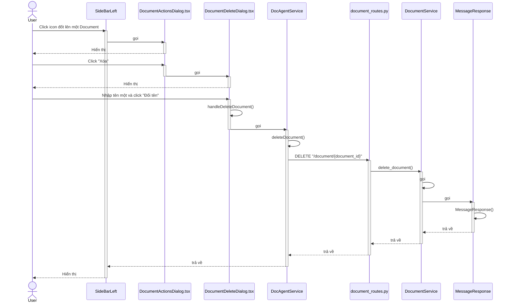
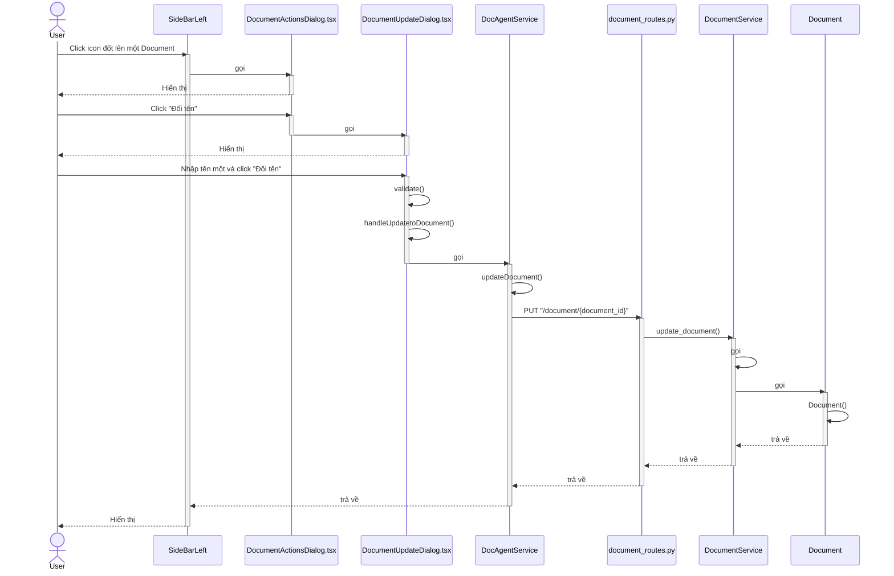
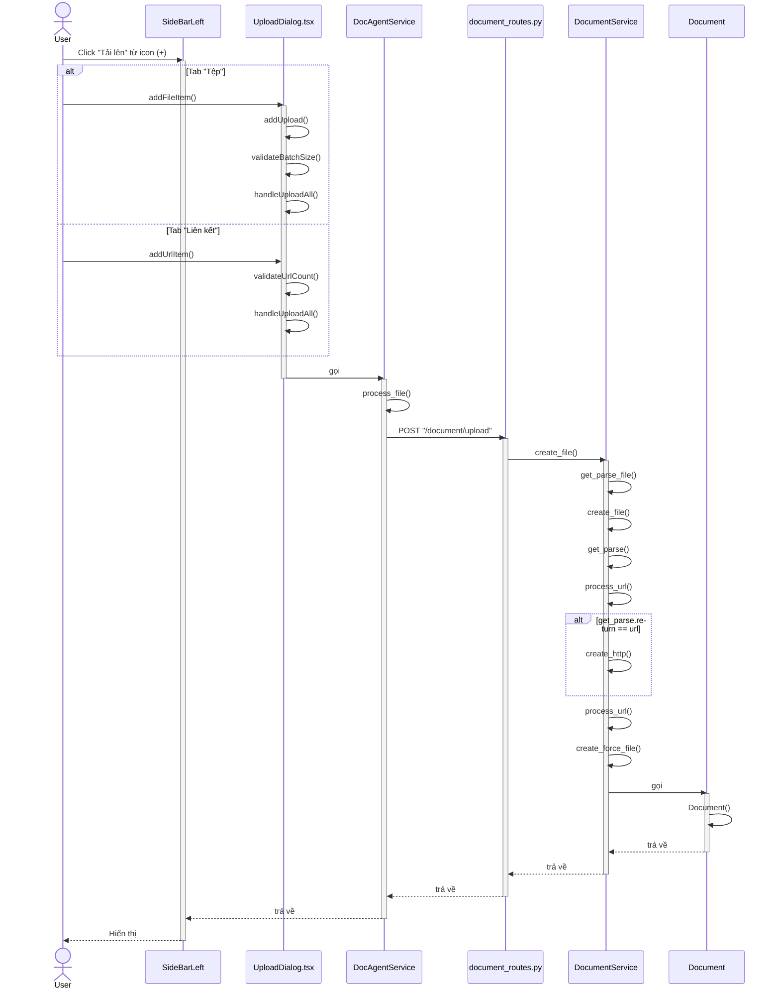

# Sequence Diagram - Quản lý Document

## 1. Xem danh sách Document

```mermaid
sequenceDiagram
    actor User
    participant DocAgentPage as DocAgentPage.tsx
    participant SideBarLeft as SideBarLeft.tsx
    participant DocumentActionsDialog as DocumentActionsDialog.tsx
    participant DocAgentService as DocAgentService
    participant DocumentRoutes as document_routes.py
    participant DocumentService as DocumentService
    participant Document as Document

    User->>DocAgentPage: Xem chi tiết Session
    activate DocAgentPage
    
    DocAgentPage->>SideBarLeft: gọi
    activate SideBarLeft
    
    SideBarLeft->>SideBarLeft: loadDocumentsFromSession()
    SideBarLeft->>DocumentActionsDialog: gọi
    activate DocumentActionsDialog
    
    DocumentActionsDialog->>DocAgentService: gọi
    deactivate DocumentActionsDialog
    activate DocAgentService
    
    DocAgentService->>DocAgentService: getDocumentsBySession()
    DocAgentService->>DocumentRoutes: GET "/document"
    activate DocumentRoutes
    
    DocumentRoutes->>DocumentService: get_documents_by_session()
    activate DocumentService
    
    DocumentService->>DocumentService: gọi
    DocumentService->>Document: gọi
    activate Document
    
    Document->>Document: Document()
    Document-->>DocumentService: trả về
    deactivate Document
    
    DocumentService-->>DocumentRoutes: trả về
    deactivate DocumentService
    
    DocumentRoutes-->>DocAgentService: trả về
    deactivate DocumentRoutes
    
    DocAgentService-->>SideBarLeft: trả về
    deactivate DocAgentService
    
    SideBarLeft-->>User: Hiển thị
    deactivate SideBarLeft
    deactivate DocAgentPage
```

---

## 2. Xóa Document

```mermaid
sequenceDiagram
    actor User
    participant SideBarLeft as SideBarLeft
    participant DocumentActionsDialog as DocumentActionsDialog.tsx
    participant DocumentDeleteDialog as DocumentDeleteDialog.tsx
    participant DocAgentService as DocAgentService
    participant DocumentRoutes as document_routes.py
    participant DocumentService as DocumentService
    participant MessageResponse as MessageResponse

    User->>SideBarLeft: Click icon đốt lên một Document
    activate SideBarLeft
    
    SideBarLeft->>DocumentActionsDialog: gọi
    activate DocumentActionsDialog
    DocumentActionsDialog-->>User: Hiển thị
    deactivate DocumentActionsDialog
    
    User->>DocumentActionsDialog: Click "Xóa"
    activate DocumentActionsDialog
    
    DocumentActionsDialog->>DocumentDeleteDialog: gọi
    deactivate DocumentActionsDialog
    activate DocumentDeleteDialog
    DocumentDeleteDialog-->>User: Hiển thị
    deactivate DocumentDeleteDialog
    
    User->>DocumentDeleteDialog: Nhập tên một và click "Đối tên"
    activate DocumentDeleteDialog
    
    DocumentDeleteDialog->>DocumentDeleteDialog: handleDeleteDocument()
    DocumentDeleteDialog->>DocAgentService: gọi
    deactivate DocumentDeleteDialog
    activate DocAgentService
    
    DocAgentService->>DocAgentService: deleteDocument()
    DocAgentService->>DocumentRoutes: DELETE "/document/{document_id}"
    activate DocumentRoutes
    
    DocumentRoutes->>DocumentService: delete_document()
    activate DocumentService
    
    DocumentService->>DocumentService: gọi
    DocumentService->>MessageResponse: gọi
    activate MessageResponse
    
    MessageResponse->>MessageResponse: MessageResponse()
    MessageResponse-->>DocumentService: trả về
    deactivate MessageResponse
    
    DocumentService-->>DocumentRoutes: trả về
    deactivate DocumentService
    
    DocumentRoutes-->>DocAgentService: trả về
    deactivate DocumentRoutes
    
    DocAgentService-->>SideBarLeft: trả về
    deactivate DocAgentService
    
    SideBarLeft-->>User: Hiển thị
    deactivate SideBarLeft
```

---

## 3. Cập nhật Document

```mermaid
sequenceDiagram
    actor User
    participant SideBarLeft as SideBarLeft
    participant DocumentActionsDialog as DocumentActionsDialog.tsx
    participant DocumentUpdateDialog as DocumentUpdateDialog.tsx
    participant DocAgentService as DocAgentService
    participant DocumentRoutes as document_routes.py
    participant DocumentService as DocumentService
    participant Document as Document

    User->>SideBarLeft: Click icon đốt lên một Document
    activate SideBarLeft
    
    SideBarLeft->>DocumentActionsDialog: gọi
    activate DocumentActionsDialog
    DocumentActionsDialog-->>User: Hiển thị
    deactivate DocumentActionsDialog
    
    User->>DocumentActionsDialog: Click "Đối tên"
    activate DocumentActionsDialog
    
    DocumentActionsDialog->>DocumentUpdateDialog: gọi
    deactivate DocumentActionsDialog
    activate DocumentUpdateDialog
    DocumentUpdateDialog-->>User: Hiển thị
    deactivate DocumentUpdateDialog
    
    User->>DocumentUpdateDialog: Nhập tên một và click "Đối tên"
    activate DocumentUpdateDialog
    
    DocumentUpdateDialog->>DocumentUpdateDialog: validate()
    DocumentUpdateDialog->>DocumentUpdateDialog: handleUpdatetoDocument()
    DocumentUpdateDialog->>DocAgentService: gọi
    deactivate DocumentUpdateDialog
    activate DocAgentService
    
    DocAgentService->>DocAgentService: updateDocument()
    DocAgentService->>DocumentRoutes: PUT "/document/{document_id}"
    activate DocumentRoutes
    
    DocumentRoutes->>DocumentService: update_document()
    activate DocumentService
    
    DocumentService->>DocumentService: gọi
    DocumentService->>Document: gọi
    activate Document
    
    Document->>Document: Document()
    Document-->>DocumentService: trả về
    deactivate Document
    
    DocumentService-->>DocumentRoutes: trả về
    deactivate DocumentService
    
    DocumentRoutes-->>DocAgentService: trả về
    deactivate DocumentRoutes
    
    DocAgentService-->>SideBarLeft: trả về
    deactivate DocAgentService
    
    SideBarLeft-->>User: Hiển thị
    deactivate SideBarLeft
```

---

## 4. Upload Document

```mermaid
sequenceDiagram
    actor User
    participant SideBarLeft as SideBarLeft
    participant UploadDialog as UploadDialog.tsx
    participant DocAgentService as DocAgentService
    participant DocumentRoutes as document_routes.py
    participant DocumentService as DocumentService
    participant Document as Document

    User->>SideBarLeft: Click "Tải lên" từ icon (+)
    activate SideBarLeft
    
    alt Tab "Tệp"
        User->>UploadDialog: addFileItem()
        activate UploadDialog
        UploadDialog->>UploadDialog: addUpload()
        UploadDialog->>UploadDialog: validateBatchSize()
        UploadDialog->>UploadDialog: handleUploadAll()
    else Tab "Liên kết"
        User->>UploadDialog: addUrlItem()
        UploadDialog->>UploadDialog: validateUrlCount()
        UploadDialog->>UploadDialog: handleUploadAll()
    end
    
    UploadDialog->>DocAgentService: gọi
    deactivate UploadDialog
    activate DocAgentService
    
    DocAgentService->>DocAgentService: process_file()
    DocAgentService->>DocumentRoutes: POST "/document/upload"
    activate DocumentRoutes
    
    DocumentRoutes->>DocumentService: create_file()
    activate DocumentService
    
    DocumentService->>DocumentService: get_parse_file()
    DocumentService->>DocumentService: create_file()
    DocumentService->>DocumentService: get_parse()
    DocumentService->>DocumentService: process_url()
    
    alt get_parse.return == url
        DocumentService->>DocumentService: create_http()
    end
    
    DocumentService->>DocumentService: process_url()
    DocumentService->>DocumentService: create_force_file()
    DocumentService->>Document: gọi
    activate Document
    
    Document->>Document: Document()
    Document-->>DocumentService: trả về
    deactivate Document
    
    DocumentService-->>DocumentRoutes: trả về
    deactivate DocumentService
    
    DocumentRoutes-->>DocAgentService: trả về
    deactivate DocumentRoutes
    
    DocAgentService-->>SideBarLeft: trả về
    deactivate DocAgentService
    
    SideBarLeft-->>User: Hiển thị
    deactivate SideBarLeft
```
