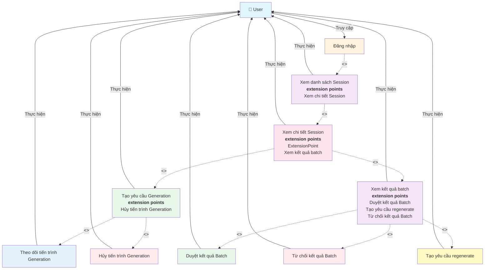

# Use Case Diagram - Generation với Batch

**Ghi chú:**
- Đăng nhập là điều kiện tiên quyết để truy cập hệ thống.
- Xem danh sách Session là bước cần thiết để có thể xem chi tiết Session.
- Xem chi tiết Session có các extension points cho các chức năng generation.
- Tạo yêu cầu Generation bao gồm Theo dõi tiến trình và có extension point Hủy tiến trình.
- Xem kết quả batch có các extension points cho Duyệt, Từ chối và Regenerate.
- User có thể reject và regenerate để cải thiện kết quả.
