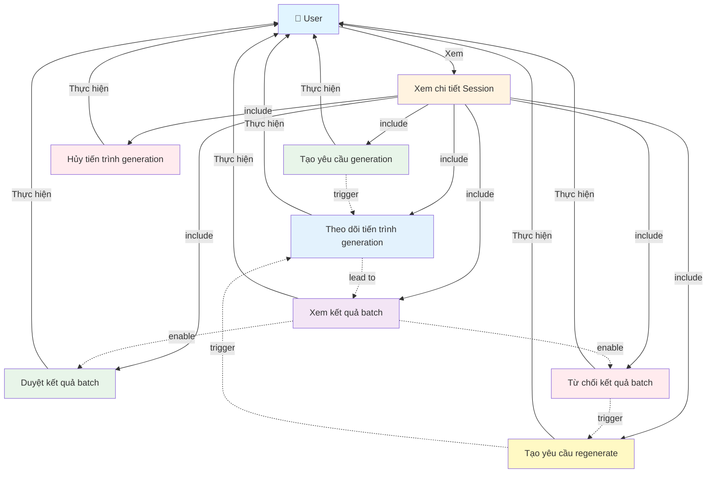

# Use Case Diagram - Generation với Batch

**Ghi chú:**
- Xem chi tiết Session là điều kiện tiên quyết để sử dụng các chức năng generation.
- Các thao tác quản lý generation được thực hiện trong giao diện Generation.
- User có thể reject và regenerate để cải thiện kết quả.
