# Use Case Diagram - Generation với Batch

```mermaid
graph TB
    Actor["👤 User"]
    
    Login["Đăng nhập"]
    ListSessions["Xem danh sách Session"]
    ViewSessionDetail["Xem chi tiết Session"]
    CreateGenRequest["Tạo yêu cầu generation"]
    TrackProgress["Theo dõi tiến trình generation"]
    CancelProcess["Hủy tiến trình generation"]
    ViewBatchResult["Xem kết quả batch"]
    ApproveBatch["Duyệt kết quả batch"]
    RejectBatch["Từ chối kết quả batch"]
    RegenerateRequest["Tạo yêu cầu regenerate"]
    
    Actor -->|Truy cập| Login
    Login -->|include| ListSessions
    ListSessions -->|Thực hiện| Actor
    
    ListSessions -->|include| ViewSessionDetail
    ViewSessionDetail -->|Thực hiện| Actor
    
    ViewSessionDetail -->|include| CreateGenRequest
    CreateGenRequest -->|Thực hiện| Actor
    
    ViewSessionDetail -->|include| TrackProgress
    TrackProgress -->|Thực hiện| Actor
    
    ViewSessionDetail -->|include| CancelProcess
    CancelProcess -->|Thực hiện| Actor
    
    ViewSessionDetail -->|include| ViewBatchResult
    ViewBatchResult -->|Thực hiện| Actor
    
    ViewSessionDetail -->|include| ApproveBatch
    ApproveBatch -->|Thực hiện| Actor
    
    ViewSessionDetail -->|include| RejectBatch
    RejectBatch -->|Thực hiện| Actor
    
    ViewSessionDetail -->|include| RegenerateRequest
    RegenerateRequest -->|Thực hiện| Actor
    
    CreateGenRequest -.->|trigger| TrackProgress
    TrackProgress -.->|lead to| ViewBatchResult
    ViewBatchResult -.->|enable| ApproveBatch
    ViewBatchResult -.->|enable| RejectBatch
    RejectBatch -.->|trigger| RegenerateRequest
    RegenerateRequest -.->|trigger| TrackProgress
    
    style Actor fill:#e1f5ff
    style Login fill:#fff3e0
    style ListSessions fill:#f3e5f5
    style ViewSessionDetail fill:#fce4ec
    style CreateGenRequest fill:#e8f5e9
    style TrackProgress fill:#e3f2fd
    style CancelProcess fill:#ffebee
    style ViewBatchResult fill:#f3e5f5
    style ApproveBatch fill:#e8f5e9
    style RejectBatch fill:#ffebee
    style RegenerateRequest fill:#fff9c4
```

**Ghi chú:**
- Đăng nhập là điều kiện tiên quyết để truy cập hệ thống.
- Xem danh sách Session là bước cần thiết để có thể xem chi tiết Session.
- Xem chi tiết Session là điều kiện tiên quyết để sử dụng các chức năng generation.
- Các thao tác quản lý generation được thực hiện trong giao diện Generation.
- User có thể reject và regenerate để cải thiện kết quả.
