# Class Diagram - Generation với Batch

```mermaid
classDiagram
    class User {
        - id: UUID
        - username: String
        - email: String
        - phone: String
        - birthDay: LocalDate
        - firstName: String
        - lastName: String
        - avatar: String
        - userCode: String
        - userPrefix: String
        - isPremium: Boolean
        - providers: List~UserIdentity~
        + getId(): UUID
        + getRoles(): Set~Role~
    }

    class Role {
        - name: RoleType
        - users: List~User~
        + getName(): RoleType
    }

    class RoleType {
        <<enumeration>>
        STUDENT
        LECTURER
        ADMIN
    }

    class Session {
        - id: UUID
        - name: String
        - description: String | null
        - created_at: DateTime
        - updated_at: DateTime
        + getId(): UUID
    }

    class Document {
        - id: UUID
        - session_id: UUID
        - name: String
        - upload_time: DateTime
        - file_path: String | null
        - file_size: Integer | null
        + getId(): UUID
    }

    class GenerationProcess {
        - id: UUID
        - session_id: UUID
        - user_id: UUID
        - result_type: ResultType
        - status: ProcessStatus
        - current_step_id: UUID | null
        - process_order: Integer
        - topic: String | null
        - result_requested_count: Integer
        - created_at: DateTime
        - updated_at: DateTime
        + getId(): UUID
        + getStatus(): ProcessStatus
        + getResultType(): ResultType
    }

    class GenerationProcessStep {
        - id: UUID
        - process_id: UUID
        - step_name: StepName
        - status: StepStatus
        - step_order: Integer
        - started_at: DateTime | null
        - finished_at: DateTime | null
        - metadata: Dict | null
        + getId(): UUID
        + getStatus(): StepStatus
    }

    class GenerationBatch {
        - id: UUID
        - process_id: UUID
        - parent_batch_id: UUID | null
        - batch_order: Integer
        - status: BatchStatus
        - result_type: ResultType
        - total_items: Integer
        - approved_items_count: Integer
        - rejected_items_count: Integer
        - created_at: DateTime
        - updated_at: DateTime
        + getId(): UUID
        + getStatus(): BatchStatus
    }

    class BatchItem {
        - id: UUID
        - batch_id: UUID
        - result_id: UUID
        - result_type: ResultType
        - status: BatchStatus
        - item_order: Integer
        - created_at: DateTime
        + getId(): UUID
        + getStatus(): BatchStatus
    }

    class BatchFeedback {
        - id: UUID
        - batch_id: UUID
        - item_id: UUID | null
        - feedback_type: FeedbackType
        - feedback_text: String | null
        - created_at: DateTime
        + getId(): UUID
    }

    class Question {
        - id: UUID
        - session_id: UUID
        - content: String
        - type: QuestionType
        - cognitive_level: CognitiveLevel
        - correct_answers: String
        - explanation: String | null
        + getId(): UUID
    }

    class Flashcard {
        - id: UUID
        - session_id: UUID
        - question: String
        - answer: String
        - type: FlashcardType
        - explanation: String | null
        + getId(): UUID
    }

    class ModelConfig {
        - id: UUID
        - name: String
        - model_type: ModelType
        - wrapper_id: UUID | null
        - is_active: Boolean
        + getId(): UUID
    }

    class ModelUsage {
        - id: UUID
        - process_id: UUID
        - model_config_id: UUID
        - tokens_used: Integer
        - created_at: DateTime
        + getId(): UUID
    }

    class QuestionGenDialog {
        - selectedDocumentIds: String[]
        - questionCount: Integer
        - flashcardCount: Integer
        - topic: String
        - showAdvanced: Boolean
        - selectedCognitiveLevels: CognitiveLevelEnum[]
        - selectedQuestionTypes: QuestionTypeEnum[]
        - selectedFlashcardTypes: FlashcardTypeEnum[]
        + handleGenerate()
        + handleDocumentToggle()
        + handleSelectAll()
    }

    class LiveProgress {
        - steps: GenerationProcessStep[]
        - currentStepId: String | null
        - expandedSteps: Set~String~
        + toggleStepDetails()
        + handleCancelProcess()
    }

    class QuestionApprovalTab {
        - batchId: String | null
        - batchItems: BatchItem[]
        - questions: Question[]
        - selectedItemIds: Set~String~
        - feedbackText: String
        - editingId: String | null
        - currentIndex: Integer
        - layout: 'single' | 'list'
        + loadBatchDetail()
        + handleApprove()
        + handleReject()
        + handleRegenerate()
        + handleItemToggle()
        + handleSelectAll()
    }

    class FlashcardApprovalTab {
        - batchId: String | null
        - batchItems: BatchItem[]
        - flashcards: Flashcard[]
        - selectedItemIds: Set~String~
        - feedbackText: String
        - editingId: String | null
        - currentIndex: Integer
        - layout: 'single' | 'list'
        + loadBatchDetail()
        + handleApprove()
        + handleReject()
        + handleRegenerate()
        + handleItemToggle()
        + handleSelectAll()
    }

    class DocAgentService {
        + getUserGenerationProcess(userId, resultType): ServiceResult~GenerationProcess~
        + batchGenerate(request): ServiceResult~BatchGenerateResponse~
        + cancelProcess(processId, userId): ServiceResult~MessageResponse~
        + getBatchDetail(batchId): ServiceResult~GenerationBatch~
        + getBatchItems(batchId): ServiceResult~BatchItem[]~
        + getPendingBatch(userId, sessionId, resultType): ServiceResult~GenerationBatch~
        + approve(request): ServiceResult~MessageResponse~
        + reject(request): ServiceResult~MessageResponse~
        + regenerate(request): ServiceResult~GenerationBatch~
    }

    class DocSocketService {
        + connectQuestionSocket(processId, userId, handlers, opts): WebSocket
        + connectFlashcardSocket(processId, userId, handlers, opts): WebSocket
        + sendStart(ws, userId): void
        + sendResume(ws, userId): void
        + sendPing(ws): void
    }

    class QuestionGenerationService {
        - model_config: ModelConfig
        - embedding_model_config: ModelConfig
        + generate(process, db): void
        + regenerate(process, batch, db): void
        + _validate_item(item): Boolean
        + _get_template(): String
    }

    class FlashcardGenerationService {
        - model_config: ModelConfig
        - embedding_model_config: ModelConfig
        + generate(process, db): void
        + regenerate(process, batch, db): void
        + _validate_item(item): Boolean
        + _get_template(): String
    }

    class GenerationPipelineService {
        <<abstract>>
        - model_config: ModelConfig
        - embedding_model_config: ModelConfig
        + execute_pipeline(process, db): void
        + _step_retrieve_context(process, db): Dict
        + _step_generate_content(process, context, db): List
        + _step_validate_results(process, results, db): List
        + _step_save_batch(process, results, db): GenerationBatch
        # _get_result_type(): ResultType
        # _validate_item(item): Boolean
        # _get_template(): String
    }

    class GenerationProcessService {
        + get_process(db, processId): GenerationProcess
        + get_user_generation_process(db, userId, resultType): GenerationProcess
        + cancel_process(db, processId, userId): Dict
    }

    class BatchService {
        + create_batch(db, processId, resultType, batchOrder, parentBatchId): GenerationBatch
        + update_batch_status(db, batchId, status, approvedCount, rejectedCount): void
        + bulk_update_batch_item_statuses(db, itemIds, status): Integer
        + get_batch_detail(db, batchId): GenerationBatch
        + get_batch_items_by_batch(db, batchId): List~BatchItem~
        + get_pending_batch(db, userId, sessionId, resultType): GenerationBatch
        + approve_batch(db, request): MessageResponse
        + reject_batch(db, request): MessageResponse
    }

    class BulkOperationsService {
        + bulk_insert_questions(db, questionsData): Integer
        + bulk_insert_flashcards(db, flashcardsData): Integer
        + bulk_insert_batch_items(db, batchId, resultIds, resultType): Integer
    }

    class WSGenerationManager {
        - connections: Dict~String, List~WebSocket~~
        - pipeline_running: Dict~String, Boolean~
        + connect(processId, websocket): void
        + disconnect(processId, websocket): void
        + broadcast(envelope): void
        + send_snapshot(service, process): void
        + send_state(processId, currentStep, processStep): void
        + send_notify(processId, code, message, meta): void
        + is_pipeline_running(processId): Boolean
        + mark_pipeline_running(processId, running): Boolean
    }

    class WsEnvelope {
        - event: WsEvent
        - process_id: String
        - payload: WsSnapshotPayload | WsStatePayload | WsNotifyPayload
    }

    class WsSnapshotPayload {
        - process: Dict
        - process_steps: List~Dict~
    }

    class WsStatePayload {
        - process_id: String
        - current_step: String | null
        - process_step: Dict | null
    }

    class WsNotifyPayload {
        - process_id: String
        - code: String | null
        - message: String | null
        - meta: Dict | null
    }

    class GenRequest {
        - topic: String
        - document_ids: List~String~
        - session_id: String | null
        - user_id: String | null
        - result_requested_count: Integer
    }

    class QuestionGenRequest {
        <<extends GenRequest>>
        - cognitive_level: List~CognitiveLevel~
        - question_type: List~QuestionType~
    }

    class FlashcardGenRequest {
        <<extends GenRequest>>
        - flashcard_type: List~FlashcardType~
    }

    class BatchGenerateResponse {
        - questions_generated: Integer
        - flashcards_generated: Integer
        - question_process_id: UUID | null
        - flashcard_process_id: UUID | null
    }

    class BatchApprovalRequest {
        - batch_id: UUID
        - selected_item_ids: List~UUID~
        - user_id: UUID
    }

    class BatchRejectionRequest {
        - batch_id: UUID
        - selected_item_ids: List~UUID~
        - feedback: String | null
        - user_id: UUID
    }

    class BatchRegenerationRequest {
        - batch_id: UUID
        - user_id: UUID
    }

    class ResultType {
        <<enumeration>>
        QUESTION
        FLASHCARD
    }

    class ProcessStatus {
        <<enumeration>>
        PENDING
        RUNNING
        COMPLETED
        FAILED
        CANCELLED
    }

    class StepStatus {
        <<enumeration>>
        PENDING
        RUNNING
        COMPLETED
        FAILED
        SKIPPED
    }

    class BatchStatus {
        <<enumeration>>
        PENDING
        APPROVED
        REJECTED
        PARTIAL
    }

    class FeedbackType {
        <<enumeration>>
        REJECTION
        IMPROVEMENT
        OTHER
    }

    %% Relationships
    User "*" -- "*" Role : has
    Role "*" -- "1" RoleType : has_type
    User "1" -- "*" GenerationProcess : creates
    Session "1" -- "*" GenerationProcess : has
    Session "1" -- "*" Document : contains
    Session "1" -- "*" Question : has
    Session "1" -- "*" Flashcard : has
    
    GenerationProcess "1" -- "*" GenerationProcessStep : has
    GenerationProcess "1" -- "*" GenerationBatch : produces
    GenerationProcess "*" -- "1" ResultType : has_type
    GenerationProcess "*" -- "1" ProcessStatus : has_status
    
    GenerationProcessStep "*" -- "1" StepStatus : has_status
    
    GenerationBatch "1" -- "*" BatchItem : contains
    GenerationBatch "*" -- "1" BatchStatus : has_status
    GenerationBatch "*" -- "1" ResultType : has_type
    GenerationBatch "0..1" -- "*" GenerationBatch : parent_child
    GenerationBatch "1" -- "*" BatchFeedback : has_feedback
    
    BatchItem "*" -- "1" BatchStatus : has_status
    BatchItem "*" -- "1" Question : references
    BatchItem "*" -- "1" Flashcard : references
    
    BatchFeedback "*" -- "1" FeedbackType : has_type
    
    ModelConfig "1" -- "*" GenerationProcess : used_by
    ModelConfig "1" -- "*" ModelUsage : tracked_by
    
    GenerationProcess "1" -- "*" ModelUsage : tracks
    
    QuestionGenDialog --> DocAgentService : uses
    QuestionGenDialog --> Document : selects
    
    LiveProgress --> GenerationProcessStep : displays
    LiveProgress --> DocAgentService : uses_for_cancel
    
    QuestionApprovalTab --> BatchItem : displays
    QuestionApprovalTab --> Question : shows
    QuestionApprovalTab --> DocAgentService : uses
    
    FlashcardApprovalTab --> BatchItem : displays
    FlashcardApprovalTab --> Flashcard : shows
    FlashcardApprovalTab --> DocAgentService : uses
    
    DocAgentService --> GenRequest : sends
    DocAgentService --> QuestionGenRequest : sends
    DocAgentService --> FlashcardGenRequest : sends
    DocAgentService --> BatchApprovalRequest : sends
    DocAgentService --> BatchRejectionRequest : sends
    DocAgentService --> BatchRegenerationRequest : sends
    DocAgentService --> BatchGenerateResponse : receives
    
    DocSocketService --> WsEnvelope : receives
    DocSocketService --> WsSnapshotPayload : handles
    DocSocketService --> WsStatePayload : handles
    DocSocketService --> WsNotifyPayload : handles
    
    QuestionGenerationService --|> GenerationPipelineService : extends
    FlashcardGenerationService --|> GenerationPipelineService : extends
    
    GenerationPipelineService --> GenerationProcess : executes
    GenerationPipelineService --> GenerationBatch : creates
    GenerationPipelineService --> ModelConfig : uses
    
    GenerationProcessService --> GenerationProcess : manages
    
    BatchService --> GenerationBatch : manages
    BatchService --> BatchItem : manages
    BatchService --> BatchFeedback : manages
    
    BulkOperationsService --> Question : creates_bulk
    BulkOperationsService --> Flashcard : creates_bulk
    BulkOperationsService --> BatchItem : creates_bulk
    
    WSGenerationManager --> WsEnvelope : broadcasts
    WSGenerationManager --> GenerationProcess : monitors
    WSGenerationManager --> GenerationProcessStep : monitors
```

**Mô tả quan hệ:**
- **User & Role & RoleType**: User có thể có nhiều Role (STUDENT, LECTURER, ADMIN), được định danh bởi RoleType enum.
- **User**: Đại diện cho người dùng của hệ thống, tạo các generation process.
- **Session**: Đại diện cho một session học tập, chứa documents, questions, flashcards và generation processes.
- **Document**: Tài liệu nguồn được sử dụng để generation.
- **GenerationProcess**: Đại diện cho một tiến trình generation, có result_type (question/flashcard) và status.
- **GenerationProcessStep**: Các bước trong pipeline generation (retrieve_context, generate_content, validate_results, save_batch).
- **GenerationBatch**: Kết quả generation được lưu trong batch, chứa nhiều BatchItem.
- **BatchItem**: Một item trong batch, tham chiếu tới Question hoặc Flashcard.
- **BatchFeedback**: Feedback từ user khi reject items, dùng để cải thiện regeneration.
- **Question & Flashcard**: Kết quả cuối cùng sau khi approve từ batch.
- **ModelConfig & ModelUsage**: Quản lý model AI sử dụng và tracking usage.
- **QuestionGenDialog** (Frontend): Dialog để tạo yêu cầu generation.
- **LiveProgress** (Frontend): Component hiển thị real-time progress qua WebSocket.
- **QuestionApprovalTab & FlashcardApprovalTab** (Frontend): Tab để approve/reject batch items.
- **DocAgentService** (Frontend): Service xử lý API calls liên quan đến generation và batch.
- **DocSocketService** (Frontend): Service quản lý WebSocket connections.
- **QuestionGenerationService & FlashcardGenerationService** (Backend): Service thực hiện generation pipeline.
- **GenerationPipelineService** (Backend): Abstract service định nghĩa pipeline generation.
- **GenerationProcessService** (Backend): Service quản lý generation processes.
- **BatchService** (Backend): Service quản lý batches và batch items.
- **BulkOperationsService** (Backend): Service thực hiện bulk insert operations.
- **WSGenerationManager** (Backend): Manager quản lý WebSocket connections và broadcast events.
- **WsEnvelope & Payloads**: Schema cho WebSocket messages.
- **GenRequest & subclasses**: Request schemas cho generation API.
- **BatchApprovalRequest, BatchRejectionRequest, BatchRegenerationRequest**: Request schemas cho batch operations.
