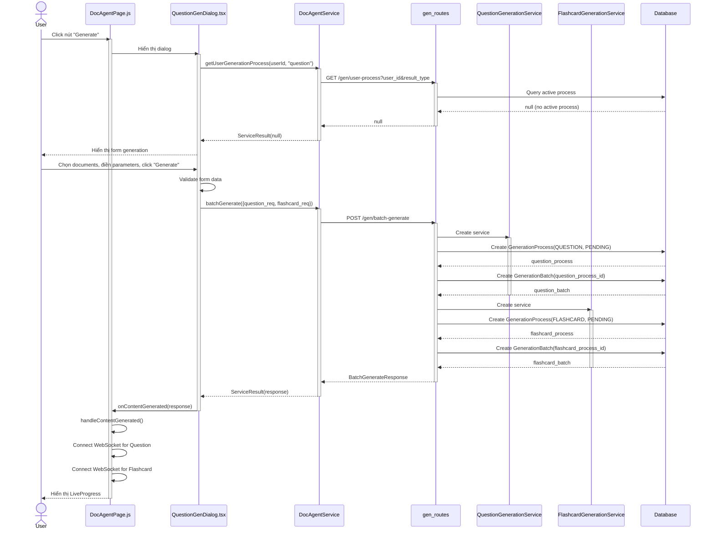
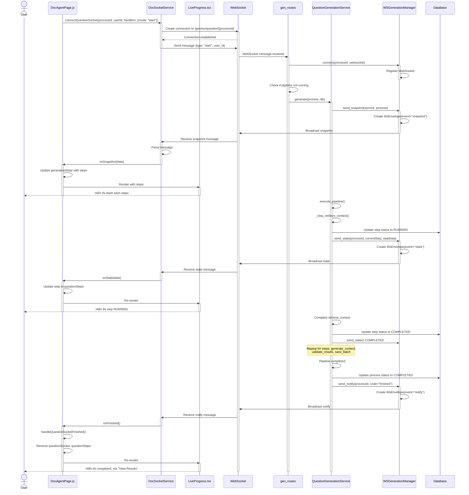
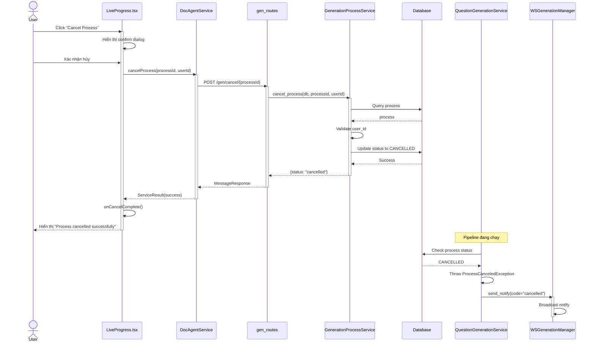
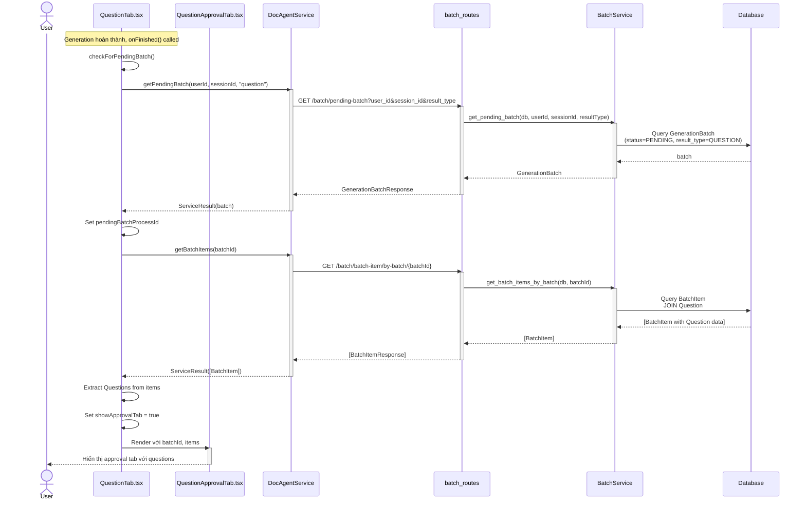
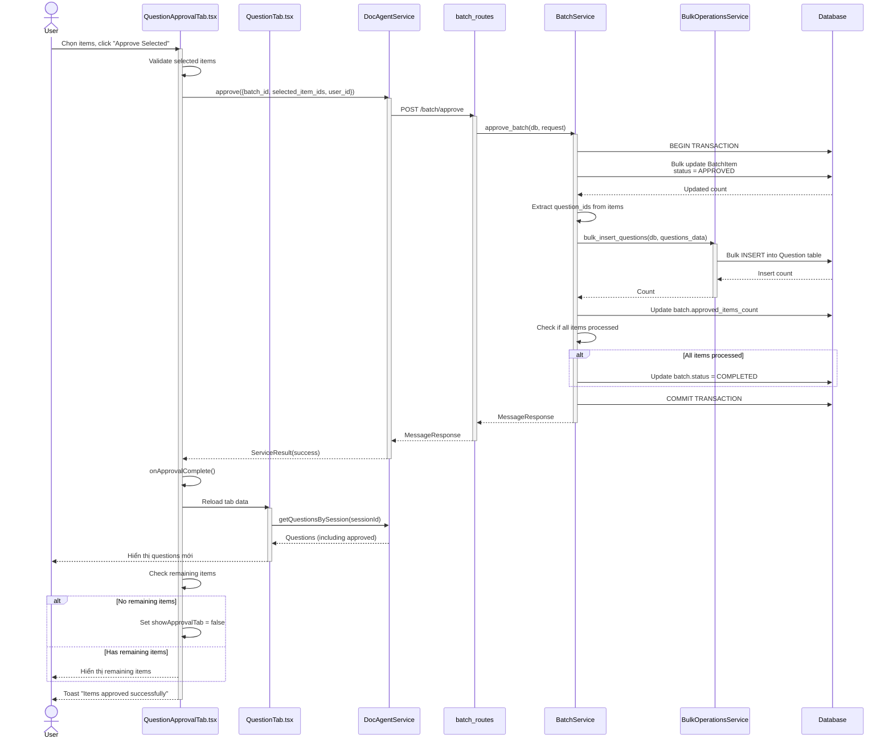
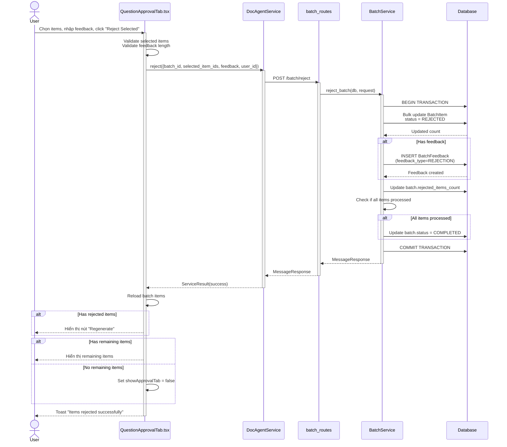
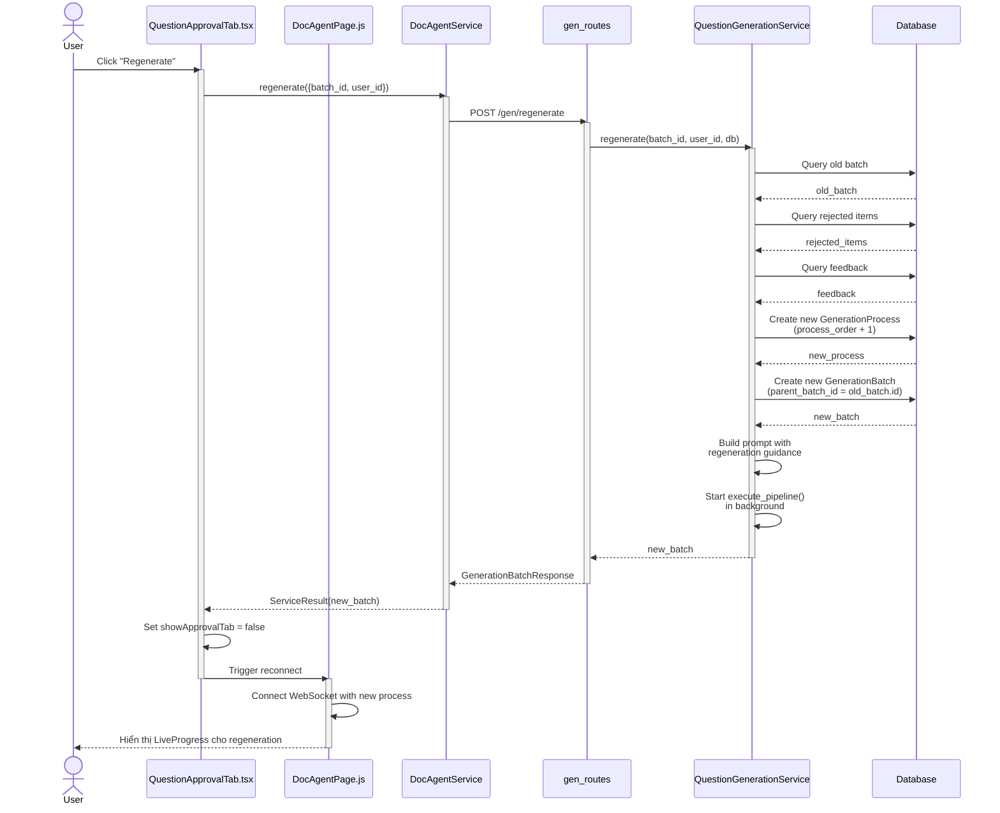
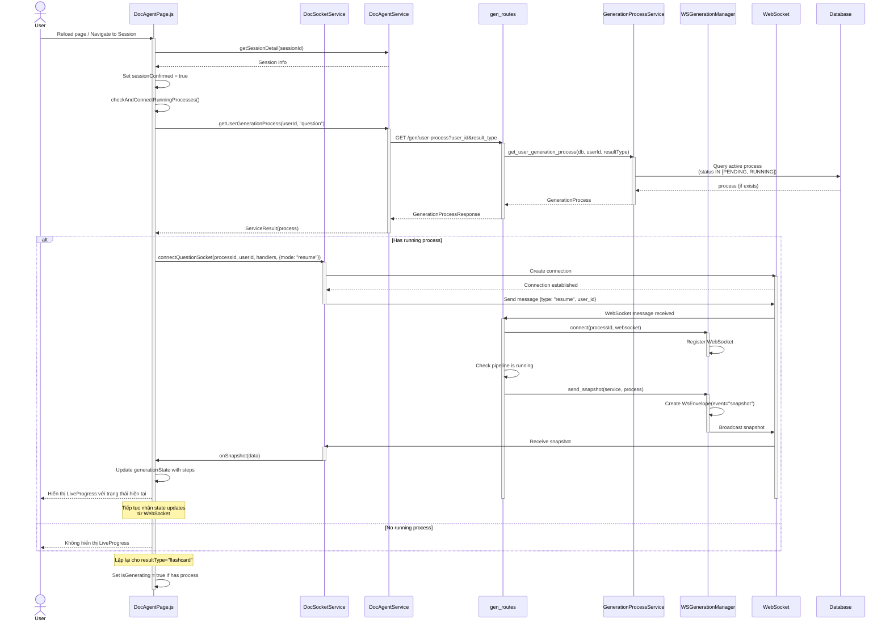

# Sequence Diagram - Generation với Batch

## 1. Tạo yêu cầu generation

---

## 2. Theo dõi tiến trình generation qua WebSocket

---

## 3. Hủy tiến trình generation

---

## 4. Xem kết quả batch

---

## 5. Duyệt kết quả batch

---

## 6. Từ chối kết quả batch

---

## 7. Tạo yêu cầu regenerate

---

## 8. Kết nối lại với tiến trình đang chạy

