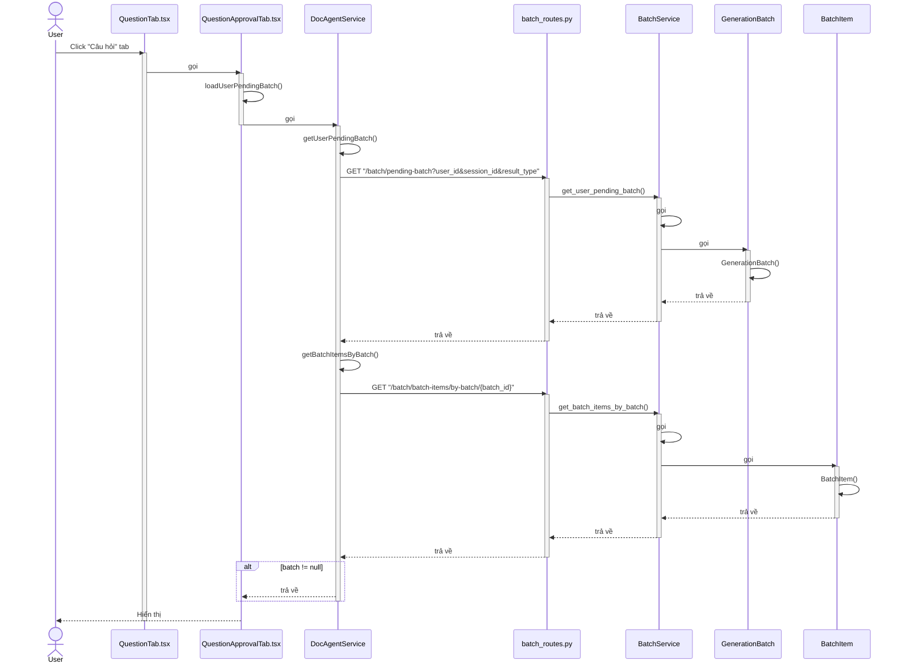
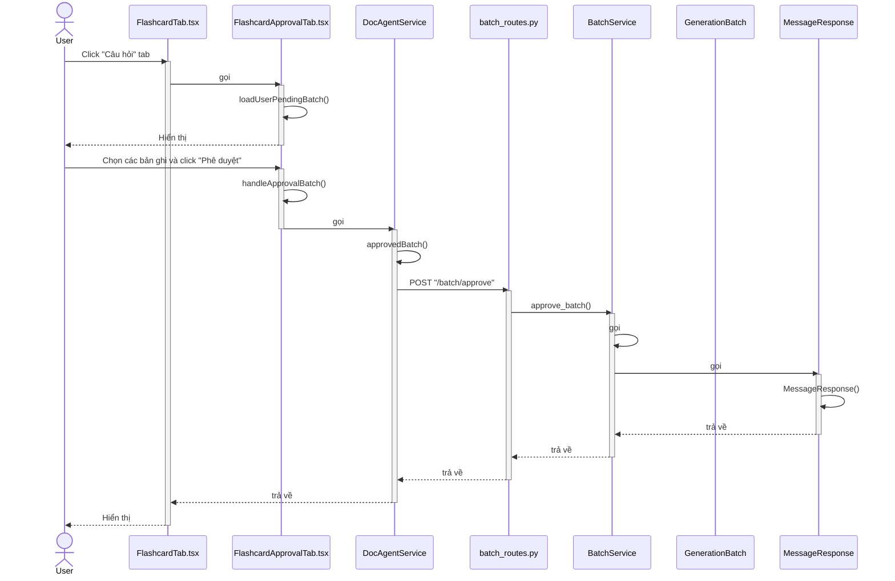
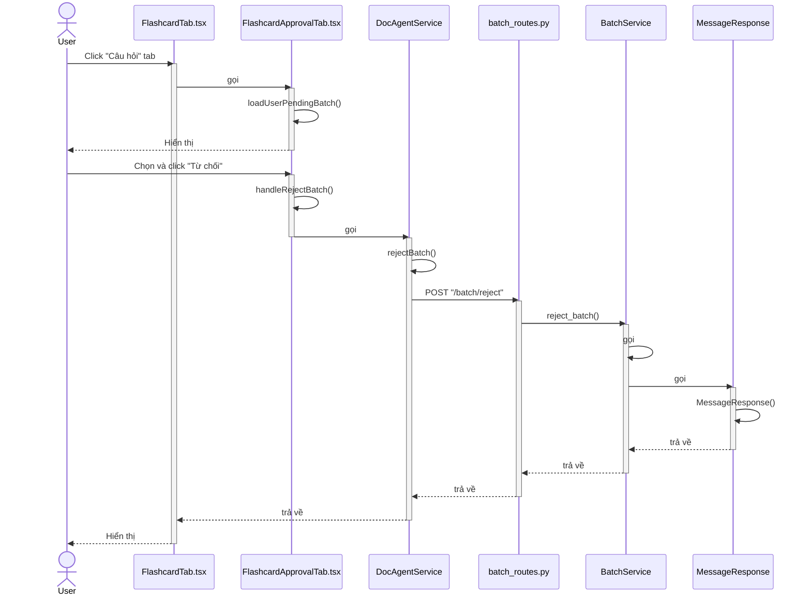
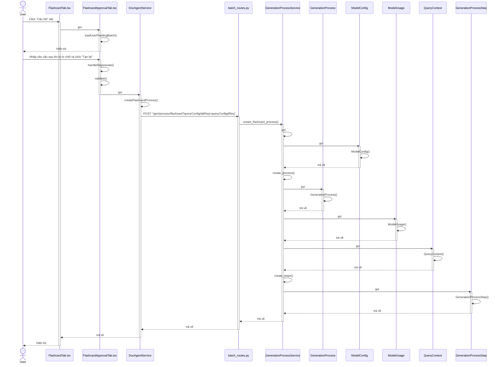
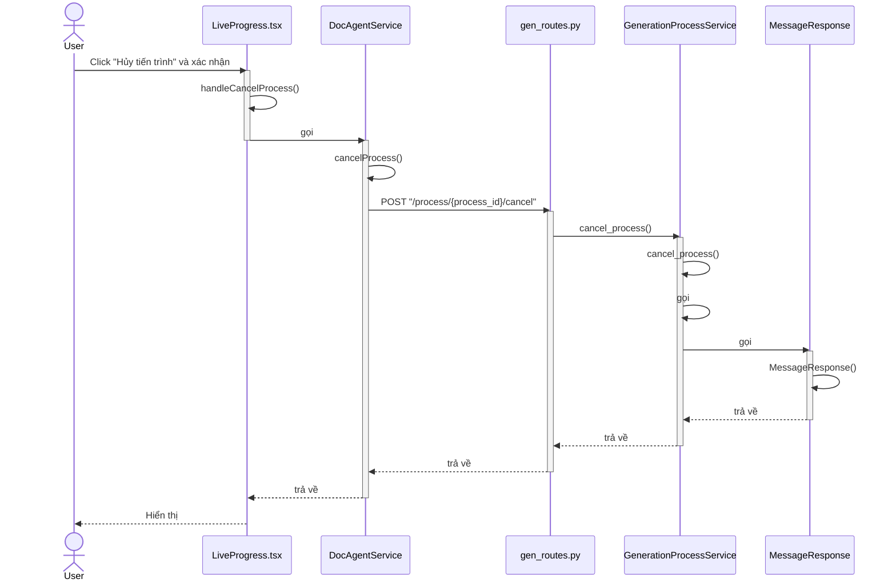
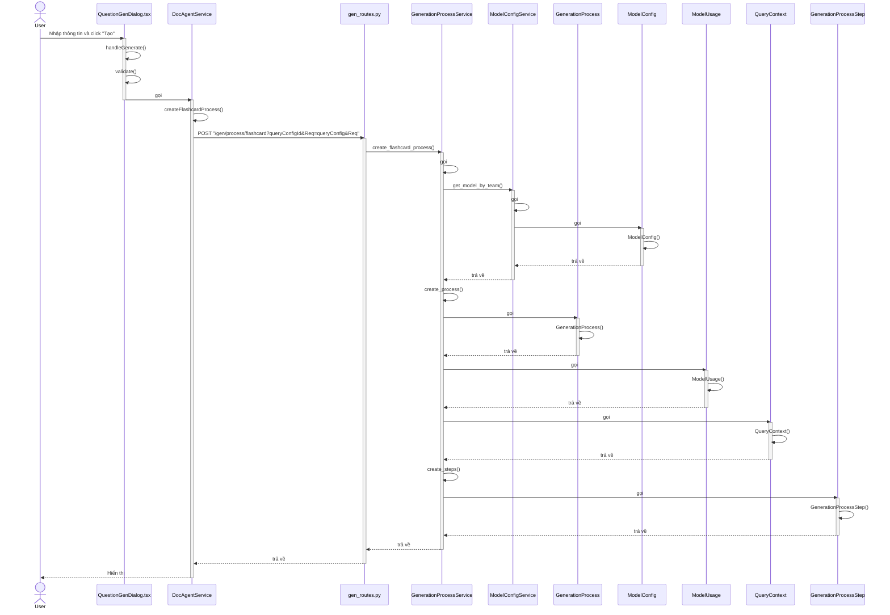
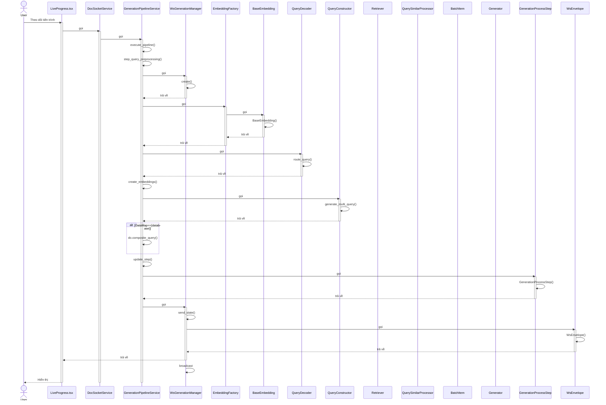
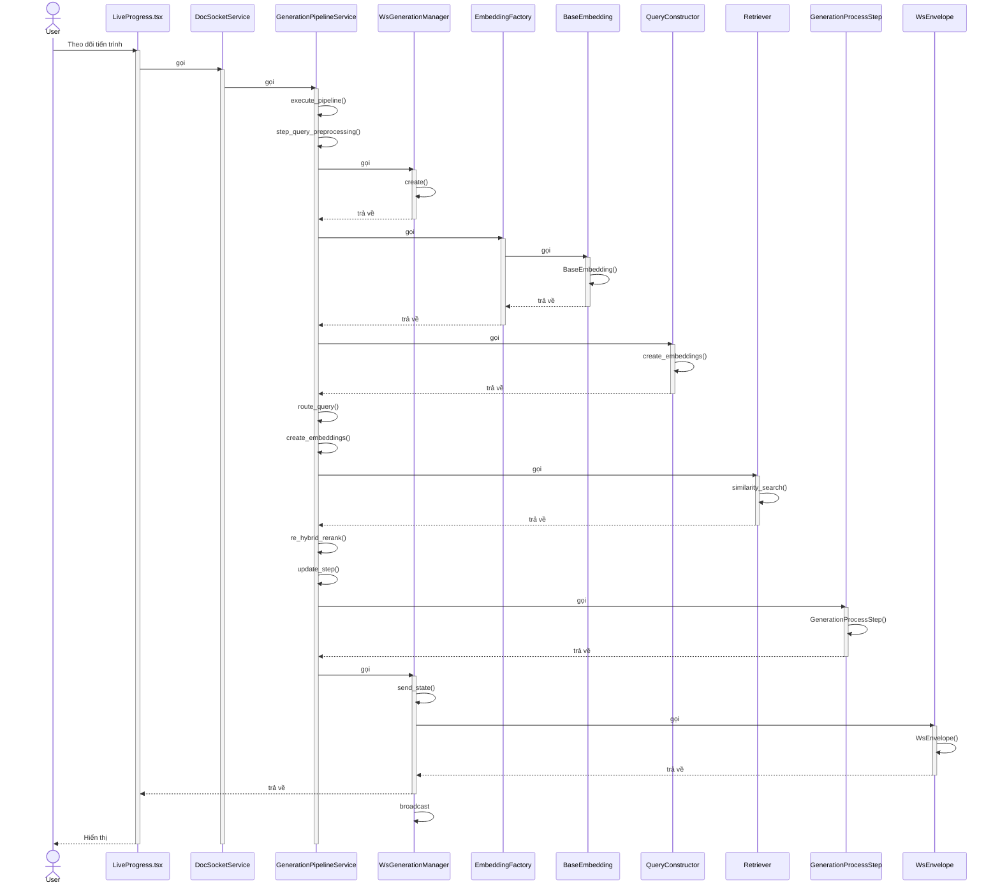
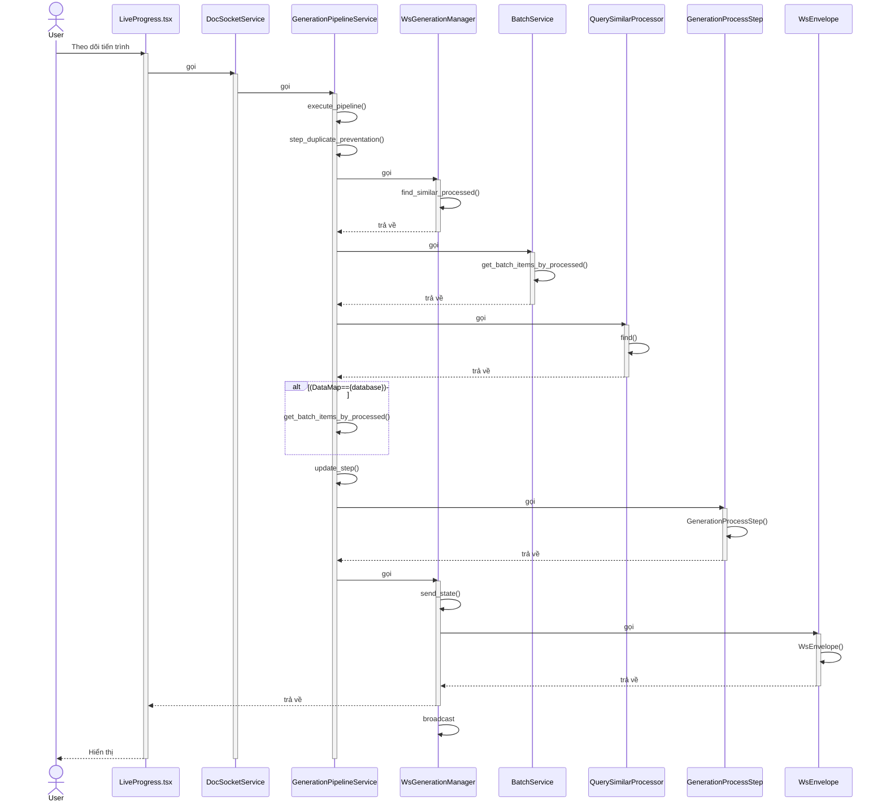
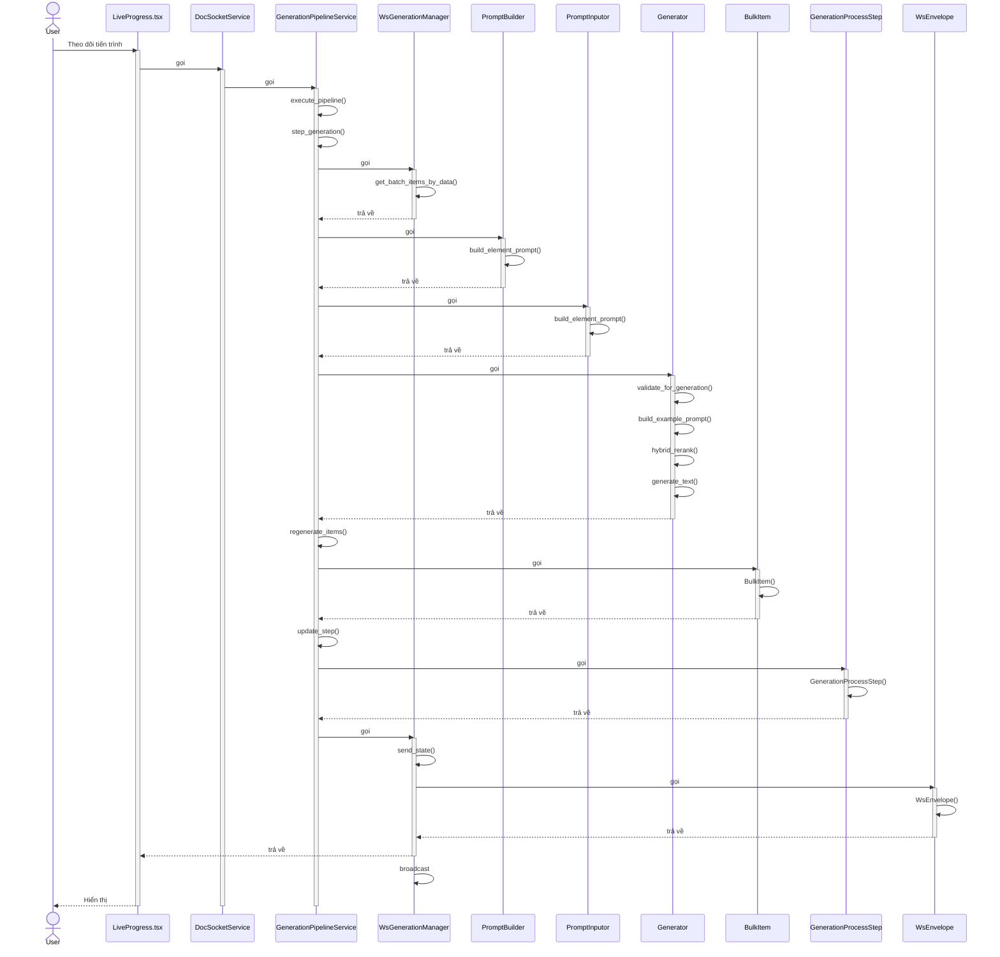

# Sequence Diagram - Generation với Batch

## 1. Xem kết quả Batch

---

## 2. Duyệt kết quả Batch

---

## 3. Từ chối kết quả Batch

---

## 4. Tạo yêu cầu regenerate

---

## 5. Hủy tiến trình Generation

---

## 6. Tạo yêu cầu Generation

---

## 7. Theo dõi tiến trình Generation - Khởi tạo

---

## 8. Theo dõi tiến trình Generation - Retrieval

---

## 9. Theo dõi tiến trình Generation - Duplicate Prevention

---

## 10. Theo dõi tiến trình Generation - Generation

