# Sequence Diagram - Generation với Batch

## 1. Tạo yêu cầu generation

```mermaid
sequenceDiagram
    actor User
    participant DocAgentPage as DocAgentPage.js
    participant QuestionGenDialog as QuestionGenDialog.tsx
    participant DocAgentService as DocAgentService
    participant GenRoutes as gen_routes
    participant GenProcessService as GenerationProcessService
    participant QuestionGenService as QuestionGenerationService
    participant FlashcardGenService as FlashcardGenerationService
    participant DB as Database

    User->>DocAgentPage: Click nút "Generate"
    activate DocAgentPage
    DocAgentPage->>QuestionGenDialog: Hiển thị dialog
    activate QuestionGenDialog
    
    QuestionGenDialog->>DocAgentService: getUserGenerationProcess()
    activate DocAgentService
    DocAgentService->>GenRoutes: GET /gen/process/running?user_id&type
    activate GenRoutes
    GenRoutes->>GenProcessService: get_user_generation_process()
    activate GenProcessService
    GenProcessService->>DB: Query active GenerationProcess
    activate DB
    Note over DB: Filter: user_id, result_type, finished_at IS NULL,<br/>canceled_at IS NULL, status IS NULL,<br/>no FAILED steps
    DB-->>GenProcessService: null (no active process)
    deactivate DB
    GenProcessService-->>GenRoutes: null
    deactivate GenProcessService
    GenRoutes-->>DocAgentService: null
    deactivate GenRoutes
    DocAgentService-->>QuestionGenDialog: ServiceResult(null)
    deactivate DocAgentService
    
    QuestionGenDialog-->>User: Hiển thị form generation
    
    User->>QuestionGenDialog: Chọn documents, điền parameters, click "Generate"
    QuestionGenDialog->>QuestionGenDialog: Validate form data
    
    QuestionGenDialog->>DocAgentService: batchGenerate()
    activate DocAgentService
    DocAgentService->>GenRoutes: POST /gen/process/question
    activate GenRoutes
    
    GenRoutes->>QuestionGenService: Create service instance
    activate QuestionGenService
    QuestionGenService->>GenProcessService: _validate_no_active_process()
    activate GenProcessService
    GenProcessService->>DB: Query active process for user
    activate DB
    DB-->>GenProcessService: null (no conflict)
    deactivate DB
    GenProcessService-->>QuestionGenService: validation passed
    deactivate GenProcessService
    
    QuestionGenService->>DB: Create GenerationProcess(QUESTION, PENDING)
    activate DB
    DB-->>QuestionGenService: question_process
    deactivate DB
    
    QuestionGenService->>DB: Create GenerationBatch(question_process_id)
    activate DB
    DB-->>QuestionGenService: question_batch
    deactivate DB
    QuestionGenService-->>GenRoutes: question_process
    deactivate QuestionGenService
    
    GenRoutes-->>DocAgentService: GenerationProcessResponse
    deactivate GenRoutes
    
    DocAgentService->>GenRoutes: POST /gen/process/flashcard
    activate GenRoutes
    
    GenRoutes->>FlashcardGenService: Create service instance
    activate FlashcardGenService
    FlashcardGenService->>GenProcessService: _validate_no_active_process()
    activate GenProcessService
    GenProcessService->>DB: Query active process for user
    activate DB
    DB-->>GenProcessService: null (no conflict)
    deactivate DB
    GenProcessService-->>FlashcardGenService: validation passed
    deactivate GenProcessService
    
    FlashcardGenService->>DB: Create GenerationProcess(FLASHCARD, PENDING)
    activate DB
    DB-->>FlashcardGenService: flashcard_process
    deactivate DB
    
    FlashcardGenService->>DB: Create GenerationBatch(flashcard_process_id)
    activate DB
    DB-->>FlashcardGenService: flashcard_batch
    deactivate DB
    FlashcardGenService-->>GenRoutes: flashcard_process
    deactivate FlashcardGenService
    
    GenRoutes-->>DocAgentService: GenerationProcessResponse
    deactivate GenRoutes
    
    DocAgentService-->>QuestionGenDialog: ServiceResult(BatchGenerateResponse)
    deactivate DocAgentService
    
    QuestionGenDialog->>DocAgentPage: onContentGenerated()
    deactivate QuestionGenDialog
    
    DocAgentPage->>DocAgentPage: handleContentGenerated()
    DocAgentPage->>DocAgentPage: Connect WebSocket for Question
    DocAgentPage->>DocAgentPage: Connect WebSocket for Flashcard
    DocAgentPage-->>User: Hiển thị LiveProgress
    deactivate DocAgentPage
```

---

## 2. Theo dõi tiến trình generation qua WebSocket

### 2.1. Khởi tạo pipeline

### 2.2. Step 1: Query Processing

### 2.3. Step 2: Retrieval

### 2.4. Step 3: Duplicate Prevention

### 2.5. Step 4: Generation

### 2.6. Hoàn thành pipeline

---

## 3. Hủy tiến trình generation

---

## 4. Xem kết quả batch

---

## 5. Duyệt kết quả batch

---

## 6. Từ chối kết quả batch

---

## 7. Tạo yêu cầu regenerate

