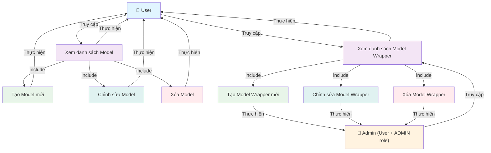

# Use Case Diagram - Cấu hình Model

**Ghi chú:**
- **User** có thể thực hiện các thao tác:
  - Xem, Tạo, Chỉnh sửa, Xóa Model của mình
  - Xem danh sách Model Wrapper
- **Admin** (User có role ADMIN) có thể thực hiện:
  - Tất cả quyền của User
  - Tạo, Chỉnh sửa, Xóa Model Wrapper
