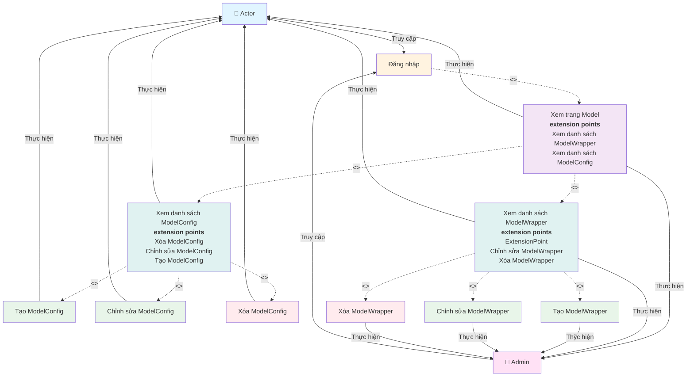

# Use Case Diagram - Quản lý ModelConfig và ModelWrapper

**Ghi chú:**
- Đăng nhập là điều kiện tiên quyết để truy cập hệ thống.
- Xem trang Model có các extension points cho phép xem danh sách ModelConfig và ModelWrapper.
- Xem danh sách là bước đầu tiên trước khi thực hiện các thao tác quản lý.
- Các thao tác với Wrapper (tạo, chỉnh sửa, xóa) chỉ dành cho Admin.
