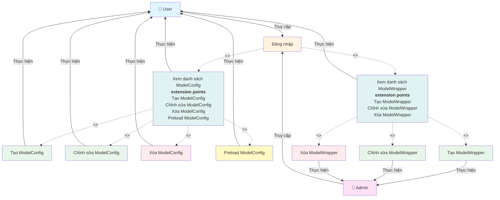

# Use Case Diagram - Quản lý ModelConfig và ModelWrapper

**Ghi chú:**
- Đăng nhập là điều kiện tiên quyết để truy cập hệ thống, được thực hiện bởi cả User và Admin.
- Sau khi đăng nhập, hệ thống tự động include (bao gồm) việc hiển thị cả danh sách ModelConfig và ModelWrapper.
- Xem danh sách ModelConfig có các extension points cho Tạo, Chỉnh sửa, Xóa và Preload ModelConfig.
- Preload ModelConfig chỉ xuất hiện khi User chưa có ModelConfig nào trong hệ thống.
- Xem danh sách ModelWrapper có các extension points cho Tạo, Chỉnh sửa và Xóa ModelWrapper.
- Các thao tác với Wrapper (tạo, chỉnh sửa, xóa) chỉ dành cho Admin.
