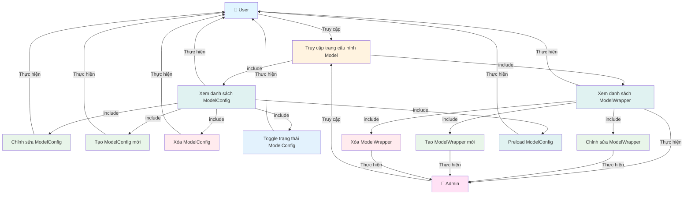

# Use Case Diagram - Quản lý ModelConfig và ModelWrapper

**Ghi chú:**
- Truy cập trang cấu hình Model là điều kiện tiên quyết để sử dụng các chức năng ModelConfig và Wrapper.
- Xem danh sách là bước đầu tiên trước khi thực hiện các thao tác quản lý.
- Các thao tác với Wrapper (tạo, chỉnh sửa, xóa) chỉ dành cho Admin.
