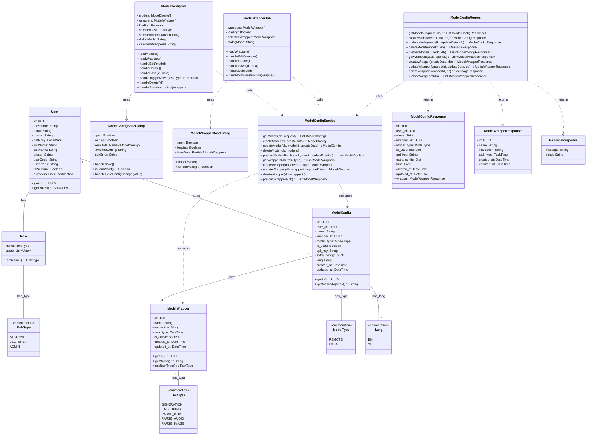

# Class Diagram - Quản lý ModelConfig và ModelWrapper

**Mô tả quan hệ:**
- **User**: Đại diện cho User của hệ thống, có thể có nhiều Role (STUDENT, LECTURER, ADMIN).
- **Role**: Đại diện cho vai trò của User trong hệ thống, được định danh bởi RoleType enum.
- **RoleType**: Enum định nghĩa các loại role: STUDENT, LECTURER, ADMIN.
- **ModelWrapper**: Đại diện cho một ModelWrapper, chứa thông tin về wrapper và instruction.
- **ModelConfig**: Đại diện cho cấu hình model của User, liên kết với ModelWrapper.
- **TaskType**: Enum định nghĩa các loại task: GENERATION, EMBEDDING, PARSE_DOC, PARSE_AUDIO, PARSE_IMAGE.
- **ModelType**: Enum định nghĩa loại model: REMOTE, LOCAL.
- **Lang**: Enum định nghĩa ngôn ngữ: EN, VI.
- **ModelConfigTab & ModelConfigBaseDialog**: Component Frontend để quản lý ModelConfig.
- **ModelWrapperTab & ModelWrapperBaseDialog**: Component Frontend để quản lý ModelWrapper.
- **ModelConfigService** (Backend): Service xử lý logic nghiệp vụ, truy vấn DB.
- **ModelConfigRoutes** (Backend): Route handlers xử lý HTTP requests.
- **ModelConfigResponse & ModelWrapperResponse**: DTO để trả về dữ liệu từ API.
- **MessageResponse**: Lớp dùng để trả về kết quả API.
