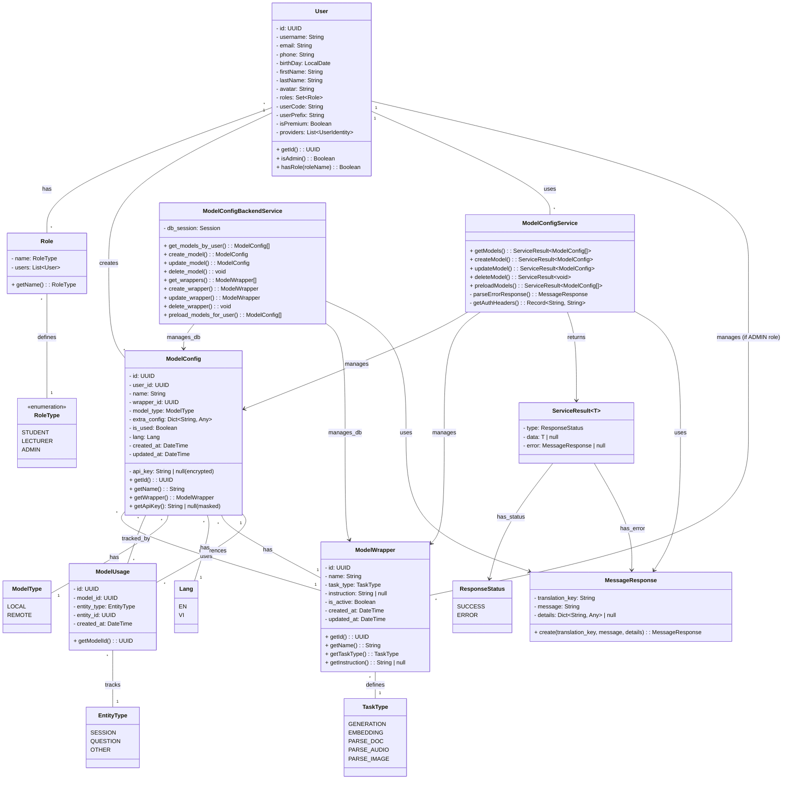

# Class Diagram - Cấu hình Model

**Mô tả quan hệ:**
- **User**: Đại diện cho User của hệ thống. Mọi User đều có thể tạo và quản lý các Model Config của mình, xem danh sách Model Wrapper. User có nhiều Role (STUDENT, LECTURER, ADMIN).
- **Role**: Đại diện cho vai trò của User trong hệ thống, được định nghĩa bởi enum RoleType.
- **RoleType**: Enum định nghĩa các loại vai trò: STUDENT, LECTURER, ADMIN. User có role ADMIN sẽ có quyền quản lý (tạo, sửa, xóa) Model Wrapper.
- **ModelConfig**: Đại diện cho một cấu hình Model của User, chứa thông tin như tên, wrapper, model type, API key (mã hóa), extra config. Được sử dụng để đóng gói dữ liệu từ cơ sở dữ liệu.
- **ModelWrapper**: Đại diện cho một định nghĩa cách tương tác với một mô hình AI cụ thể, chứa tên, task type, và hướng dẫn sử dụng.
- **ModelUsage**: Theo dõi việc sử dụng Model cho các entity khác nhau trong hệ thống.
- **ModelConfigService** (Frontend): Lớp service Frontend xử lý các API call liên quan đến Model Config.
- **ModelConfigBackendService** (Backend): Lớp service Backend xử lý logic nghiệp vụ của Model Config, truy vấn cơ sở dữ liệu và đóng gói dữ liệu thành Model.
- **MessageResponse** & **ServiceResult**: Các lớp dùng để trả về kết quả API.
- **ModelType**: Enum định nghĩa kiểu Model (LOCAL hoặc REMOTE).
- **TaskType**: Enum định nghĩa loại tác vụ mà Wrapper hỗ trợ.
- **Lang**: Enum định nghĩa ngôn ngữ của Model.
- **EntityType**: Enum định nghĩa loại entity sử dụng Model.
