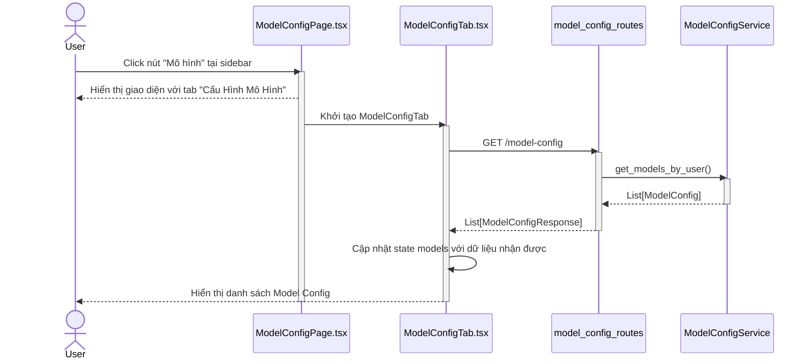
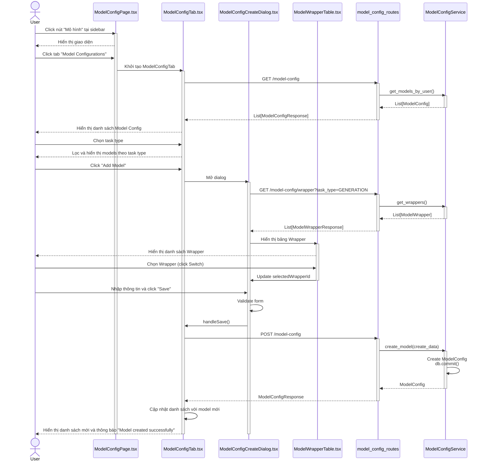
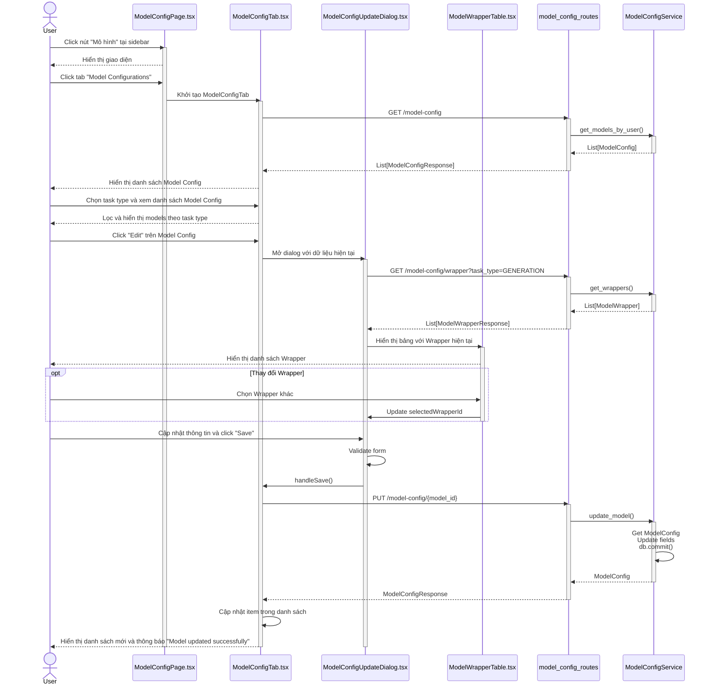
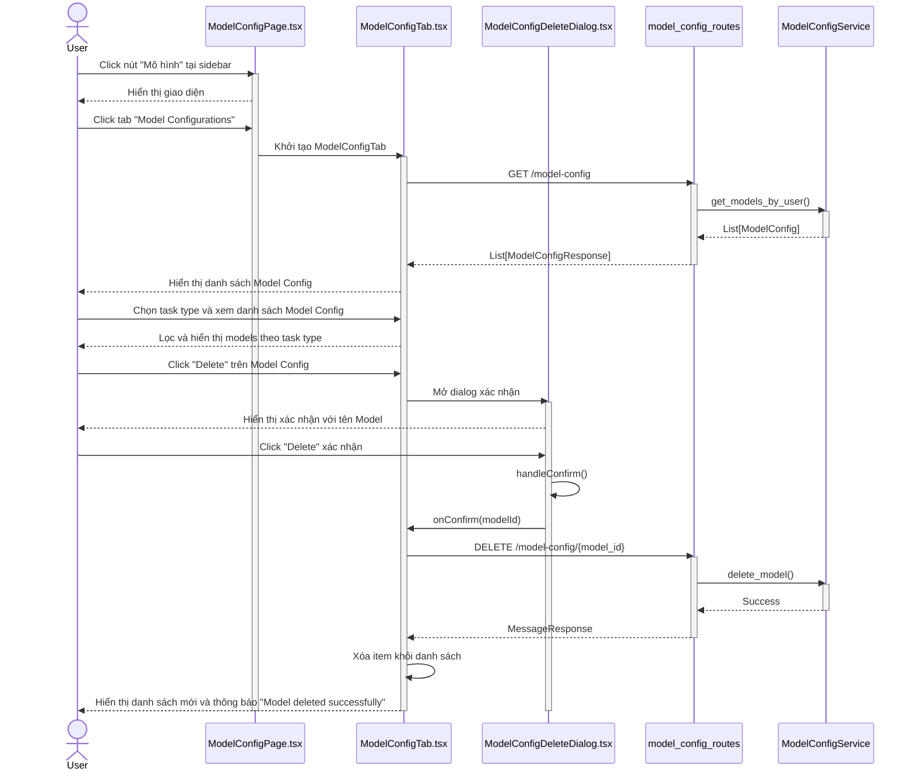
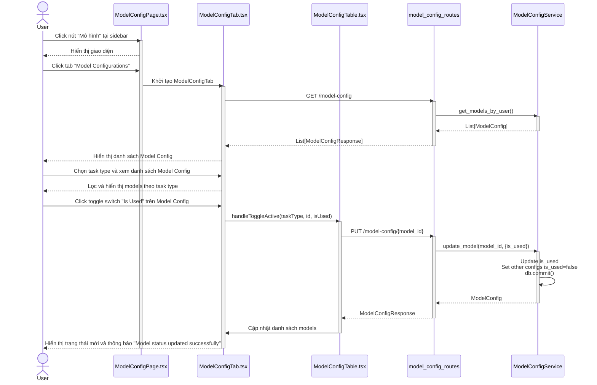
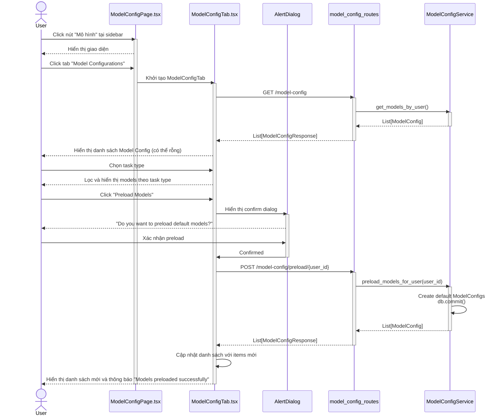
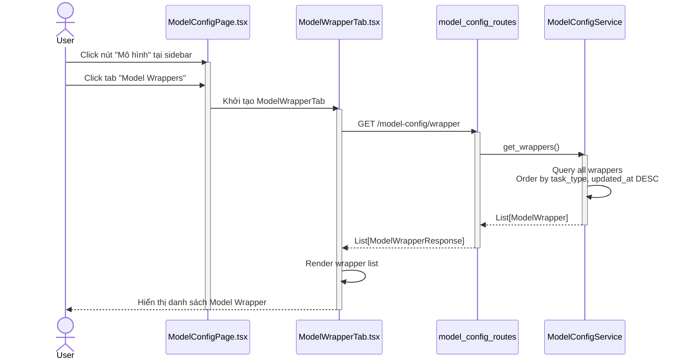
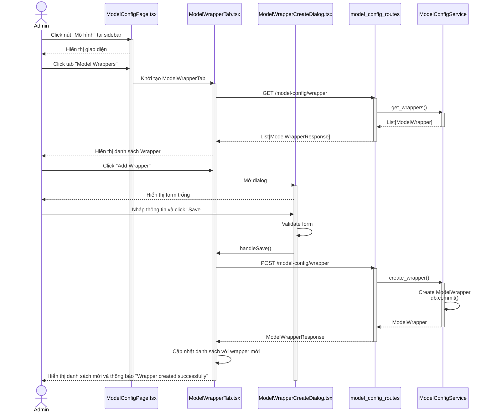
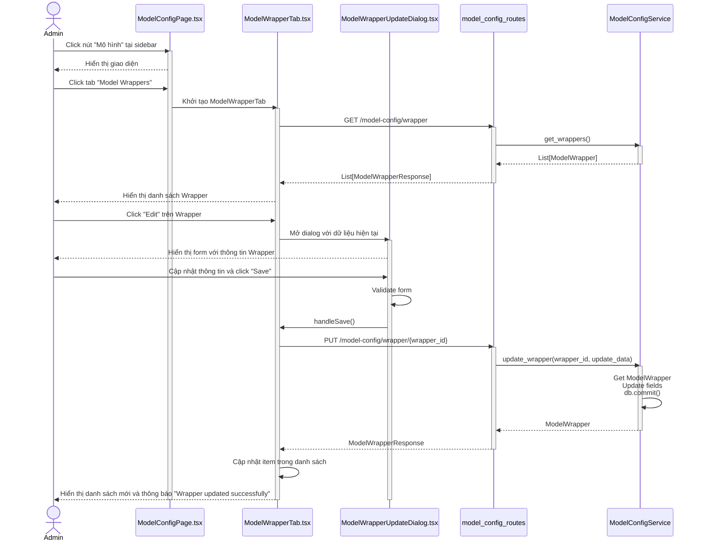
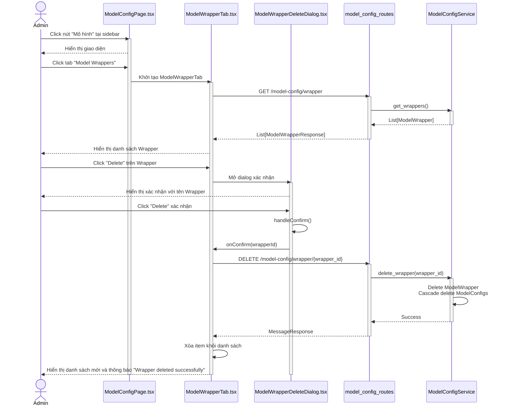

# Sequence Diagram - Quản lý Model Config và Model Wrapper

## 1. Xem danh sách Model Config

---

## 2. Tạo Model Config mới

---

## 3. Chỉnh sửa Model Config

---

## 4. Xóa Model Config

---

## 5. Toggle trạng thái sử dụng Model Config

---

## 6. Preload Model Config

---

## 7. Xem danh sách Model Wrapper

---

## 8. Tạo Model Wrapper mới (Admin only)

---

## 9. Chỉnh sửa Model Wrapper (Admin only)

---

## 10. Xóa Model Wrapper (Admin only)

