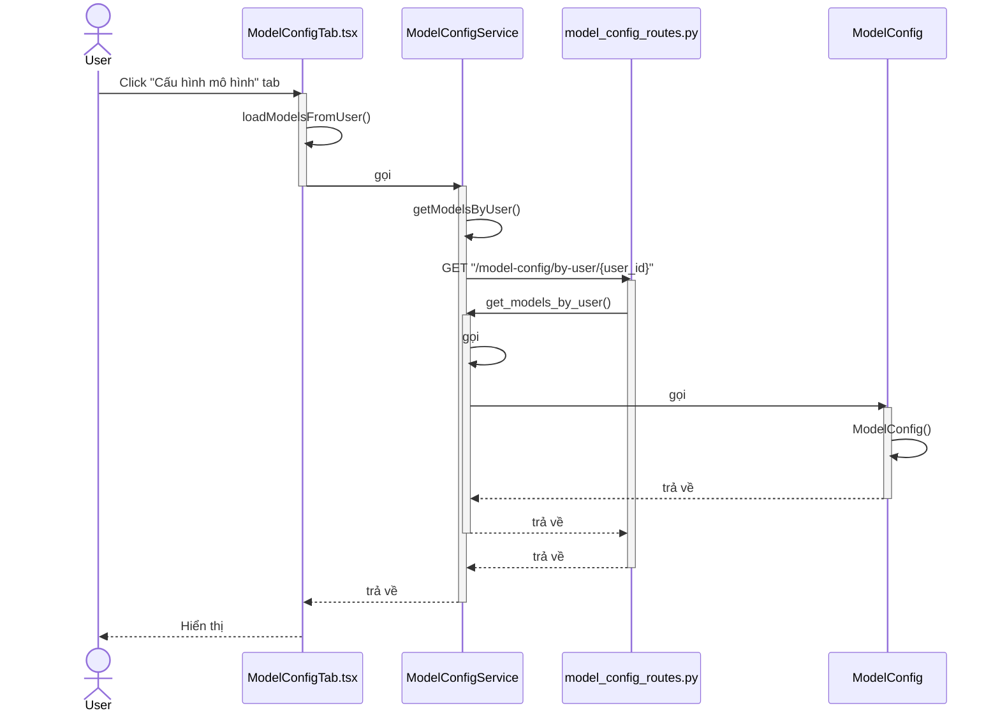
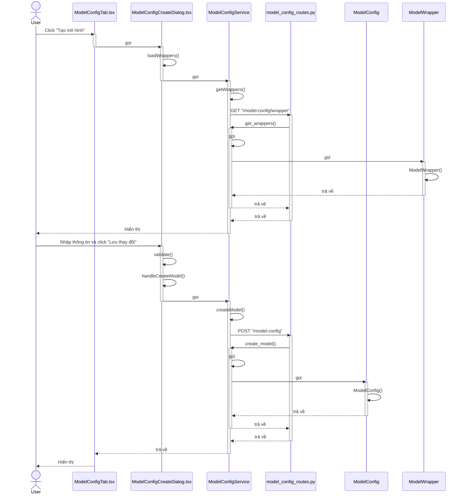
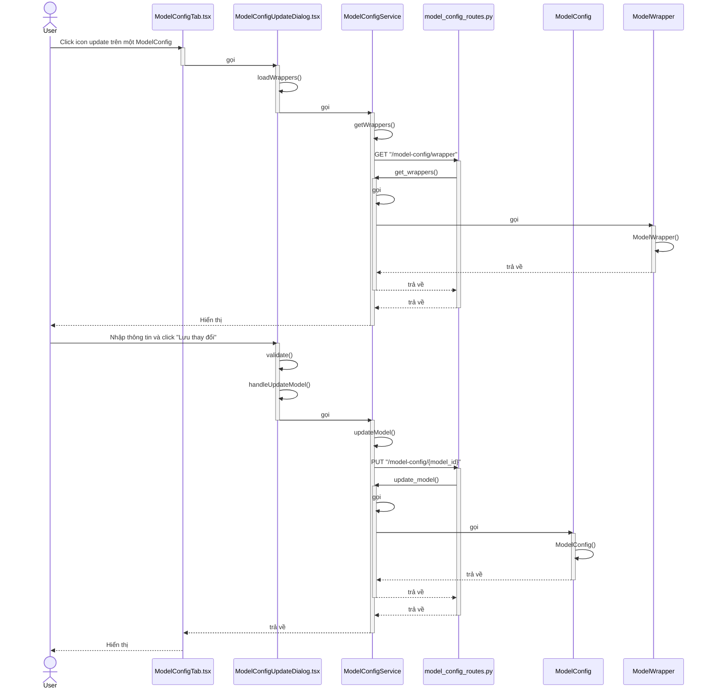
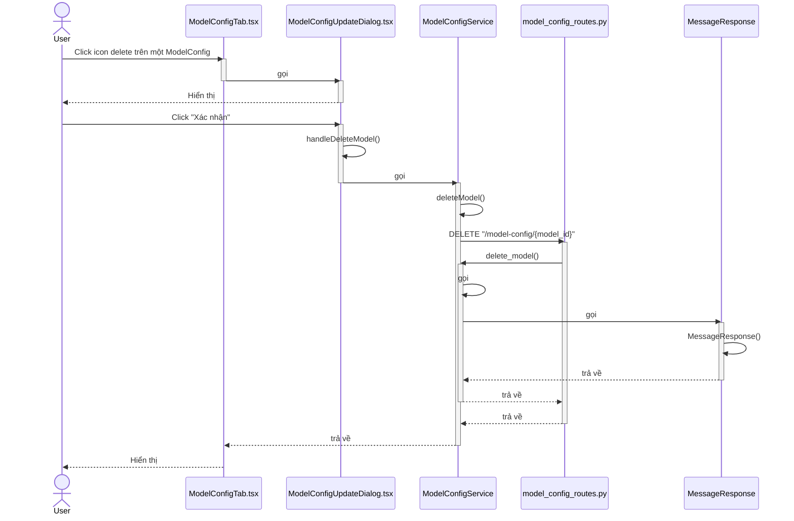
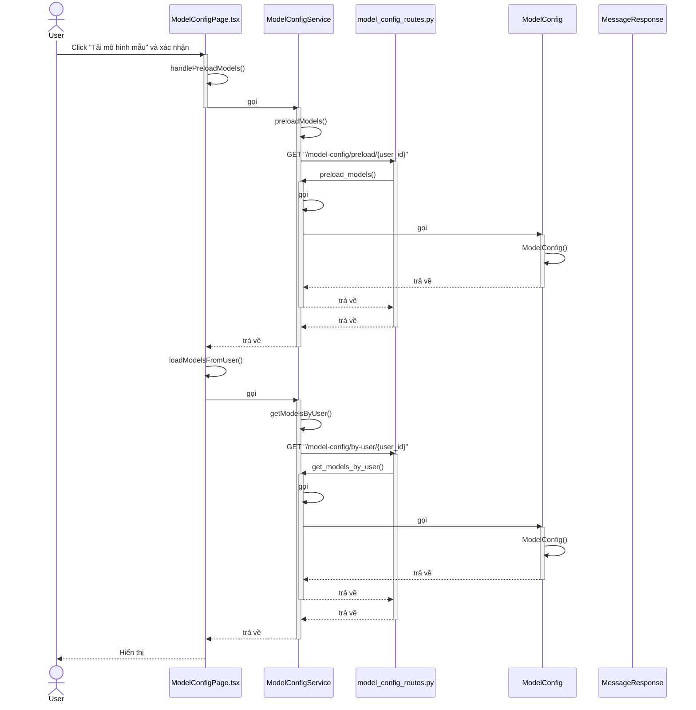
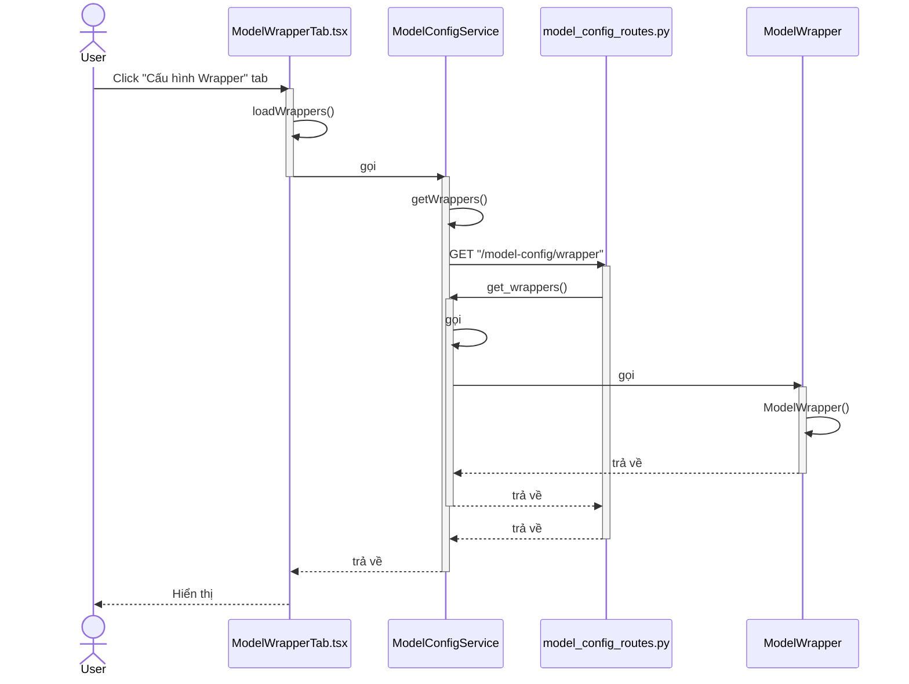
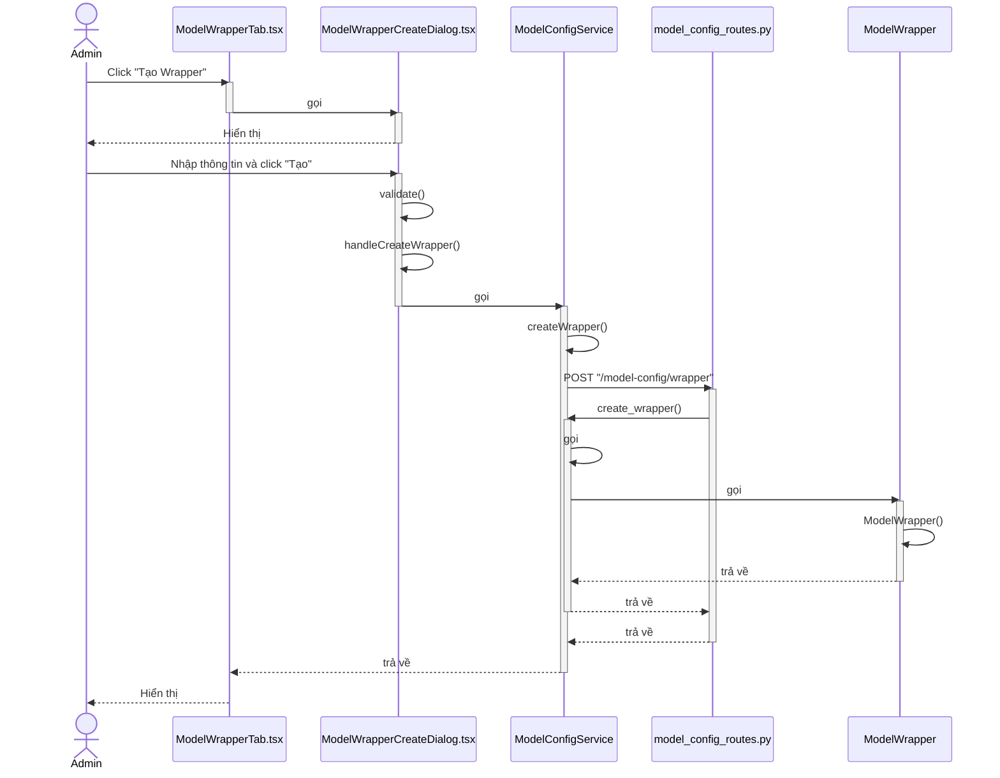
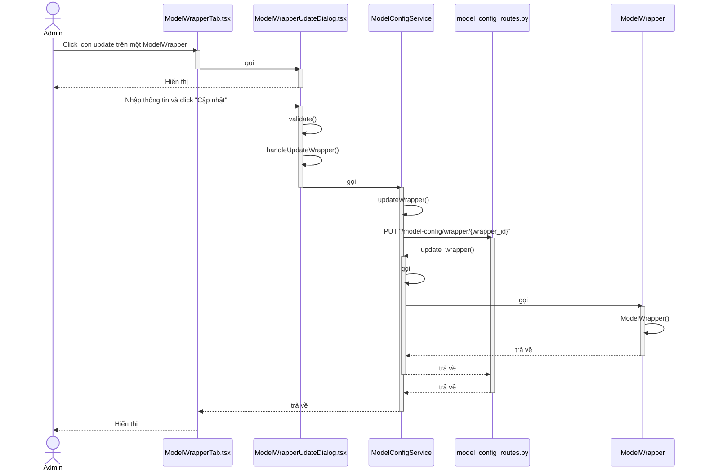
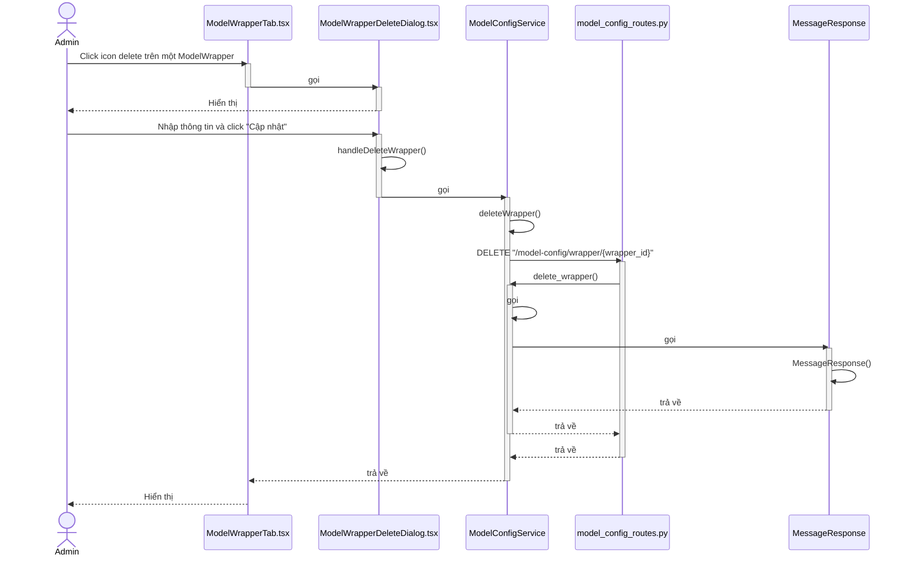

# Sequence Diagram - Quản lý ModelConfig và ModelWrapper

## 1. Xem danh sách ModelConfig

---

## 2. Tạo ModelConfig mới

---

## 3. Chỉnh sửa ModelConfig

---

## 4. Xóa ModelConfig

---

## 5. Preload ModelConfig

---

## 6. Xem danh sách ModelWrapper

---

## 7. Tạo ModelWrapper mới (Admin only)

---

## 8. Chỉnh sửa ModelWrapper (Admin only)

---

## 9. Xóa ModelWrapper (Admin only)

