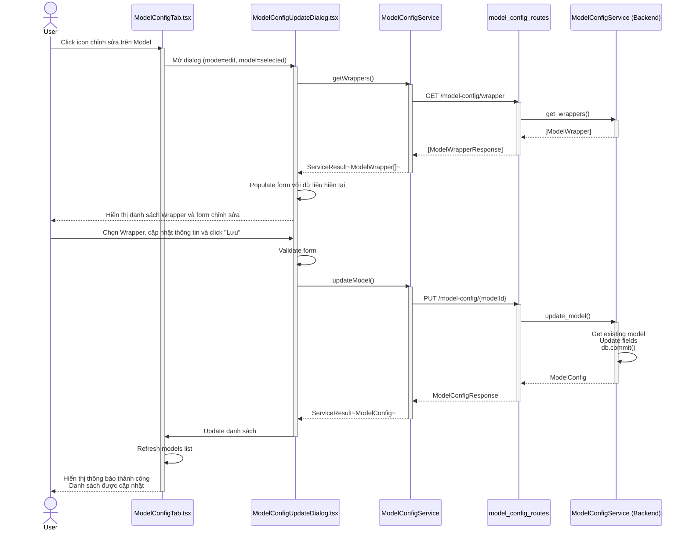

# Sequence Diagram - Cấu hình Model

## 1. Xem danh sách Model

---

## 2. Tạo Model mới

---

## 3. Chỉnh sửa Model

---

## 4. Xóa Model

---

## 5. Xem danh sách Model Wrapper

---

## 6. Tạo Model Wrapper mới

---

## 7. Chỉnh sửa Model Wrapper

---

## 8. Xóa Model Wrapper

