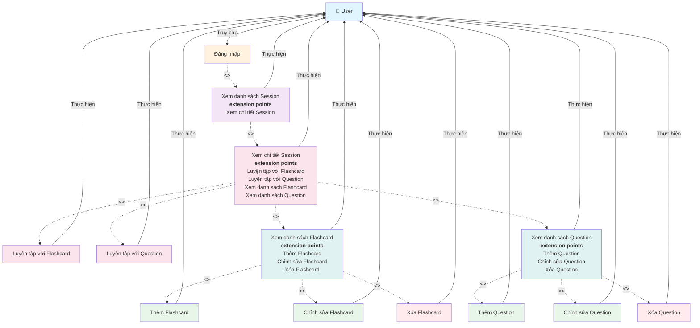

# Use Case Diagram - Quản lý Question và Flashcard

**Ghi chú:**
- Đăng nhập là điều kiện tiên quyết để truy cập hệ thống.
- Xem danh sách Session là bước cần thiết để có thể xem chi tiết Session.
- Xem chi tiết Session có các extension points cho phép truy cập danh sách và luyện tập.
- Xem danh sách Question/Flashcard có các extension points cho các thao tác chỉnh sửa, tạo mới, xóa.
- Các thao tác Luyện tập được thực hiện trong giao diện xem danh sách tương ứng.

