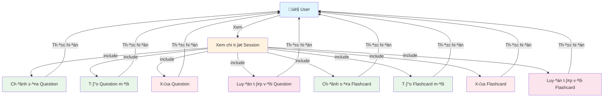

# Use Case Diagram - Quản lý Question và Flashcard

```mermaid
graph TB
    Actor["👤 User"]
    
    ViewSessionDetail["Xem chi ti·∫øt Session"]
    EditQuestion["Chỉnh sửa Question"]
    CreateQuestion["T·∫°o Question m·ªõi"]
    DeleteQuestion["Xóa Question"]
    PracticeQuestion["Luyện tập với Question"]
    
    EditFlashcard["Chỉnh sửa Flashcard"]
    CreateFlashcard["T·∫°o Flashcard m·ªõi"]
    DeleteFlashcard["Xóa Flashcard"]
    PracticeFlashcard["Luyện tập với Flashcard"]
    
    Actor -->|Xem| ViewSessionDetail
    
    ViewSessionDetail -->|include| EditQuestion
    EditQuestion -->|Thực hiện| Actor
    
    ViewSessionDetail -->|include| CreateQuestion
    CreateQuestion -->|Thực hiện| Actor
    
    ViewSessionDetail -->|include| DeleteQuestion
    DeleteQuestion -->|Thực hiện| Actor
    
    ViewSessionDetail -->|include| PracticeQuestion
    PracticeQuestion -->|Thực hiện| Actor
    
    ViewSessionDetail -->|include| EditFlashcard
    EditFlashcard -->|Thực hiện| Actor
    
    ViewSessionDetail -->|include| CreateFlashcard
    CreateFlashcard -->|Thực hiện| Actor
    
    ViewSessionDetail -->|include| DeleteFlashcard
    DeleteFlashcard -->|Thực hiện| Actor
    
    ViewSessionDetail -->|include| PracticeFlashcard
    PracticeFlashcard -->|Thực hiện| Actor
    
    style Actor fill:#e1f5ff
    style ViewSessionDetail fill:#fff3e0
    style EditQuestion fill:#e8f5e9
    style CreateQuestion fill:#e8f5e9
    style DeleteQuestion fill:#ffebee
    style PracticeQuestion fill:#fce4ec
    style EditFlashcard fill:#e8f5e9
    style CreateFlashcard fill:#e8f5e9
    style DeleteFlashcard fill:#ffebee
    style PracticeFlashcard fill:#fce4ec
```

**Ghi ch√∫:**
- Xem chi tiết Session là điều kiện tiên quyết để sử dụng các chức năng Question và Flashcard.
- Các thao tác chỉnh sửa, tạo mới, xóa được thực hiện trong giao diện Edit.
- Các thao tác Luyện tập được thực hiện trong giao diện xem danh sách tương ứng.

