# Class Diagram - Quản lý Question và Flashcard

```mermaid
classDiagram
    class User {
        - id: UUID
        - username: String
        - email: String
        + getId(): UUID
    }

    class Session {
        - id: UUID
        - name: String
        - description: String | null
        - created_at: DateTime
        - updated_at: DateTime
        + getId(): UUID
    }

    class Question {
        - id: UUID
        - session_id: UUID
        - content: String
        - type: QuestionType
        - cognitive_level: CognitiveLevel
        - correct_answers: String
        - explanation: String | null
        - source_context: String | null
        - created_at: DateTime
        - updated_at: DateTime
        + getId(): UUID
        + getSessionId(): UUID
        + getContent(): String
        + getType(): QuestionType
    }

    class QuestionAnswer {
        - id: UUID
        - question_id: UUID
        - content: String
        - is_correct: Boolean
        - explanation: String | null
        + getId(): UUID
        + getQuestionId(): UUID
        + getContent(): String
        + isCorrect(): Boolean
    }

    class Flashcard {
        - id: UUID
        - session_id: UUID
        - question: String
        - answer: String
        - type: FlashcardType
        - explanation: String | null
        - source_context: String | null
        - created_at: DateTime
        - updated_at: DateTime
        + getId(): UUID
        + getSessionId(): UUID
        + getQuestion(): String
        + getAnswer(): String
    }

    class QuestionTab {
        - currentIndex: Integer
        - selectedAnswers: Map
        - showResults: Boolean
        - internalQuestions: Question[]
        - isLoading: Boolean
        + loadQuestionsFromSession()
        + goToNext()
        + goToPrevious()
        + handleAnswerSelect()
        + redoPractice()
    }

    class QuestionEditTab {
        - editingId: String | null
        - searchTerm: String
        - internalQuestions: Question[]
        - isLoading: Boolean
        + loadQuestionsFromSession()
        + handleEdit()
        + handleSave()
        + handleDelete()
        + addNewQuestion()
    }

    class FlashcardTab {
        - currentIndex: Integer
        - isFlipped: Boolean
        - internalFlashcards: Flashcard[]
        - isLoading: Boolean
        + loadFlashcardsFromSession()
        + goToNext()
        + goToPrevious()
        + flipCard()
    }

    class FlashcardEditTab {
        - editingId: String | null
        - searchTerm: String
        - internalFlashcards: Flashcard[]
        - isLoading: Boolean
        + loadFlashcardsFromSession()
        + handleEdit()
        + handleSave()
        + handleDelete()
        + addNewCard()
    }

    class DocAgentService {
        + getQuestionsBySession(sessionId: String): ServiceResult~Question[]~
        + getFlashcardsBySession(sessionId: String): ServiceResult~Flashcard[]~
        + createQuestion(data: Partial~Question~): ServiceResult~Question~
        + createFlashcard(data: Partial~Flashcard~): ServiceResult~Flashcard~
        + updateQuestion(id: String, data: Partial~Question~): ServiceResult~Question~
        + updateFlashcard(id: String, data: Partial~Flashcard~): ServiceResult~Flashcard~
        + deleteQuestion(id: String): ServiceResult~MessageResponse~
        + deleteFlashcard(id: String): ServiceResult~MessageResponse~
        - parseErrorResponse(): MessageResponse
        - getAuthHeaders(): Record~String, String~
    }

    class QuestionService {
        + get_questions_by_session(db: Session, session_id: str): List~Question~
        + create_question(db: Session, data: QuestionCreateRequest): Question
        + update_question(db: Session, id: str, data: QuestionUpdateRequest): Question
        + delete_question(db: Session, id: str): void
    }

    class FlashcardService {
        + get_flashcards_by_session(db: Session, session_id: str): List~Flashcard~
        + create_flashcard(db: Session, data: FlashcardCreateRequest): Flashcard
        + update_flashcard(db: Session, id: str, data: FlashcardUpdateRequest): Flashcard
        + delete_flashcard(db: Session, id: str): void
    }

    class QuestionResponse {
        - id: UUID
        - session_id: UUID
        - content: String
        - type: QuestionType
        - cognitive_level: CognitiveLevel
        - correct_answers: String
        - explanation: String | null
        - question_answers: List~QuestionAnswerResponse~
        - source_context: String | null
        - created_at: DateTime
    }

    class FlashcardResponse {
        - id: UUID
        - session_id: UUID
        - question: String
        - answer: String
        - type: FlashcardType
        - explanation: String | null
        - source_context: String | null
        - created_at: DateTime
    }

    class MessageResponse {
        - translation_key: String
        - message: String
        - details: Dict~String, Any~ | null
        + create(translation_key, message, details): MessageResponse
    }

    class ServiceResult~T~ {
        - type: ResponseStatus
        - data: T | null
        - error: MessageResponse | null
    }

    class ResponseStatus {
        SUCCESS
        ERROR
    }

    class QuestionType {
        SINGLE_CHOICE
        MULTIPLE_CHOICE
        TRUE_FALSE
        TEXT_ANSWER
    }

    class CognitiveLevel {
        REMEMBER
        UNDERSTAND
        APPLY
        ANALYZE
        EVALUATE
        CREATE
    }

    class FlashcardType {
        DEFINITION
        HISTORICAL_FIGURE
        CONCEPT
        TERMINOLOGY
        OTHER
    }

    %% Relationships
    User "1" -- "*" Session : creates
    Session "1" -- "*" Question : contains
    Session "1" -- "*" Flashcard : contains
    Question "1" -- "*" QuestionAnswer : has
    
    QuestionTab --> Session : displays
    QuestionTab --> Question : interacts
    QuestionEditTab --> Session : displays
    QuestionEditTab --> Question : interacts
    
    FlashcardTab --> Session : displays
    FlashcardTab --> Flashcard : interacts
    FlashcardEditTab --> Session : displays
    FlashcardEditTab --> Flashcard : interacts
    
    DocAgentService --> Question : manages
    DocAgentService --> Flashcard : manages
    DocAgentService --> ServiceResult : returns
    DocAgentService --> MessageResponse : uses
    
    QuestionService --> Question : manages
    QuestionService --> MessageResponse : uses
    FlashcardService --> Flashcard : manages
    FlashcardService --> MessageResponse : uses
    
    ServiceResult --> ResponseStatus : has_status
    ServiceResult --> MessageResponse : has_error
    
    Question "*" -- "1" QuestionType : has_type
    Question "*" -- "1" CognitiveLevel : has_level
    Flashcard "*" -- "1" FlashcardType : has_type
```

**Mô tả quan hệ:**
- **User**: Đại diện cho User của hệ thống.
- **Session**: Đại diện cho một Session, chứa các Question và flashcard.
- **Question & QuestionAnswer**: Đại diện Question với các tùy chọn trả lời.
- **Flashcard**: Đại diện cho một Flashcard.
- **QuestionTab & QuestionEditTab**: Component Frontend để xem và chỉnh sửa Question.
- **FlashcardTab & FlashcardEditTab**: Component Frontend để xem và chỉnh sửa flashcard.
- **DocAgentService** (Frontend): Service xử lý API call liên quan đến Question và flashcard.
- **QuestionService & FlashcardService** (Backend): Service xử lý logic nghiệp vụ, truy vấn DB.
- **QuestionResponse & FlashcardResponse**: DTO để trả về dữ liệu từ API.
- **MessageResponse & ServiceResult**: Lớp dùng để trả về kết quả API.

