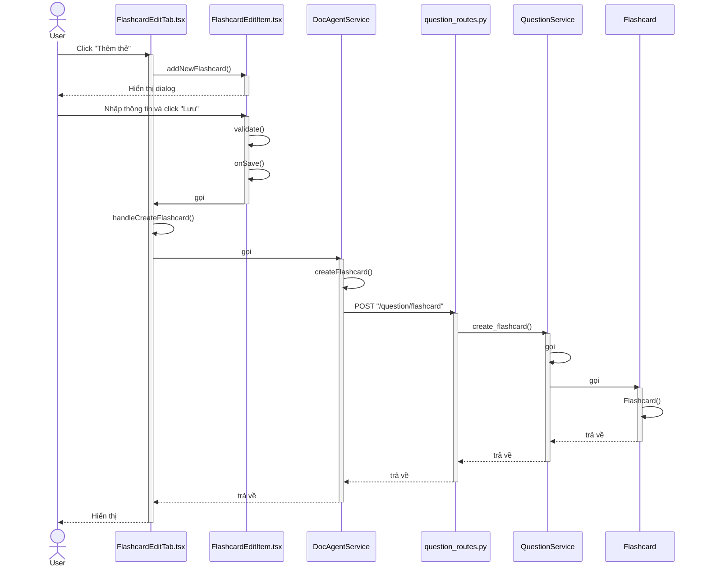
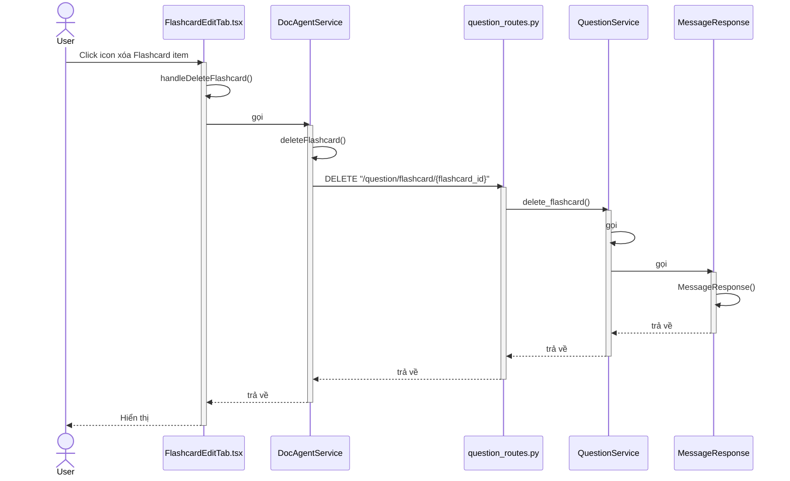
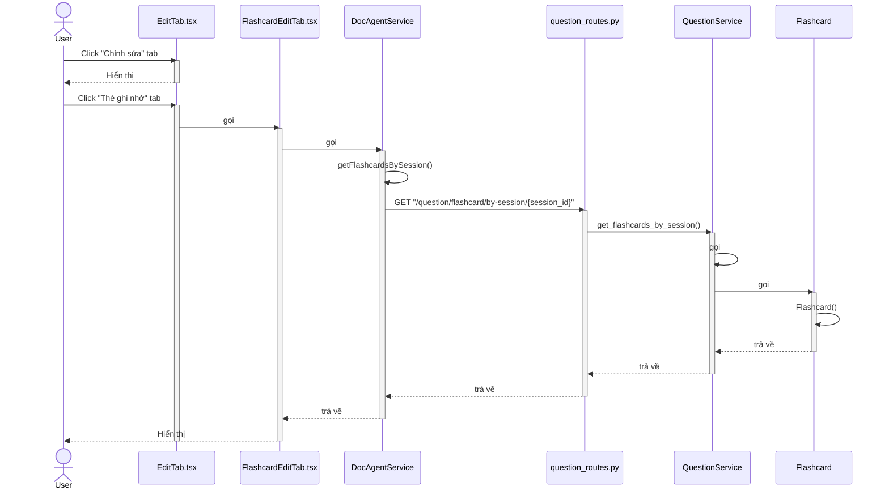
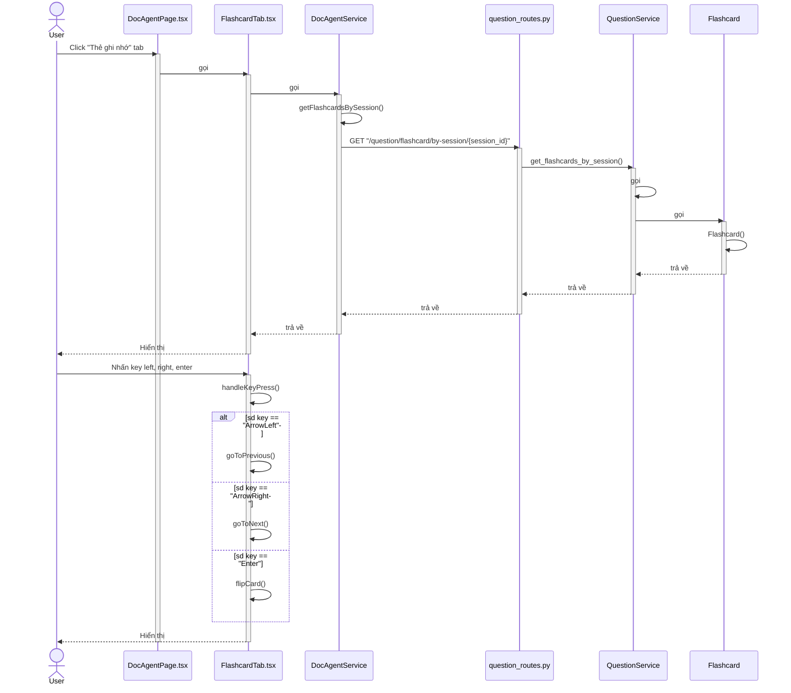
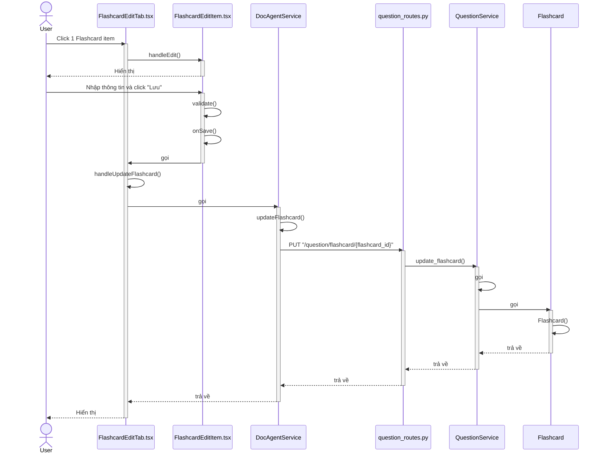
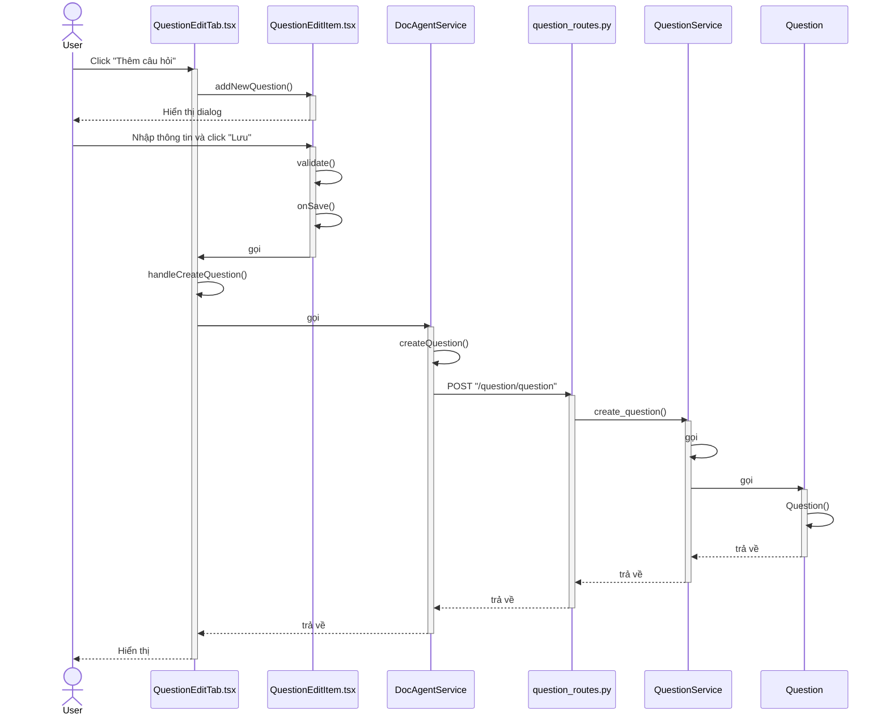
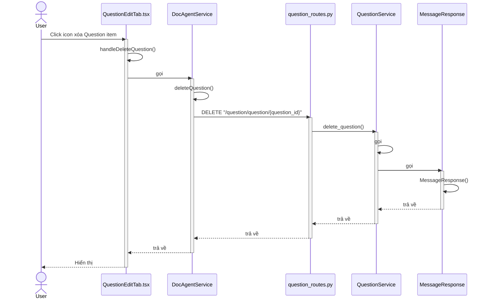
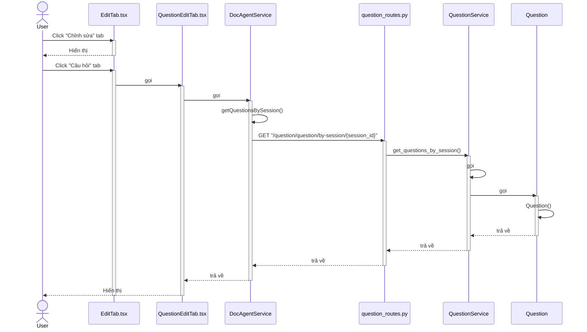
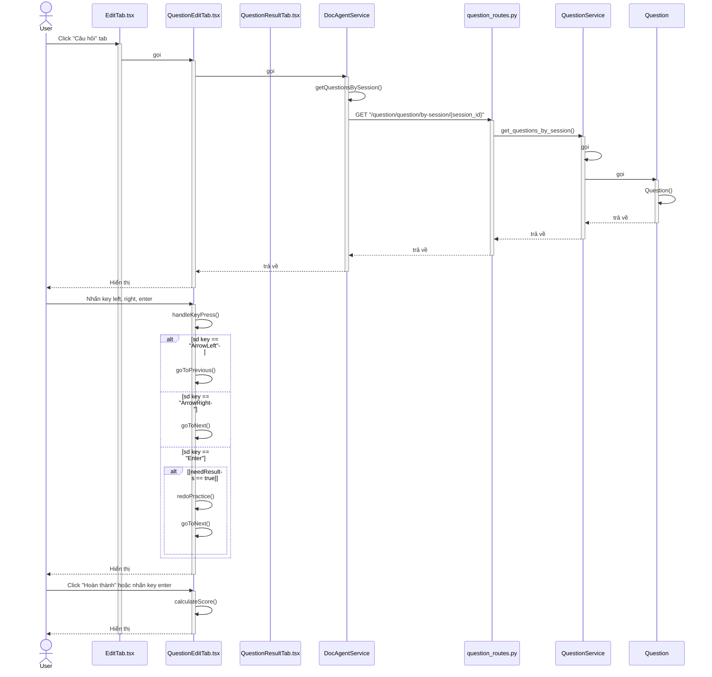
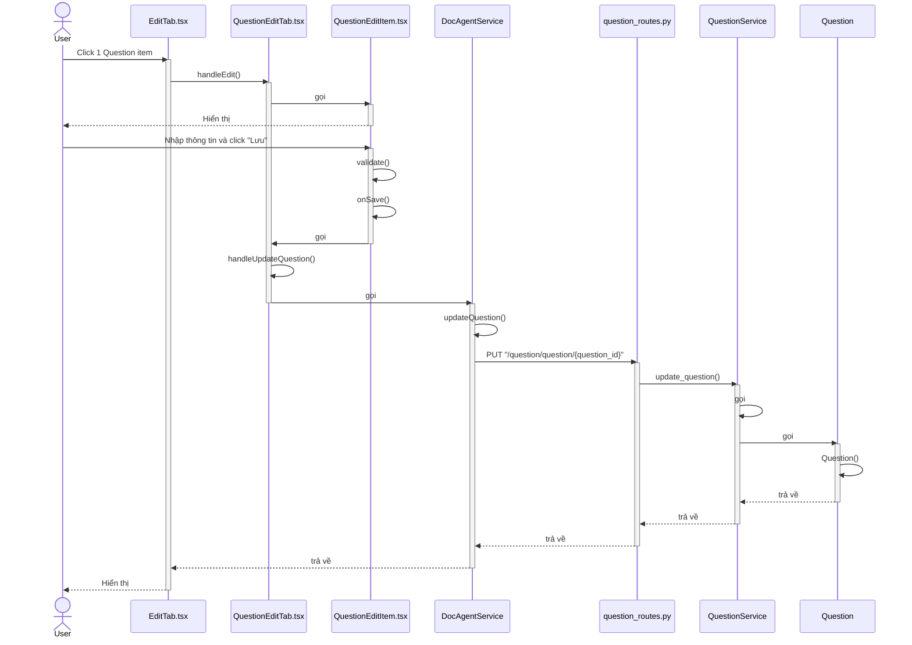

# Sequence Diagram - Quản lý Question và Flashcard

## 1. Tạo Flashcard mới

---

## 2. Xóa Flashcard

---

## 3. Xem danh sách Flashcard (Edit Tab)

---

## 4. Xem danh sách Flashcard (Practice Tab)

---

## 5. Chỉnh sửa Flashcard

---

## 6. Tạo Question mới

---

## 7. Xóa Question

---

## 8. Xem danh sách Question (Edit Tab)

---

## 9. Xem danh sách Question (Practice Tab)

---

## 10. Chỉnh sửa Question

