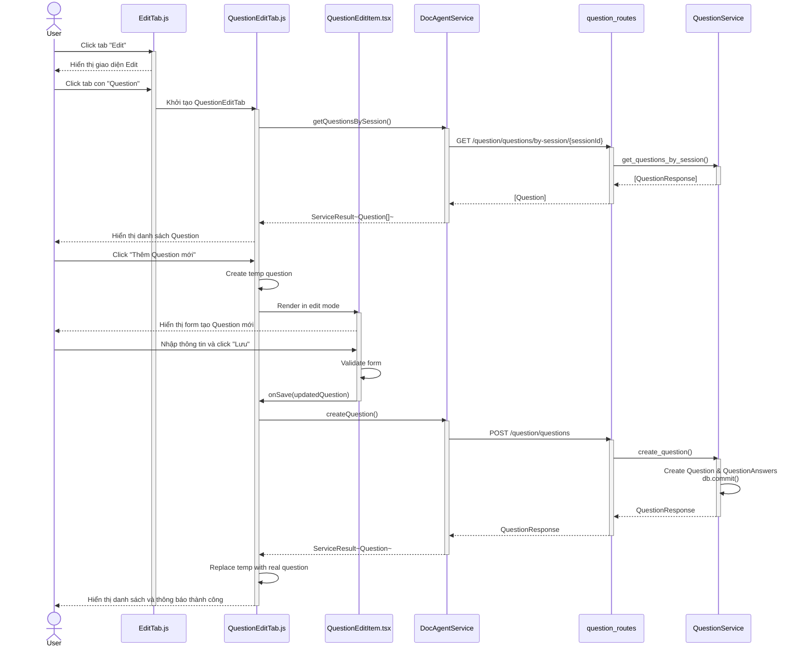
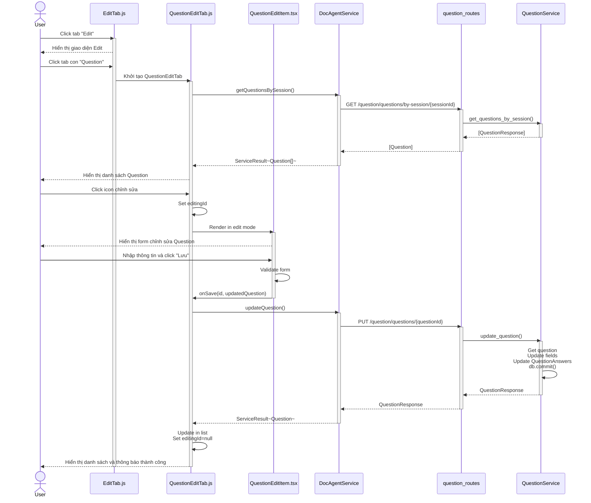
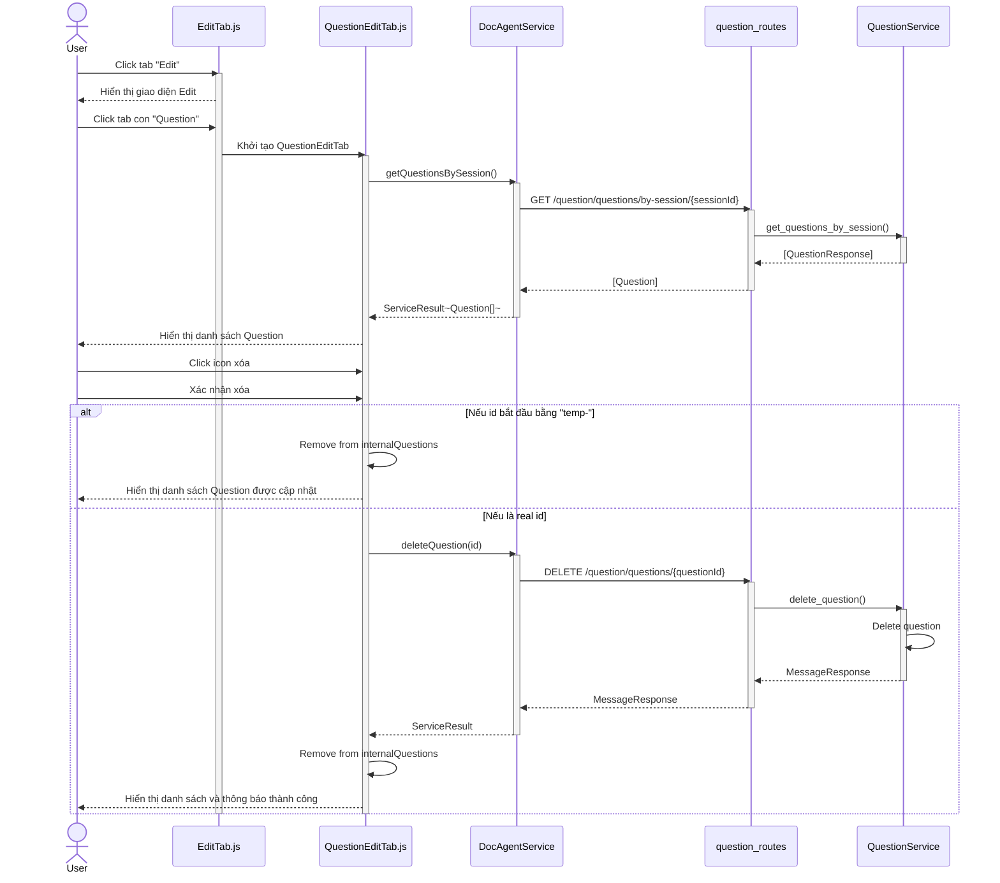
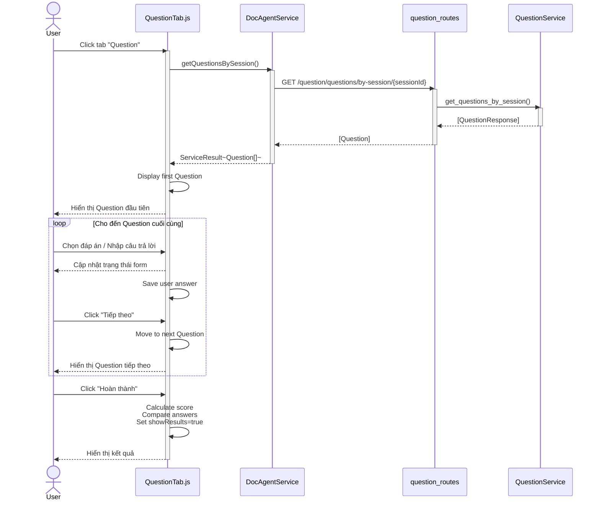
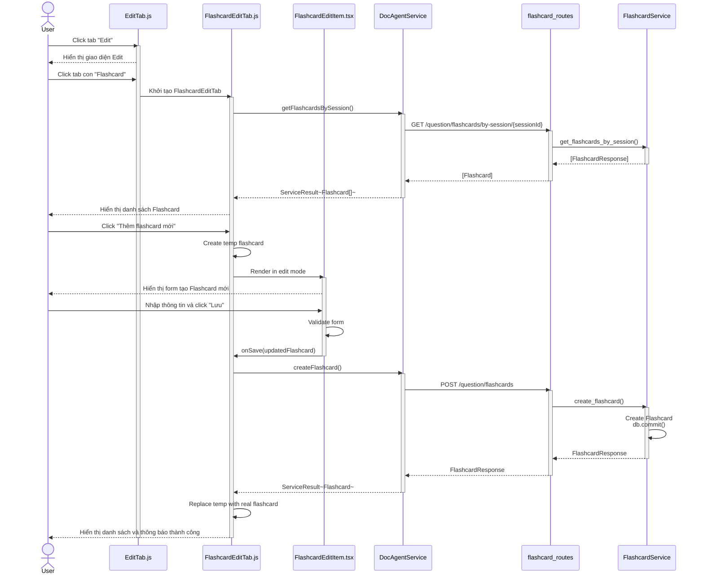
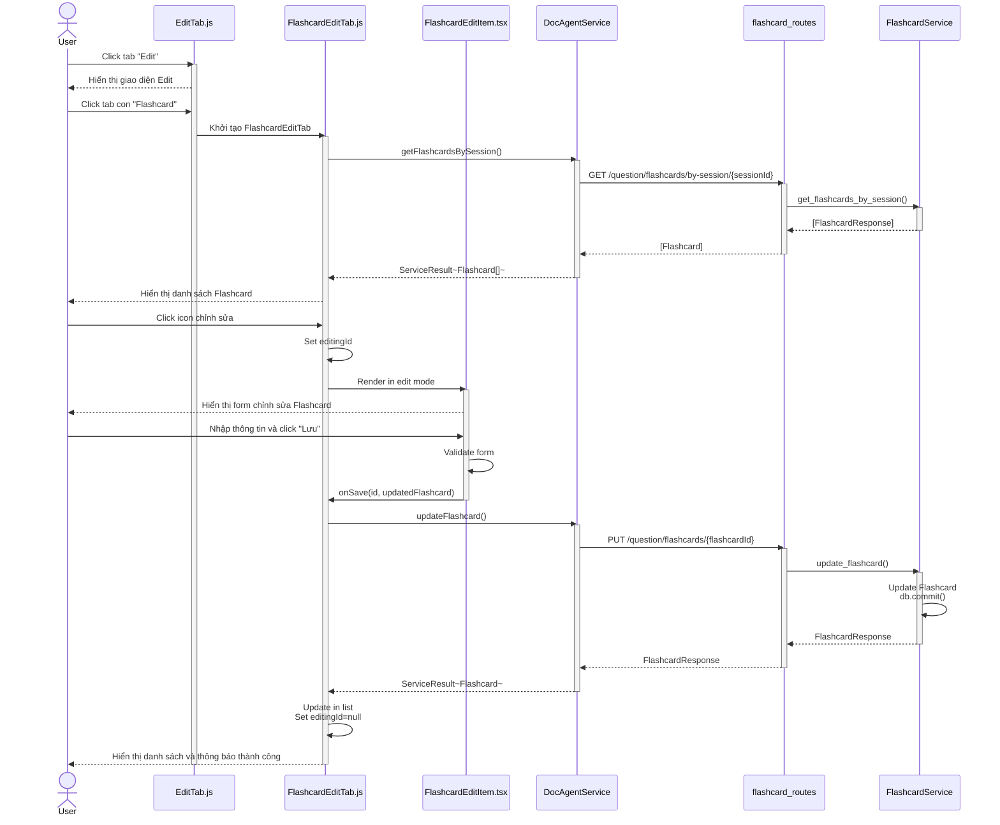
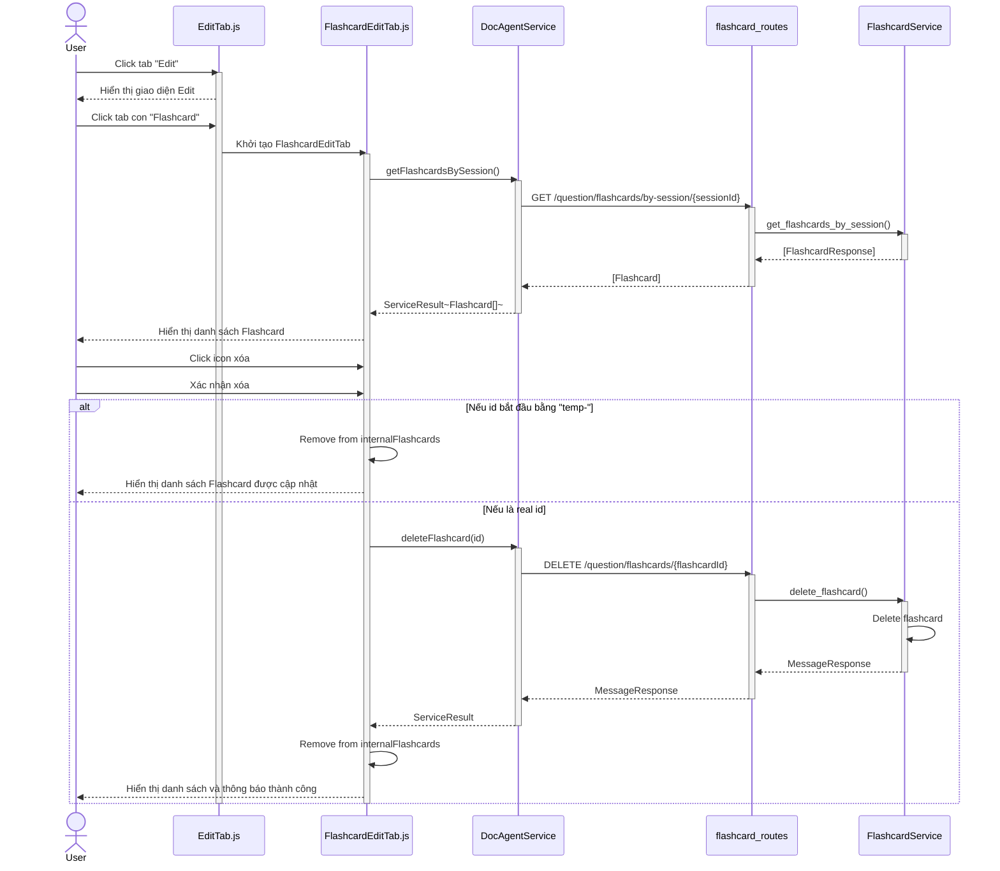
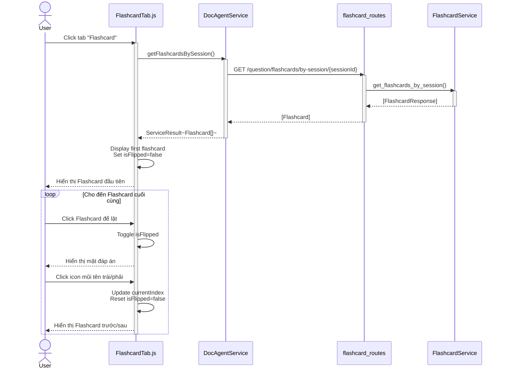

# Sequence Diagram - Quản lý Question và Flashcard

## 1. Tạo Question mới

---

## 2. Chỉnh sửa Question

---

## 3. Xóa Question

---

## 4. Luyện tập với Question

---

## 5. Tạo Flashcard mới

---

## 6. Chỉnh sửa Flashcard

---

## 7. Xóa Flashcard

---

## 8. Luyện tập với Flashcard

