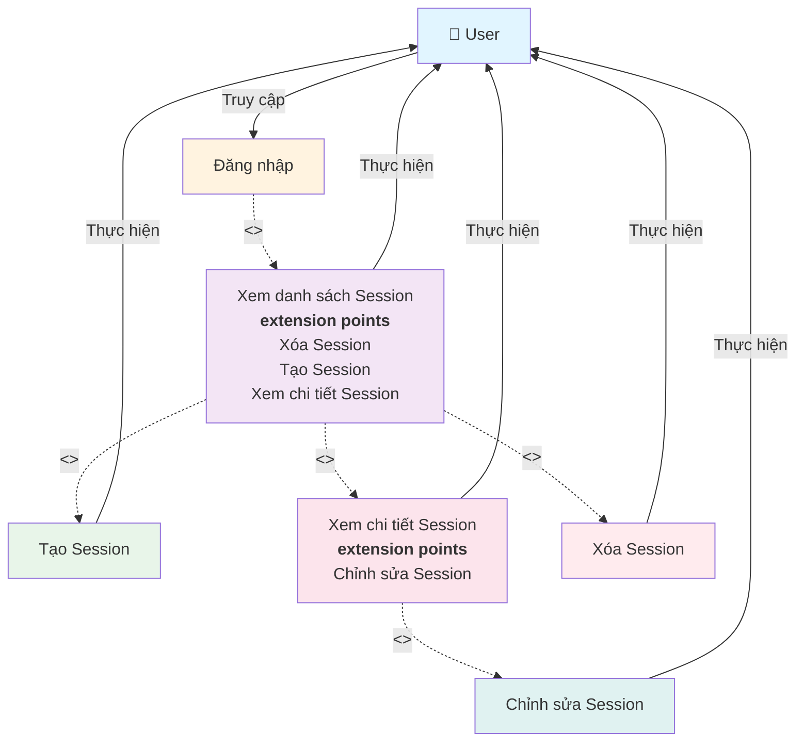

# Use Case Diagram - Quản lý các Session

**Ghi chú:**
- Đăng nhập là điều kiện tiên quyết để truy cập các chức năng quản lý Session.
- Use Case "Xem danh sách Session" là trung tâm với các extension points cho phép User thực hiện: Tạo, Xem chi tiết, và Xóa Session.
- Use Case "Xem chi tiết Session" có extension point cho phép Chỉnh sửa Session.
