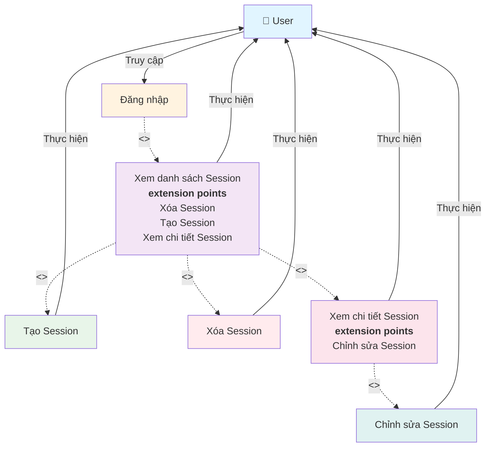

# Use Case Diagram - Quản lý Session

**Ghi chú:**
- Đăng nhập là điều kiện tiên quyết để truy cập các chức năng quản lý Session.
- Use Case "Xem danh sách Session" là điểm bắt đầu sau khi đăng nhập.
- Use Case "Xem danh sách Session" có các extension points: Tạo Session, Xóa Session, Xem chi tiết Session.
- Use Case "Xem chi tiết Session" có extension point: Chỉnh sửa Session.
