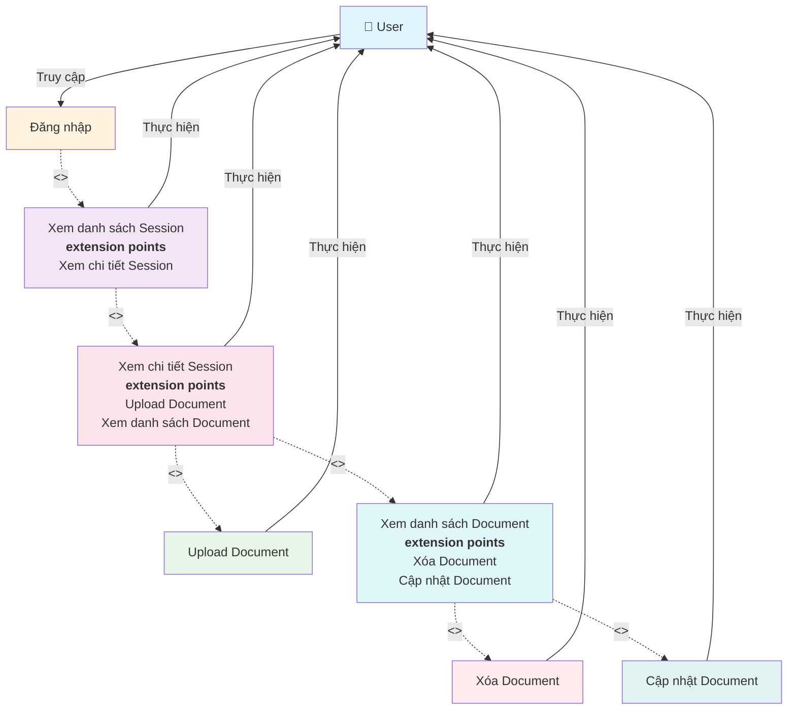

# Use Case Diagram - Quản lý Document

**Ghi chú:**
- Đăng nhập là điều kiện tiên quyết để truy cập các chức năng quản lý Document.
- Use Case "Xem danh sách Session" là điểm bắt đầu sau khi đăng nhập.
- Use Case "Xem chi tiết Session" có extension points cho phép User thực hiện: Upload Document và Xem danh sách Document.
- Use Case "Xem danh sách Document" có extension points cho phép Xóa và Cập nhật Document.
