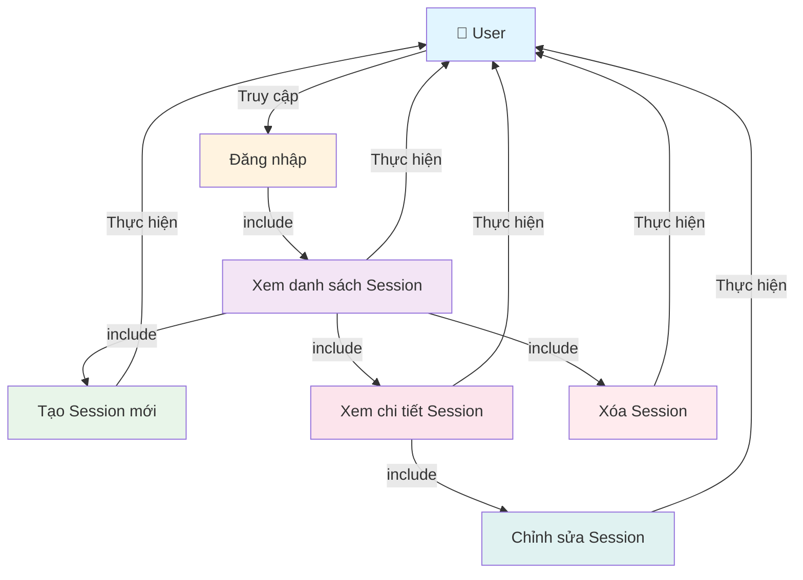

# Use Case Diagram - Quản lý các Session

**Ghi chú:**
- Đăng nhập là điều kiện tiên quyết để truy cập các chức năng quản lý Session.
- Use Case "Xem danh sách Session" là trung tâm, từ đó User có thể thực hiện các thao tác: Tạo, Xem chi tiết, Chỉnh sửa, và Xóa Session.
