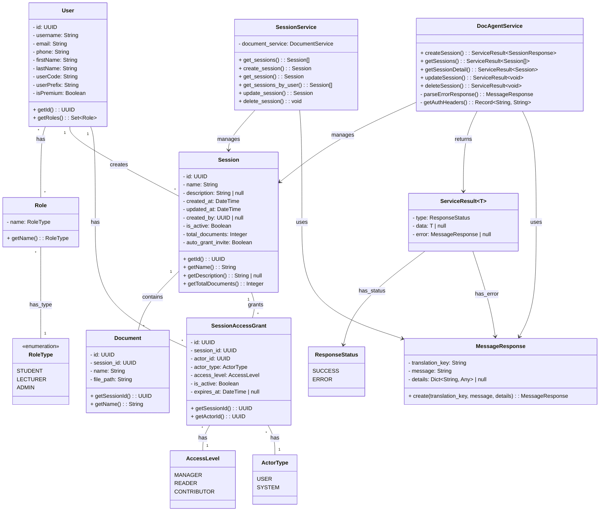

# Class Diagram - Quản lý các Session

**Mô tả quan hệ:**
- **User**: Đại diện cho User của hệ thống, có thể có nhiều Role (STUDENT, LECTURER, ADMIN). User có thể tạo và quản lý các Session.
- **Role**: Đại diện cho vai trò của User trong hệ thống, được định danh bởi RoleType enum.
- **RoleType**: Enum định nghĩa các loại role: STUDENT, LECTURER, ADMIN.
- **Session**: Đại diện cho một Session, chứa thông tin cơ bản như tên, mô tả, ngày tạo. Được sử dụng để đóng gói dữ liệu từ cơ sở dữ liệu.
- **Document**: Các tài liệu thuộc về một Session.
- **SessionAccessGrant**: Quản lý quyền truy cập vào Session cho các User khác.
- **DocAgentService** (Frontend): Lớp service Frontend xử lý các API call liên quan đến session.
- **SessionService** (Backend): Lớp service Backend xử lý logic nghiệp vụ của session, truy vấn cơ sở dữ liệu và đóng gói dữ liệu thành Model.
- **MessageResponse** & **ServiceResult**: Các lớp dùng để trả về kết quả API.
