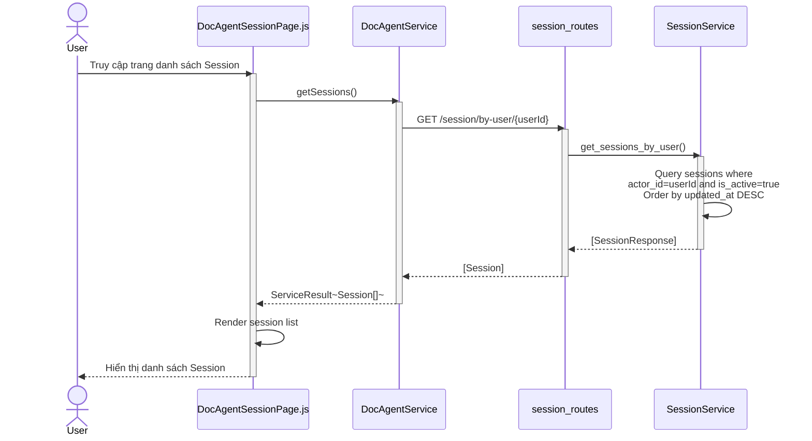
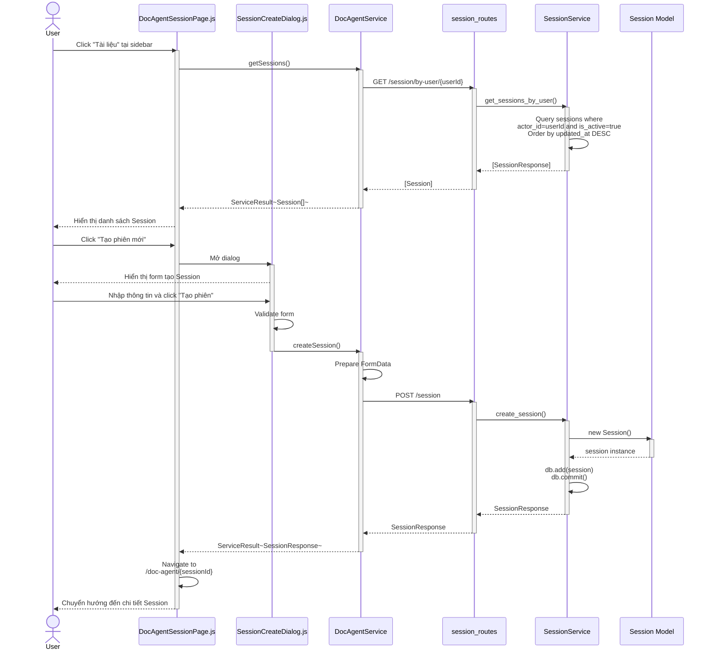
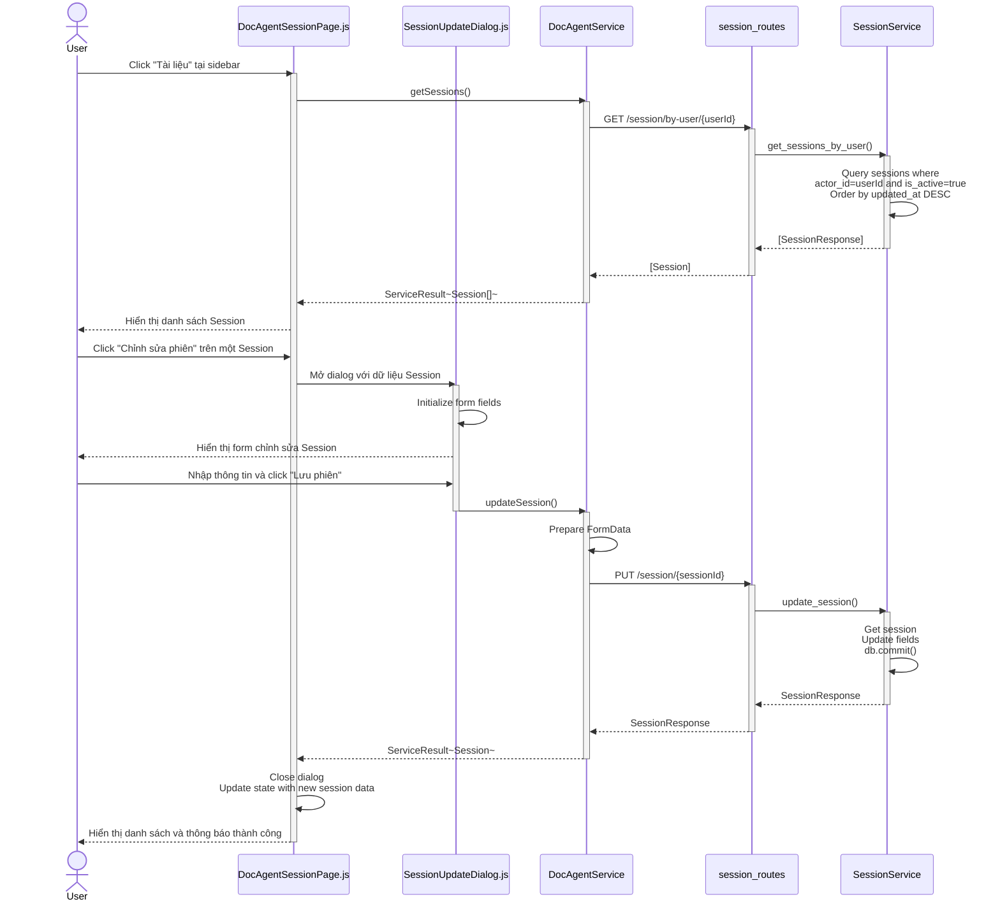
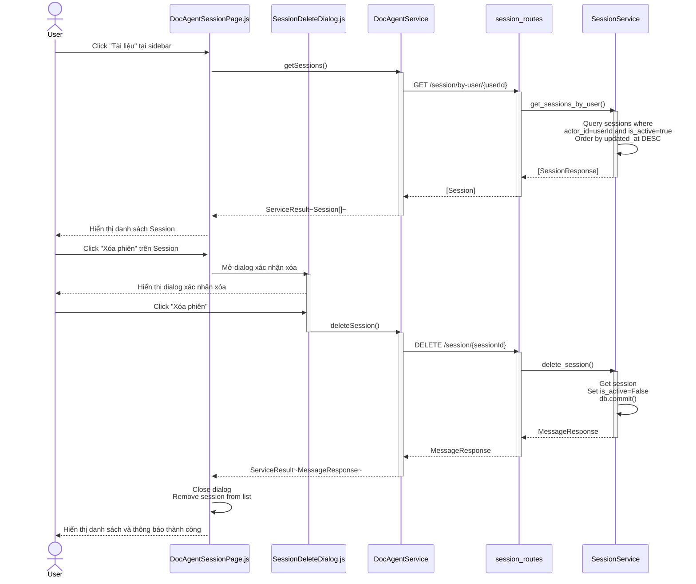

# Sequence Diagram - Quản lý các Session

## 1. Xem danh sách Session

```mermaid
sequenceDiagram
    actor User
    participant DocAgentSessionPage as DocAgentSessionPage.js
    participant DocAgentService as DocAgentService
    participant SessionRoutes as session_routes
    participant SessionService as SessionService

    User->>DocAgentSessionPage: Truy cập trang danh sách Session
    activate DocAgentSessionPage
    
    DocAgentSessionPage->>DocAgentService: getSessions()
    activate DocAgentService
    
    DocAgentService->>SessionRoutes: GET /session/by-user/{userId}
    activate SessionRoutes
    
    SessionRoutes->>SessionService: get_sessions_by_user()
    activate SessionService
    
    SessionService->>SessionService: Query sessions where<br/>actor_id=userId and is_active=true<br/>Order by updated_at DESC
    
    SessionService-->>SessionRoutes: [SessionResponse]
    deactivate SessionService
    
    SessionRoutes-->>DocAgentService: [Session]
    deactivate SessionRoutes
    
    DocAgentService-->>DocAgentSessionPage: ServiceResult~Session[]~
    deactivate DocAgentService
    
    DocAgentSessionPage->>DocAgentSessionPage: Render session list
    DocAgentSessionPage-->>User: Hiển thị danh sách Session
    deactivate DocAgentSessionPage
```

---

## 2. Tạo Session mới

```mermaid
sequenceDiagram
    actor User
    participant DocAgentSessionPage as DocAgentSessionPage.js
    participant SessionCreateDialog as SessionCreateDialog.js
    participant DocAgentService as DocAgentService
    participant SessionRoutes as session_routes
    participant SessionService as SessionService
    participant SessionModel as Session Model

    User->>DocAgentSessionPage: Click "Tài liệu" tại sidebar
    activate DocAgentSessionPage
    
    DocAgentSessionPage->>DocAgentService: getSessions()
    activate DocAgentService
    DocAgentService->>SessionRoutes: GET /session/by-user/{userId}
    activate SessionRoutes
    SessionRoutes->>SessionService: get_sessions_by_user()
    activate SessionService
    SessionService->>SessionService: Query sessions where<br/>actor_id=userId and is_active=true<br/>Order by updated_at DESC
    SessionService-->>SessionRoutes: [SessionResponse]
    deactivate SessionService
    SessionRoutes-->>DocAgentService: [Session]
    deactivate SessionRoutes
    DocAgentService-->>DocAgentSessionPage: ServiceResult~Session[]~
    deactivate DocAgentService
    
    DocAgentSessionPage-->>User: Hiển thị danh sách Session
    
    User->>DocAgentSessionPage: Click "Tạo phiên mới"
    
    DocAgentSessionPage->>SessionCreateDialog: Mở dialog
    activate SessionCreateDialog
    SessionCreateDialog-->>User: Hiển thị form tạo Session
    
    User->>SessionCreateDialog: Nhập thông tin và click "Tạo phiên"
    SessionCreateDialog->>SessionCreateDialog: Validate form
    SessionCreateDialog->>DocAgentService: createSession()
    deactivate SessionCreateDialog
    activate DocAgentService
    
    DocAgentService->>DocAgentService: Prepare FormData
    DocAgentService->>SessionRoutes: POST /session
    activate SessionRoutes
    
    SessionRoutes->>SessionService: create_session()
    activate SessionService
    
    SessionService->>SessionModel: new Session()
    activate SessionModel
    SessionModel-->>SessionService: session instance
    deactivate SessionModel
    
    SessionService->>SessionService: db.add(session)<br/>db.commit()
    SessionService-->>SessionRoutes: SessionResponse
    deactivate SessionService
    
    SessionRoutes-->>DocAgentService: SessionResponse
    deactivate SessionRoutes
    
    DocAgentService-->>DocAgentSessionPage: ServiceResult~SessionResponse~
    deactivate DocAgentService
    
    DocAgentSessionPage->>DocAgentSessionPage: Navigate to<br/>/doc-agent/{sessionId}
    DocAgentSessionPage-->>User: Chuyển hướng đến chi tiết Session
    deactivate DocAgentSessionPage
```

---

## 3. Chỉnh sửa Session

```mermaid
sequenceDiagram
    actor User
    participant DocAgentSessionPage as DocAgentSessionPage.js
    participant SessionUpdateDialog as SessionUpdateDialog.js
    participant DocAgentService as DocAgentService
    participant SessionRoutes as session_routes
    participant SessionService as SessionService

    User->>DocAgentSessionPage: Click "Tài liệu" tại sidebar
    activate DocAgentSessionPage
    
    DocAgentSessionPage->>DocAgentService: getSessions()
    activate DocAgentService
    DocAgentService->>SessionRoutes: GET /session/by-user/{userId}
    activate SessionRoutes
    SessionRoutes->>SessionService: get_sessions_by_user()
    activate SessionService
    SessionService->>SessionService: Query sessions where<br/>actor_id=userId and is_active=true<br/>Order by updated_at DESC
    SessionService-->>SessionRoutes: [SessionResponse]
    deactivate SessionService
    SessionRoutes-->>DocAgentService: [Session]
    deactivate SessionRoutes
    DocAgentService-->>DocAgentSessionPage: ServiceResult~Session[]~
    deactivate DocAgentService
    
    DocAgentSessionPage-->>User: Hiển thị danh sách Session
    
    User->>DocAgentSessionPage: Click "Chỉnh sửa phiên" trên một Session
    
    DocAgentSessionPage->>SessionUpdateDialog: Mở dialog với dữ liệu Session
    activate SessionUpdateDialog
    
    SessionUpdateDialog->>SessionUpdateDialog: Initialize form fields
    SessionUpdateDialog-->>User: Hiển thị form chỉnh sửa Session
    
    User->>SessionUpdateDialog: Nhập thông tin và click "Lưu phiên"
    
    SessionUpdateDialog->>DocAgentService: updateSession()
    deactivate SessionUpdateDialog
    activate DocAgentService
    
    DocAgentService->>DocAgentService: Prepare FormData
    DocAgentService->>SessionRoutes: PUT /session/{sessionId}
    activate SessionRoutes
    
    SessionRoutes->>SessionService: update_session()
    activate SessionService
    
    SessionService->>SessionService: Get session<br/>Update fields<br/>db.commit()
    SessionService-->>SessionRoutes: SessionResponse
    deactivate SessionService
    
    SessionRoutes-->>DocAgentService: SessionResponse
    deactivate SessionRoutes
    
    DocAgentService-->>DocAgentSessionPage: ServiceResult~Session~
    deactivate DocAgentService
    
    DocAgentSessionPage->>DocAgentSessionPage: Close dialog<br/>Update state with new session data
    DocAgentSessionPage-->>User: Hiển thị danh sách và thông báo thành công
    deactivate DocAgentSessionPage
```

---

## 4. Xóa Session

```mermaid
sequenceDiagram
    actor User
    participant DocAgentSessionPage as DocAgentSessionPage.js
    participant SessionDeleteDialog as SessionDeleteDialog.js
    participant DocAgentService as DocAgentService
    participant SessionRoutes as session_routes
    participant SessionService as SessionService

    User->>DocAgentSessionPage: Click "Tài liệu" tại sidebar
    activate DocAgentSessionPage
    
    DocAgentSessionPage->>DocAgentService: getSessions()
    activate DocAgentService
    DocAgentService->>SessionRoutes: GET /session/by-user/{userId}
    activate SessionRoutes
    SessionRoutes->>SessionService: get_sessions_by_user()
    activate SessionService
    SessionService->>SessionService: Query sessions where<br/>actor_id=userId and is_active=true<br/>Order by updated_at DESC
    SessionService-->>SessionRoutes: [SessionResponse]
    deactivate SessionService
    SessionRoutes-->>DocAgentService: [Session]
    deactivate SessionRoutes
    DocAgentService-->>DocAgentSessionPage: ServiceResult~Session[]~
    deactivate DocAgentService
    
    DocAgentSessionPage-->>User: Hiển thị danh sách Session
    
    User->>DocAgentSessionPage: Click "Xóa phiên" trên Session
    
    DocAgentSessionPage->>SessionDeleteDialog: Mở dialog xác nhận xóa
    activate SessionDeleteDialog
    SessionDeleteDialog-->>User: Hiển thị dialog xác nhận xóa
    
    User->>SessionDeleteDialog: Click "Xóa phiên"
    SessionDeleteDialog->>DocAgentService: deleteSession()
    deactivate SessionDeleteDialog
    activate DocAgentService
    
    DocAgentService->>SessionRoutes: DELETE /session/{sessionId}
    activate SessionRoutes
    
    SessionRoutes->>SessionService: delete_session()
    activate SessionService
    
    SessionService->>SessionService: Get session<br/>Set is_active=False<br/>db.commit()
    SessionService-->>SessionRoutes: MessageResponse
    deactivate SessionService
    
    SessionRoutes-->>DocAgentService: MessageResponse
    deactivate SessionRoutes
    
    DocAgentService-->>DocAgentSessionPage: ServiceResult~MessageResponse~
    deactivate DocAgentService
    
    DocAgentSessionPage->>DocAgentSessionPage: Close dialog<br/>Remove session from list
    DocAgentSessionPage-->>User: Hiển thị danh sách và thông báo thành công
```
