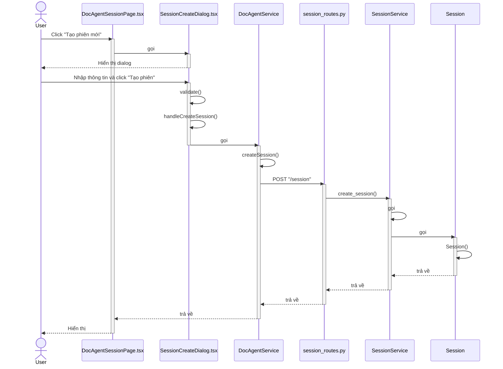
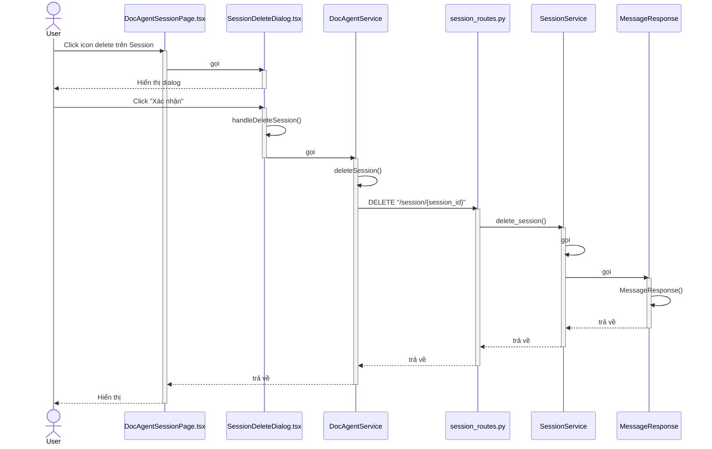
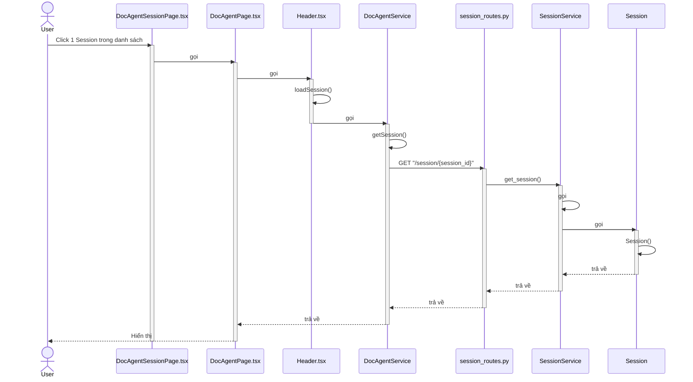
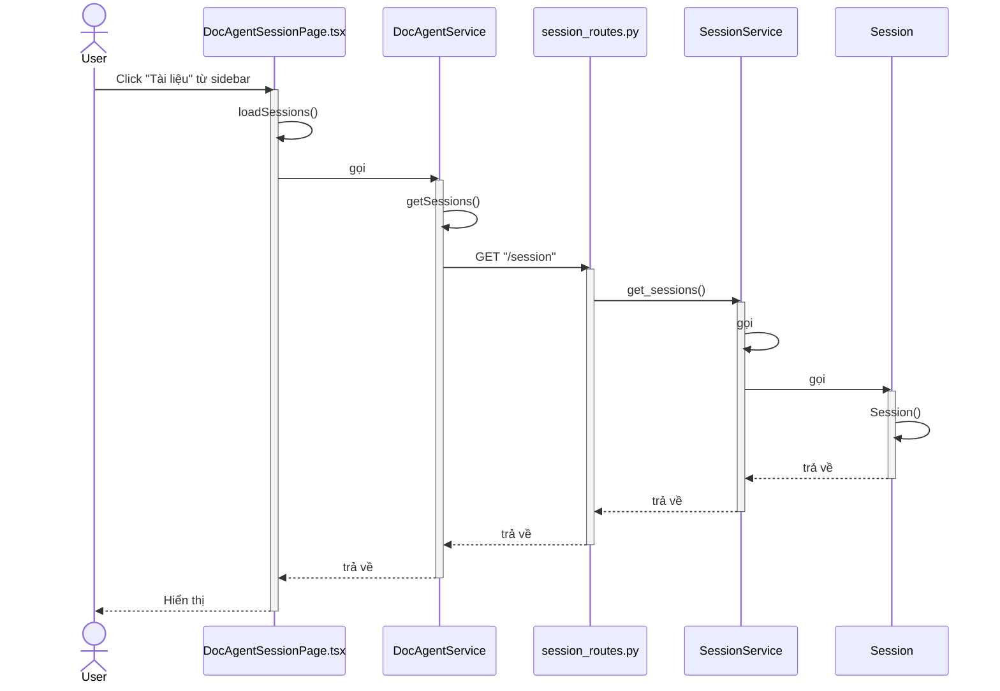
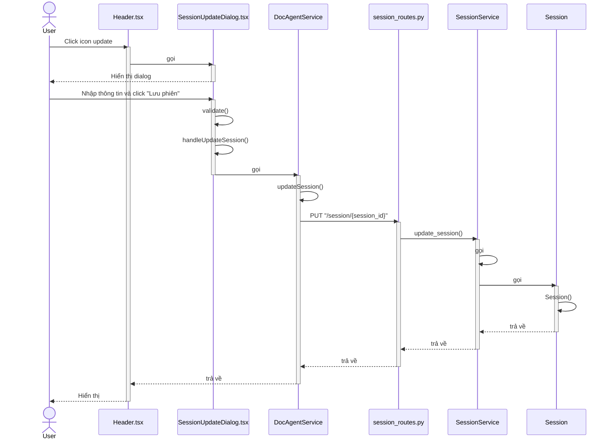

# Sequence Diagram - Quản lý Session

## 1. Tạo Session mới

```mermaid
sequenceDiagram
    actor User
    participant DocAgentSessionPage as DocAgentSessionPage.tsx
    participant SessionCreateDialog as SessionCreateDialog.tsx
    participant DocAgentService as DocAgentService
    participant SessionRoutes as session_routes.py
    participant SessionService as SessionService
    participant Session as Session

    User->>DocAgentSessionPage: Click "Tạo phiên mới"
    activate DocAgentSessionPage
    
    DocAgentSessionPage->>SessionCreateDialog: gọi
    activate SessionCreateDialog
    SessionCreateDialog-->>User: Hiển thị dialog
    deactivate SessionCreateDialog
    
    User->>SessionCreateDialog: Nhập thông tin và click "Tạo phiên"
    activate SessionCreateDialog
    SessionCreateDialog->>SessionCreateDialog: validate()
    SessionCreateDialog->>SessionCreateDialog: handleCreateSession()
    
    SessionCreateDialog->>DocAgentService: gọi
    deactivate SessionCreateDialog
    activate DocAgentService
    
    DocAgentService->>DocAgentService: createSession()
    DocAgentService->>SessionRoutes: POST "/session"
    activate SessionRoutes
    
    SessionRoutes->>SessionService: create_session()
    activate SessionService
    
    SessionService->>SessionService: gọi
    SessionService->>Session: gọi
    activate Session
    
    Session->>Session: Session()
    Session-->>SessionService: trả về
    deactivate Session
    
    SessionService-->>SessionRoutes: trả về
    deactivate SessionService
    
    SessionRoutes-->>DocAgentService: trả về
    deactivate SessionRoutes
    
    DocAgentService-->>DocAgentSessionPage: trả về
    deactivate DocAgentService
    
    DocAgentSessionPage-->>User: Hiển thị
    deactivate DocAgentSessionPage
```

---

## 2. Xóa Session

```mermaid
sequenceDiagram
    actor User
    participant DocAgentSessionPage as DocAgentSessionPage.tsx
    participant SessionDeleteDialog as SessionDeleteDialog.tsx
    participant DocAgentService as DocAgentService
    participant SessionRoutes as session_routes.py
    participant SessionService as SessionService
    participant MessageResponse as MessageResponse

    User->>DocAgentSessionPage: Click icon delete trên Session
    activate DocAgentSessionPage
    
    DocAgentSessionPage->>SessionDeleteDialog: gọi
    activate SessionDeleteDialog
    SessionDeleteDialog-->>User: Hiển thị dialog
    deactivate SessionDeleteDialog
    
    User->>SessionDeleteDialog: Click "Xác nhận"
    activate SessionDeleteDialog
    
    SessionDeleteDialog->>SessionDeleteDialog: handleDeleteSession()
    SessionDeleteDialog->>DocAgentService: gọi
    deactivate SessionDeleteDialog
    activate DocAgentService
    
    DocAgentService->>DocAgentService: deleteSession()
    DocAgentService->>SessionRoutes: DELETE "/session/{session_id}"
    activate SessionRoutes
    
    SessionRoutes->>SessionService: delete_session()
    activate SessionService
    
    SessionService->>SessionService: gọi
    SessionService->>MessageResponse: gọi
    activate MessageResponse
    
    MessageResponse->>MessageResponse: MessageResponse()
    MessageResponse-->>SessionService: trả về
    deactivate MessageResponse
    
    SessionService-->>SessionRoutes: trả về
    deactivate SessionService
    
    SessionRoutes-->>DocAgentService: trả về
    deactivate SessionRoutes
    
    DocAgentService-->>DocAgentSessionPage: trả về
    deactivate DocAgentService
    
    DocAgentSessionPage-->>User: Hiển thị
    deactivate DocAgentSessionPage
```

---

## 3. Xem chi tiết Session

```mermaid
sequenceDiagram
    actor User
    participant DocAgentSessionPage as DocAgentSessionPage.tsx
    participant DocAgentPage as DocAgentPage.tsx
    participant Header as Header.tsx
    participant DocAgentService as DocAgentService
    participant SessionRoutes as session_routes.py
    participant SessionService as SessionService
    participant Session as Session

    User->>DocAgentSessionPage: Click 1 Session trong danh sách
    activate DocAgentSessionPage
    
    DocAgentSessionPage->>DocAgentPage: gọi
    activate DocAgentPage
    
    DocAgentPage->>Header: gọi
    activate Header
    
    Header->>Header: loadSession()
    Header->>DocAgentService: gọi
    deactivate Header
    activate DocAgentService
    
    DocAgentService->>DocAgentService: getSession()
    DocAgentService->>SessionRoutes: GET "/session/{session_id}"
    activate SessionRoutes
    
    SessionRoutes->>SessionService: get_session()
    activate SessionService
    
    SessionService->>SessionService: gọi
    SessionService->>Session: gọi
    activate Session
    
    Session->>Session: Session()
    Session-->>SessionService: trả về
    deactivate Session
    
    SessionService-->>SessionRoutes: trả về
    deactivate SessionService
    
    SessionRoutes-->>DocAgentService: trả về
    deactivate SessionRoutes
    
    DocAgentService-->>DocAgentPage: trả về
    deactivate DocAgentService
    
    DocAgentPage-->>User: Hiển thị
    deactivate DocAgentPage
    deactivate DocAgentSessionPage
```

---

## 4. Xem danh sách Session

```mermaid
sequenceDiagram
    actor User
    participant DocAgentSessionPage as DocAgentSessionPage.tsx
    participant DocAgentService as DocAgentService
    participant SessionRoutes as session_routes.py
    participant SessionService as SessionService
    participant Session as Session

    User->>DocAgentSessionPage: Click "Tài liệu" từ sidebar
    activate DocAgentSessionPage
    
    DocAgentSessionPage->>DocAgentSessionPage: loadSessions()
    DocAgentSessionPage->>DocAgentService: gọi
    activate DocAgentService
    
    DocAgentService->>DocAgentService: getSessions()
    DocAgentService->>SessionRoutes: GET "/session"
    activate SessionRoutes
    
    SessionRoutes->>SessionService: get_sessions()
    activate SessionService
    
    SessionService->>SessionService: gọi
    SessionService->>Session: gọi
    activate Session
    
    Session->>Session: Session()
    Session-->>SessionService: trả về
    deactivate Session
    
    SessionService-->>SessionRoutes: trả về
    deactivate SessionService
    
    SessionRoutes-->>DocAgentService: trả về
    deactivate SessionRoutes
    
    DocAgentService-->>DocAgentSessionPage: trả về
    deactivate DocAgentService
    
    DocAgentSessionPage-->>User: Hiển thị
    deactivate DocAgentSessionPage
```

---

## 5. Cập nhật Session

```mermaid
sequenceDiagram
    actor User
    participant Header as Header.tsx
    participant SessionUpdateDialog as SessionUpdateDialog.tsx
    participant DocAgentService as DocAgentService
    participant SessionRoutes as session_routes.py
    participant SessionService as SessionService
    participant Session as Session

    User->>Header: Click icon update
    activate Header
    
    Header->>SessionUpdateDialog: gọi
    activate SessionUpdateDialog
    SessionUpdateDialog-->>User: Hiển thị dialog
    deactivate SessionUpdateDialog
    
    User->>SessionUpdateDialog: Nhập thông tin và click "Lưu phiên"
    activate SessionUpdateDialog
    
    SessionUpdateDialog->>SessionUpdateDialog: validate()
    SessionUpdateDialog->>SessionUpdateDialog: handleUpdateSession()
    SessionUpdateDialog->>DocAgentService: gọi
    deactivate SessionUpdateDialog
    activate DocAgentService
    
    DocAgentService->>DocAgentService: updateSession()
    DocAgentService->>SessionRoutes: PUT "/session/{session_id}"
    activate SessionRoutes
    
    SessionRoutes->>SessionService: update_session()
    activate SessionService
    
    SessionService->>SessionService: gọi
    SessionService->>Session: gọi
    activate Session
    
    Session->>Session: Session()
    Session-->>SessionService: trả về
    deactivate Session
    
    SessionService-->>SessionRoutes: trả về
    deactivate SessionService
    
    SessionRoutes-->>DocAgentService: trả về
    deactivate SessionRoutes
    
    DocAgentService-->>Header: trả về
    deactivate DocAgentService
    
    Header-->>User: Hiển thị
    deactivate Header
```
