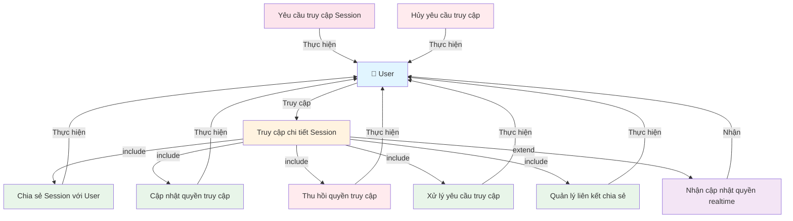

# Use Case Diagram - Quản lý Session Access

**Ghi chú:**
- User có thể thực hiện các chức năng quản lý Session Access.
- Phân quyền cụ thể được xử lý bởi hệ thống quản lý quyền truy cập.
- User có thể yêu cầu và hủy yêu cầu truy cập khi chưa có quyền.
- User nhận thông báo realtime khi quyền thay đổi.
- Truy cập chi tiết Session là điều kiện tiên quyết cho các thao tác quản lý.
