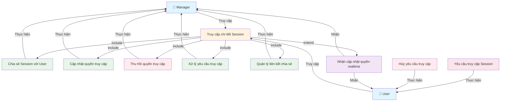

````markdown

# Use Case Diagram - Quản lý Session Access



**Ghi chú:**
- Manager có toàn quyền quản lý chia sẻ Session.
- User có thể yêu cầu và hủy yêu cầu truy cập.
- Cả Manager và User đều nhận thông báo realtime khi quyền thay đổi.
- Truy cập chi tiết Session là điều kiện tiên quyết cho các thao tác quản lý.


````