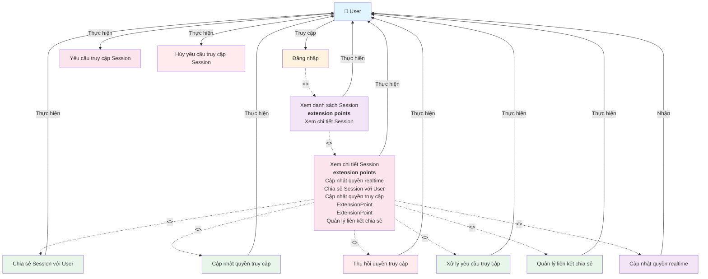

# Use Case Diagram - Quản lý Session Access

**Ghi chú:**
- Đăng nhập là điều kiện tiên quyết để truy cập hệ thống.
- Xem danh sách Session là bước cần thiết để có thể xem chi tiết Session.
- Xem chi tiết Session có các extension points cho các thao tác quản lý Session Access.
- Phân quyền cụ thể được xử lý bởi hệ thống quản lý quyền truy cập.
- User có thể yêu cầu và hủy yêu cầu truy cập khi chưa có quyền.
- User nhận thông báo realtime khi quyền thay đổi.
