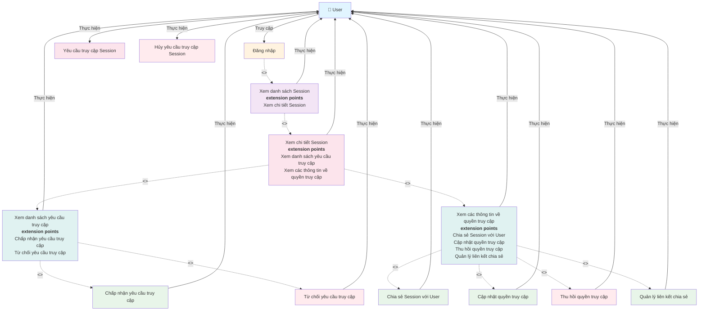

# Use Case Diagram - Quản lý Session Access

**Ghi chú:**
- Đăng nhập là điều kiện tiên quyết để truy cập hệ thống.
- Xem danh sách Session là bước cần thiết để có thể xem chi tiết Session.
- Xem chi tiết Session có hai extension points:
  - Xem danh sách yêu cầu truy cập (với extension points: Chấp nhận và Từ chối yêu cầu)
  - Xem các thông tin về quyền truy cập (với extension points: Chia sẻ, Cập nhật, Thu hồi quyền và Quản lý liên kết)
- User có thể yêu cầu và hủy yêu cầu truy cập khi chưa có quyền.
- Phân quyền cụ thể được xử lý bởi hệ thống quản lý quyền truy cập.
