# Use Case Diagram - Quản lý Session Access

```mermaid
graph TB
    User["👤 User"]
    
    Login["Đăng nhập"]
    ListSessions["Xem danh sách Session"]
    ViewSessionDetail["Xem chi tiết Session"]
    
    ShareSession["Chia sẻ Session với User"]
    UpdatePermission["Cập nhật quyền truy cập"]
    RevokePermission["Thu hồi quyền truy cập"]
    HandleRequest["Xử lý yêu cầu truy cập"]
    ManageLink["Quản lý liên kết chia sẻ"]
    
    RequestAccess["Yêu cầu truy cập Session"]
    CancelRequest["Hủy yêu cầu truy cập"]
    
    ReceiveUpdate["Nhận cập nhật quyền realtime"]
    
    User -->|Truy cập| Login
    Login -->|include| ListSessions
    ListSessions -->|Thực hiện| User
    
    ListSessions -->|include| ViewSessionDetail
    ViewSessionDetail -->|Thực hiện| User
    
    ViewSessionDetail -->|include| ShareSession
    ShareSession -->|Thực hiện| User
    
    ViewSessionDetail -->|include| UpdatePermission
    UpdatePermission -->|Thực hiện| User
    
    ViewSessionDetail -->|include| RevokePermission
    RevokePermission -->|Thực hiện| User
    
    ViewSessionDetail -->|include| HandleRequest
    HandleRequest -->|Thực hiện| User
    
    ViewSessionDetail -->|include| ManageLink
    ManageLink -->|Thực hiện| User
    
    RequestAccess -->|Thực hiện| User
    
    CancelRequest -->|Thực hiện| User
    
    ViewSessionDetail -->|extend| ReceiveUpdate
    ReceiveUpdate -->|Nhận| User
    
    style User fill:#e1f5ff
    style Login fill:#fff3e0
    style ListSessions fill:#f3e5f5
    style ViewSessionDetail fill:#fce4ec
    style ShareSession fill:#e8f5e9
    style UpdatePermission fill:#e8f5e9
    style RevokePermission fill:#ffebee
    style HandleRequest fill:#e8f5e9
    style ManageLink fill:#e8f5e9
    style RequestAccess fill:#fce4ec
    style CancelRequest fill:#ffebee
    style ReceiveUpdate fill:#f3e5f5
```

**Ghi chú:**
- Đăng nhập là điều kiện tiên quyết để truy cập hệ thống.
- Xem danh sách Session là bước cần thiết để có thể xem chi tiết Session.
- Xem chi tiết Session là điều kiện tiên quyết cho các thao tác quản lý Session Access.
- Phân quyền cụ thể được xử lý bởi hệ thống quản lý quyền truy cập.
- User có thể yêu cầu và hủy yêu cầu truy cập khi chưa có quyền.
- User nhận thông báo realtime khi quyền thay đổi.
