# Class Diagram - Quản lý Session Access

```mermaid
classDiagram
    class User {
        - id: UUID
        - username: String
        - email: String
        - phone: String
        - birthDay: LocalDate
        - firstName: String
        - lastName: String
        - avatar: String
        - userCode: String
        - userPrefix: String
        - isPremium: Boolean
        - providers: List~UserIdentity~
        + getId(): UUID
        + getRoles(): Set~Role~
    }

    class Role {
        - name: RoleType
        - users: List~User~
        + getName(): RoleType
    }

    class RoleType {
        <<enumeration>>
        STUDENT
        LECTURER
        ADMIN
    }

    class Session {
        - id: UUID
        - name: String
        - description: String | null
        - created_by: UUID
        - created_at: DateTime
        - updated_at: DateTime
        + getId(): UUID
        + getName(): String
    }

    class SessionAccessGrant {
        - id: UUID
        - session_id: UUID
        - actor_id: UUID
        - actor_type: ActorType
        - access_level: AccessLevel
        - is_active: Boolean
        - expires_at: DateTime | null
        - source: AccessSource
        - created_at: DateTime
        - updated_at: DateTime
        + getId(): UUID
        + isActive(): Boolean
    }

    class SessionAccessLink {
        - id: UUID
        - session_id: UUID
        - is_active: Boolean
        - access_level: AccessLevel
        - expires_at: DateTime | null
        - created_at: DateTime
        - updated_at: DateTime
        + isValid(): Boolean
    }

    class SessionAccessInvite {
        - id: UUID
        - session_id: UUID
        - granted_access_id: UUID | null
        - invited_by: UUID
        - invited_to: UUID
        - invited_to_type: ActorType
        - invited_level: AccessLevel
        - status: RequestStatus
        - created_at: DateTime
        + getId(): UUID
    }

    class SessionAccessRequest {
        - id: UUID
        - session_id: UUID
        - granted_access_id: UUID | null
        - requested_by: UUID
        - requested_by_type: ActorType
        - requested_level: AccessLevel
        - status: RequestStatus
        - reviewed_by: UUID | null
        - reviewed_at: DateTime | null
        - created_at: DateTime
        + getId(): UUID
    }

    class AccessLevel {
        <<enumeration>>
        READER
        CONTRIBUTOR
        MANAGER
    }

    class ActorType {
        <<enumeration>>
        USER
    }

    class RequestStatus {
        <<enumeration>>
        PENDING
        APPROVED
        REJECTED
    }

    class AccessSource {
        <<enumeration>>
        INVITE
        REQUEST
        LINK
    }

    class AccessUseSource {
        <<enumeration>>
        GRANT
        LINK
    }

    class WsSessionAccessEventType {
        <<enumeration>>
        PERMISSION_GRANTED
        PERMISSION_CHANGED
        PERMISSION_REVOKED
        LINK_UPDATED
        REQUEST_CREATED
        REQUEST_DELETED
        INVITE_CREATED
    }

    class Header {
        - sessionInfo: Session | null
        - isSessionLoading: Boolean
        - userId: String
        - userAccessLevel: AccessLevel
        - requestTabReloadKey: Number
        + handleEditClick()
        + handleSessionUpdated()
        + openShareModal()
    }

    class SessionShareModal {
        - sessionId: String
        - userId: String
        - currentUserId: String
        - userAccessLevel: AccessLevel
        - activeTab: 'share' | 'request'
        - sharedWith: SharedPerson[]
        - generalAccess: SessionAccessLink | null
        - requests: AccessRequest[]
        - requestTabReloadKey: Number
        + handleAddUser()
        + handlePermissionChange()
        + handleRemoveUser()
        + handleGeneralAccessChange()
        + handleToggleGeneralAccess()
        + handleApproveRequest()
        + handleDenyRequest()
        + handleCopyLink()
    }

    class RequestAccessState {
        - sessionId: String
        - userId: String
        - variant: 'dialog' | 'fullpage'
        - existingRequest: SessionAccessRequest | null
        - isRequesting: Boolean
        - isDeleting: Boolean
        + checkExistingRequest()
        + handleRequestAccess()
        + handleCancelRequest()
    }

    class DocAgentPage {
        - sessionId: String
        - userId: String
        - sessionConfirmed: Boolean
        - permissionLoading: Boolean
        - permission: UserPermission
        - sessionSocket: WebSocket | null
        - requestTabReloadKey: Number
        + connectSessionWebSocket()
        + handlePermissionGranted()
        + handlePermissionChanged()
        + handlePermissionRevoked()
        + handleRequestCreated()
        + handleRequestDeleted()
        + handleLinkUpdated()
    }

    class DocAgentService {
        + getUserSessionGrant(sessionId, userId): ServiceResult~SessionAccessGrant~
        + getSessionLink(sessionId): ServiceResult~SessionAccessLink~
        + updateSessionLink(linkId, data): ServiceResult~SessionAccessLink~
        + getSessionGrants(sessionId, active): ServiceResult~SessionAccessGrant[]~
        + updateGrant(grantId, data): ServiceResult~SessionAccessGrant~
        + revokeGrant(grantId): ServiceResult~MessageResponse~
        + createInvite(data): ServiceResult~SessionAccessInvite~
        + getSessionInvites(sessionId): ServiceResult~SessionAccessInvite[]~
        + createRequest(data): ServiceResult~SessionAccessRequest~
        + getSessionRequests(sessionId): ServiceResult~SessionAccessRequest[]~
        + getUserSessionRequest(sessionId, userId): ServiceResult~SessionAccessRequest~
        + acceptRequest(requestId, data): ServiceResult~SessionAccessRequest~
        + rejectRequest(requestId): ServiceResult~MessageResponse~
        + deleteRequest(requestId, sessionId): ServiceResult~MessageResponse~
        - getAuthHeaders(sessionId): Record~String, String~
        - parseErrorResponse(response): MessageResponse
    }

    class DocSocketService {
        + connectSessionSocket(sessionId, userId, handlers): WebSocket
        + sendSessionPing(ws): void
        + sendSessionSubscribe(ws): void
        + startSessionKeepAlive(ws, intervalMs): Number
        + closeSessionSocket(ws): void
        - buildSessionWsUrl(sessionId, userId): String
    }

    class SessionAccessService {
        + get_user_session_grant(db, session_id, user_id): SessionAccessGrant
        + get_session_access_link_by_session(db, session_id): SessionAccessLink
        + update_session_access_link(db, link_id, request): SessionAccessLink
        + get_session_access_grant(db, grant_id): SessionAccessGrant
        + update_session_access_grant(db, grant_id, request): SessionAccessGrant
        + revoke_session_access_grant(db, grant_id): SessionAccessGrant
        + create_session_access_invite(db, request, auto_grant): SessionAccessInvite
        + accept_session_access_invite(db, invite_id): SessionAccessInvite
        + revoke_session_access_invite(db, invite_id): SessionAccessInvite
        + create_session_access_request(db, request): SessionAccessRequest
        + accept_session_access_request(db, request_id, request): SessionAccessRequest
        + reject_session_access_request(db, request_id): MessageResponse
        + delete_session_access_request(db, request_id): MessageResponse
    }

    class WSSessionAccessManager {
        - active_connections: Dict~String, Set~WebSocket~~
        - ws_to_session: Dict~WebSocket, String~
        - ws_to_user: Dict~WebSocket, String~
        + connect(session_id, websocket, user_id)
        + disconnect(websocket)
        + broadcast_to_session(session_id, event_type, payload, exclude_user_id)
        + broadcast_permission_granted(payload)
        + broadcast_permission_changed(payload)
        + broadcast_permission_revoked(payload)
        + broadcast_link_updated(payload, exclude_user_id)
        + broadcast_request_created(payload)
        + broadcast_request_deleted(payload)
    }

    class WsSessionAccessPayload {
        - session_id: String
        - affected_user_id: String | null
        - actor_user_id: String | null
        - new_access_level: AccessLevel | null
        - message: String | null
        - metadata: Dict | null
    }

    class WsSessionAccessEnvelope {
        - event: WsSessionAccessEventType
        - payload: WsSessionAccessPayload
    }

    class MessageResponse {
        - translation_key: String
        - message: String
        - details: Dict | null
        + create(translation_key, message, details): MessageResponse
    }

    class ServiceResult~T~ {
        - type: ResponseStatus
        - data: T | null
        - error: MessageResponse | null
    }

    class ResponseStatus {
        <<enumeration>>
        SUCCESS
        ERROR
    }

    %% Relationships
    User "*" -- "*" Role : has
    Role "*" -- "1" RoleType : has_type
    User "1" -- "*" Session : creates
    Session "1" -- "*" SessionAccessGrant : has_grants
    Session "1" -- "1" SessionAccessLink : has_link
    Session "1" -- "*" SessionAccessInvite : has_invites
    Session "1" -- "*" SessionAccessRequest : has_requests
    
    SessionAccessGrant "*" -- "1" AccessLevel : has_level
    SessionAccessGrant "*" -- "1" ActorType : has_actor_type
    SessionAccessGrant "*" -- "1" AccessSource : has_source
    SessionAccessGrant "1" -- "0..1" SessionAccessInvite : granted_by_invite
    SessionAccessGrant "1" -- "0..1" SessionAccessRequest : granted_by_request
    
    SessionAccessLink "*" -- "1" AccessLevel : has_level
    
    SessionAccessInvite "*" -- "1" AccessLevel : has_level
    SessionAccessInvite "*" -- "1" ActorType : has_actor_type
    SessionAccessInvite "*" -- "1" RequestStatus : has_status
    
    SessionAccessRequest "*" -- "1" AccessLevel : has_level
    SessionAccessRequest "*" -- "1" ActorType : has_actor_type
    SessionAccessRequest "*" -- "1" RequestStatus : has_status
    
    Header --> SessionShareModal : opens
    Header --> Session : displays
    
    SessionShareModal --> DocAgentService : uses
    SessionShareModal --> SessionAccessGrant : manages
    SessionShareModal --> SessionAccessLink : configures
    SessionShareModal --> SessionAccessRequest : handles
    
    RequestAccessState --> DocAgentService : uses
    RequestAccessState --> SessionAccessRequest : manages
    
    DocAgentPage --> DocSocketService : uses
    DocAgentPage --> SessionShareModal : contains
    DocAgentPage --> RequestAccessState : shows_when_no_access
    DocAgentPage --> WsSessionAccessEnvelope : receives
    
    DocAgentService --> ServiceResult : returns
    DocAgentService --> MessageResponse : uses
    
    DocSocketService --> WsSessionAccessEnvelope : receives
    
    SessionAccessService --> SessionAccessGrant : manages
    SessionAccessService --> SessionAccessLink : manages
    SessionAccessService --> SessionAccessInvite : manages
    SessionAccessService --> SessionAccessRequest : manages
    SessionAccessService --> MessageResponse : returns
    
    WSSessionAccessManager --> WsSessionAccessEnvelope : broadcasts
    WSSessionAccessManager --> WsSessionAccessPayload : uses
    
    WsSessionAccessEnvelope --> WsSessionAccessEventType : has_event
    WsSessionAccessEnvelope --> WsSessionAccessPayload : has_payload
    
    WsSessionAccessPayload --> AccessLevel : contains
    
    ServiceResult --> ResponseStatus : has_status
    ServiceResult --> MessageResponse : has_error
```

**Mô tả quan hệ:**
- **User & Role & RoleType**: User có thể có nhiều Role (STUDENT, LECTURER, ADMIN), được định danh bởi RoleType enum.
- **User & Session**: User tạo Session và có thể được cấp quyền truy cập.
- **SessionAccessGrant**: Lưu trữ quyền truy cập của User vào Session, được tạo từ Invite hoặc Request.
- **SessionAccessLink**: Cấu hình link chia sẻ công khai cho Session.
- **SessionAccessInvite**: Lời mời chia sẻ Session từ Manager đến User.
- **SessionAccessRequest**: Yêu cầu truy cập từ User muốn vào Session.
- **Header & SessionShareModal** (Frontend): Giao diện quản lý chia sẻ và xử lý yêu cầu.
- **RequestAccessState** (Frontend): Giao diện yêu cầu truy cập khi User không có quyền.
- **DocAgentPage** (Frontend): Component chính kết nối WebSocket để nhận cập nhật realtime.
- **DocAgentService** (Frontend): Service xử lý API call liên quan đến session access.
- **DocSocketService** (Frontend): Service quản lý WebSocket connection.
- **SessionAccessService** (Backend): Service xử lý logic nghiệp vụ, truy vấn DB.
- **WSSessionAccessManager** (Backend): Quản lý WebSocket connections và broadcast events.
- **WsSessionAccessEnvelope & WsSessionAccessPayload**: Data structure cho WebSocket messages.
