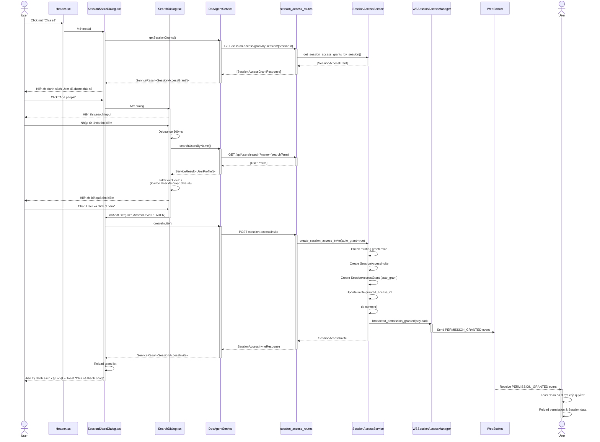
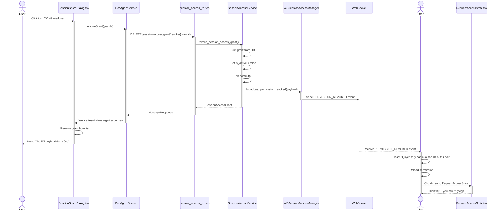
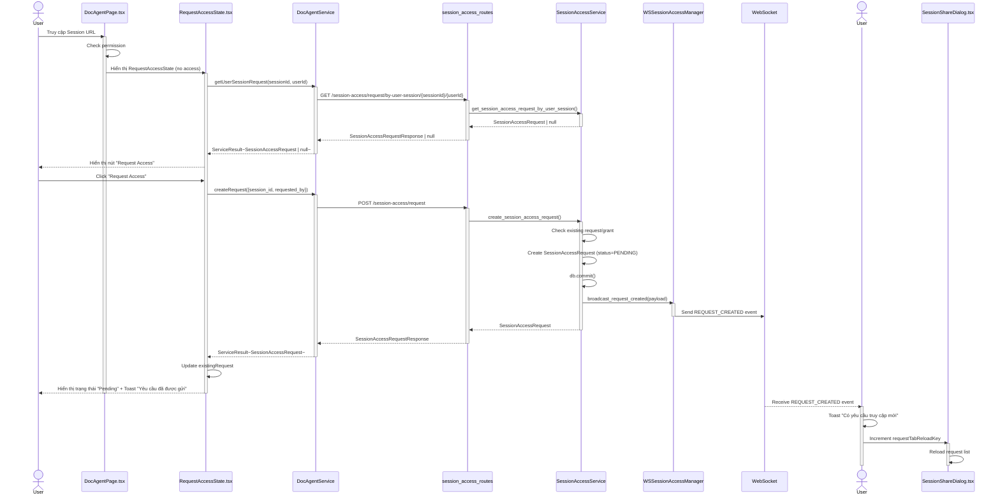
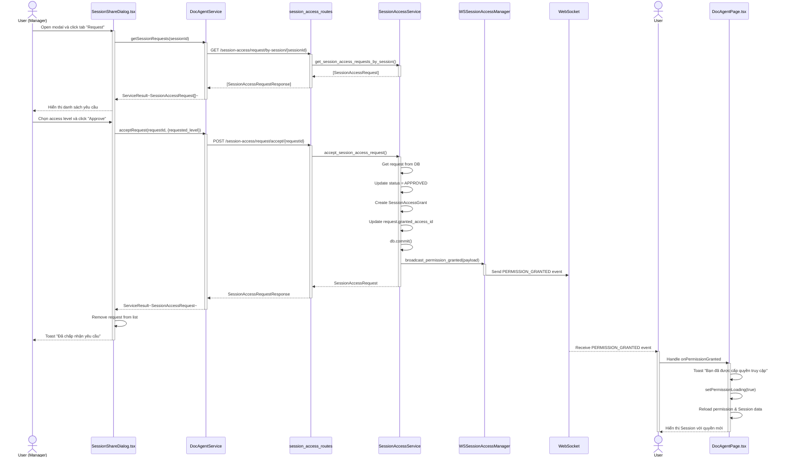
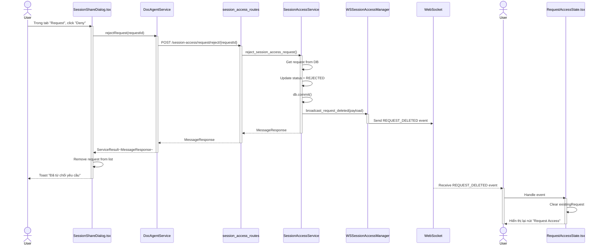
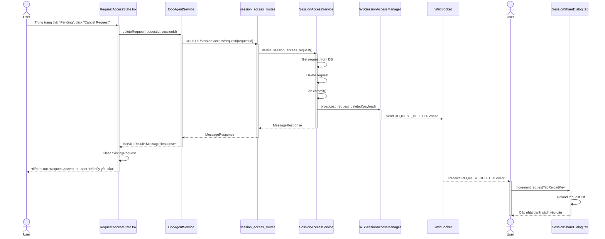

# Sequence Diagram - Quản lý Session Access

## 1. Chia sẻ Session với User cụ thể

---

## 2. Cập nhật quyền truy cập

---

## 3. Thu hồi quyền truy cập

---

## 4. Yêu cầu truy cập Session

---

## 5. Chấp nhận yêu cầu truy cập

---

## 6. Từ chối yêu cầu truy cập

---

## 7. Hủy yêu cầu truy cập

---

## 8. Quản lý liên kết chia sẻ công khai

---

## 9. Nhận cập nhật quyền realtime qua WebSocket

